# 2018-11-15 13:20:34

Running some tests to see if data transformations make things look better. I coded a within-subject normalization, and also a within-variable normalization. Let's see if it makes any difference for our best resul in each of the 2 brain modalities. Maybe try different algorithms too. We can try it with fMRI later.

```bash
job_name=dataTransforms_rawCV;
mydir=/data/NCR_SBRB/baseline_prediction/;
swarm_file=swarm.automl_${job_name};
rm -rf $swarm_file;
for f in struct_volume_11142018_260timeDiff12mo.RData.gz dti_ad_voxelwise_n223_09212018.RData.gz; do
    for target in nvVSper perVSrem; do
        for pp in subjScale dataScale subjScale,dataScale None; do
            for algo in DeepLearning DRF GBM GLM; do
                for i in {1..100}; do
                    myseed=$RANDOM;
                    echo "Rscript --vanilla ~/research_code/automl/raw_multiDomain_autoValidation_oneAlgo.R ${mydir}/$f ${mydir}/long_clin_0918.csv ${target} ${mydir}/models_raw_dataTransforms/${USER} $myseed $algo $pp" >> $swarm_file;
                    echo "Rscript --vanilla ~/research_code/automl/raw_multiDomain_autoValidation_oneAlgo.R ${mydir}/$f ${mydir}/long_clin_0918.csv ${target} ${mydir}/models_raw_dataTransforms/${USER} -$myseed $algo $pp" >> $swarm_file;
                done;
            done;
        done;
    done;
done
sed -i -e "s/^/unset http_proxy; /g" $swarm_file;
split -l 1000 $swarm_file ${job_name}_split;
for f in `/bin/ls ${job_name}_split??`; do
    echo "ERROR" > swarm_wait_${USER}
    while grep -q ERROR swarm_wait_${USER}; do
        echo "Trying $f"
        swarm -f $f -g 40 -t 16 --time 3:00:00 --partition quick --logdir trash_${job_name} --job-name ${job_name} -m R --gres=lscratch:10 2> swarm_wait_${USER};
        if grep -q ERROR swarm_wait_${USER}; then
            echo -e "\tError, sleeping..."
            sleep 10m;
        fi;
    done;
done
```

# 2018-11-16 14:10:03

Let's compile the results to see if data transformations make any difference:

```bash
echo "target,pheno,var,seed,nfeat,model,auc,f1,acc,ratio" > dataTransforms_summary.csv;
dir=dataTransforms_rawCV;
for f in `ls -1 trash_${dir}/*o`; do
    phen=`head -n 2 $f | tail -1 | awk '{FS=" "; print $7}' | cut -d"/" -f 6`;
    target=`head -n 2 $f | tail -1 | awk '{FS=" "; print $9}'`;
    seed=`head -n 2 $f | tail -1 | awk '{FS=" "; print $11}'`;
    var=`head -n 2 $f | tail -1 | awk '{FS=" "; print $13}'`;
    model=`grep -A 1 model_id $f | tail -1 | awk '{FS=" "; print $2}' | cut -d"_" -f 1`;
    auc=`grep -A 1 model_id $f | tail -1 | awk '{FS=" "; print $3}'`;
    nfeat=`grep "Running model on" $f | awk '{FS=" "; print $5}'`;
    ratio=`grep -A 1 "Class distribution" $f | tail -1 | awk '{FS=" "; {for (i=2; i<=NF; i++) printf $i ";"}}'`;
    f1=`grep -A 2 "Maximum Metrics:" $f | tail -1 | awk '{FS=" "; print $5}'`;
    acc=`grep -A 5 "Maximum Metrics:" $f | tail -1 | awk '{FS=" "; print $5}'`;
    echo $target,$phen,$var,$seed,$nfeat,$model,$auc,$f1,$acc,$ratio >> dataTransforms_summary.csv;
done;
```

There are many variables here. First, let's stick to AD, and see if any
algorithm is particularly sensitive to the 4 different data transforms:

```r
data = read.csv('~/tmp/dataTransforms_summary.csv')
data$group = ''
data[data$seed<0,]$group = 'RND'
data$group2 = sapply(1:nrow(data), function(x) { sprintf('%s_%s', data$var[x], data$group[x])} )
# then, for each target
idx = data$target=='nvVSper' & data$model=='DeepLearning' & data$pheno=='struct_volume_11142018_260timeDiff12mo.RData.gz'
p1<-ggplot(data[idx,], aes(x=group2, y=auc, fill=group2))
print(p1+geom_boxplot() + ggtitle(unique(data[idx,]$target)))
```


It looks like subjScaling has a slight effect on DeepLearning for structural,
but not necessarily for DTI. 

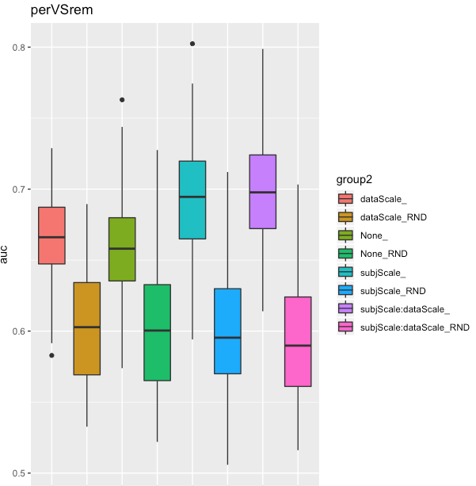


That's particularly obvious in perVSrem. Let's see if other algorithms are as
affected. GBM doesn't do as well as DeepLearning, but the best results there are
actually with DTI and no transformation. Not that much better than random
though. Not much difference in structural. 

Not much improvement in DRF, which is also not better than deep learning. 

The GLM results are actually much better than its random counterpart, but will
need to check against other algorithms. subjScale and None are somewhat tied.
But for structural, particularly in perVSrem, subjScale trumps the rest. So, it
looks like we need to do some subject scaling after all. Let's see how results
compare across algorithms. We can do it for None and subjScale just for kicks:

```r
data[data$model=='XRT','model'] = 'DRF'
data$group3 = sapply(1:nrow(data), function(x) { sprintf('%s_%s', data$var[x], data$model[x])} )
idx = data$target=='nvVSper' & (data$var=='None' | data$var=='subjScale') & data$seed>0 & data$pheno=='struct_volume_11142018_260timeDiff12mo.RData.gz'
p1<-ggplot(data[idx,], aes(x=group3, y=auc, fill=group3))
print(p1+geom_boxplot() + ggtitle(unique(data[idx,]$target)))
```

For struct nvVSper, subjScale DL, with None DL as a close second. For DTI it's
actually inverted, with None slightly better. Interestingly, GLM is not too bad either.


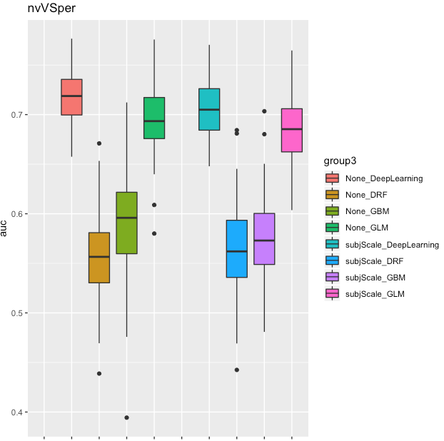

That DTI trend is also true for perVSrem, and struct still prefers subjScale.

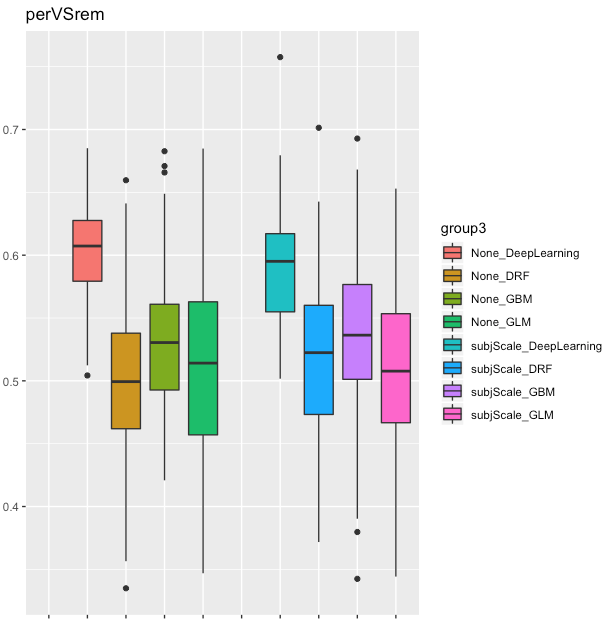

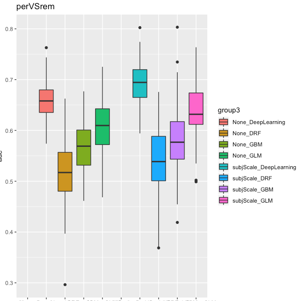

Does Deep Learning tend to overfit more?

```r
idx = data$target=='nvVSper' & (data$var=='None' | data$var=='subjScale') & data$seed<0 & data$pheno=='struct_volume_11142018_260timeDiff12mo.RData.gz'
p1<-ggplot(data[idx,], aes(x=group3, y=auc, fill=group3))
print(p1+geom_boxplot() + ggtitle(unique(data[idx,]$target)))
```


Yep, it definitely does, regardless of dataset or target. We just need to make sure whatever results we're
getting are not there with random data:

```r
idx = data$target=='nvVSper' & (data$var=='None' | data$var=='subjScale') & data$model=='DeepLearning' & data$pheno=='struct_volume_11142018_260timeDiff12mo.RData.gz'
p1<-ggplot(data[idx,], aes(x=group2, y=auc, fill=group2))
print(p1+geom_boxplot() + ggtitle(unique(data[idx,]$target)))
```

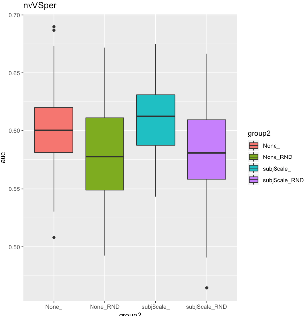


Maybe with nvVSper in structural, but definitely not in perVSrem, especially if
we do subjScale. For DTI the story is different: not much for perVSrem, but very
good for nvVSper.

So, across the board, DeepLearning does better, and it doesn't seem to care too
much whether it's subjScaled or not, at least not for DTI. I wonder
if this will change when we include rsFMRI, and if we combine data across
domains? We could also keep subjScale for structural (and maybe fMRI) but not
DTI?

```bash
job_name=dataTransformsDTIStruct_rawCV;
mydir=/data/NCR_SBRB/baseline_prediction/;
swarm_file=swarm.automl_${job_name};
rm -rf $swarm_file;
f1="${mydir}/dti_fa_voxelwise_n223_09212018.RData.gz,${mydir}/dti_ad_voxelwise_n223_09212018.RData.gz,${mydir}/dti_rd_voxelwise_n223_09212018.RData.gz";
f2="${mydir}/struct_area_11142018_260timeDiff12mo.RData.gz,${mydir}/struct_volume_11142018_260timeDiff12mo.RData.gz,${mydir}/struct_thickness_11142018_260timeDiff12mo.RData.gz";
f3="${mydir}/dti_fa_voxelwise_n223_09212018.RData.gz,${mydir}/dti_ad_voxelwise_n223_09212018.RData.gz,${mydir}/dti_rd_voxelwise_n223_09212018.RData.gz,${mydir}/struct_area_11142018_260timeDiff12mo.RData.gz,${mydir}/struct_volume_11142018_260timeDiff12mo.RData.gz,${mydir}/struct_thickness_11142018_260timeDiff12mo.RData.gz";
for f in $f1 $f2 $f3; do
    for target in nvVSper perVSrem; do
        for pp in subjScale dataScale subjScale,dataScale None; do
            for algo in DeepLearning GLM; do
                for i in {1..100}; do
                    myseed=$RANDOM;
                    echo "Rscript --vanilla ~/research_code/automl/raw_multiDomain_autoValidation_oneAlgo.R $f ${mydir}/long_clin_0918.csv ${target} ${mydir}/models_raw_dataTransforms/${USER} $myseed $algo $pp" >> $swarm_file;
                    echo "Rscript --vanilla ~/research_code/automl/raw_multiDomain_autoValidation_oneAlgo.R $f ${mydir}/long_clin_0918.csv ${target} ${mydir}/models_raw_dataTransforms/${USER} -$myseed $algo $pp" >> $swarm_file;
                done;
            done;
        done;
    done;
done
sed -i -e "s/^/unset http_proxy; /g" $swarm_file;
split -l 1000 $swarm_file ${job_name}_split;
for f in `/bin/ls ${job_name}_split??`; do
    echo "ERROR" > swarm_wait_${USER}
    while grep -q ERROR swarm_wait_${USER}; do
        echo "Trying $f"
        swarm -f $f -g 60 -t 16 --time 3:00:00 --partition norm --logdir trash_${job_name} --job-name ${job_name} -m R --gres=lscratch:10 2> swarm_wait_${USER};
        if grep -q ERROR swarm_wait_${USER}; then
            echo -e "\tError, sleeping..."
            sleep 10m;
        fi;
    done;
done
```

# 2018-11-19 10:41:46

Let's see how the best fMRI run are affected by data transformation:

```bash
job_name=dataTransformsFMRI_rawCV;
mydir=/data/NCR_SBRB/baseline_prediction/;
swarm_file=swarm.automl_${job_name};
rm -rf $swarm_file;
for f in aparc_pcorr_kendall_trimmed_n215_11152018.RData.gz \
    aparc_pcorr_pearson_n215_11152018.RData.gz \
    aparc.a2009s_corr_kendall_n215_11152018.RData.gz; do
    for target in nvVSper perVSrem; do
        for pp in subjScale dataScale subjScale,dataScale None; do
            for algo in DeepLearning GLM; do
                for i in {1..100}; do
                    myseed=$RANDOM;
                    echo "Rscript --vanilla ~/research_code/automl/raw_multiDomain_autoValidation_oneAlgo.R ${mydir}/$f ${mydir}/long_clin_0918.csv ${target} ${mydir}/models_raw_dataTransforms/${USER} $myseed $algo $pp" >> $swarm_file;
                    echo "Rscript --vanilla ~/research_code/automl/raw_multiDomain_autoValidation_oneAlgo.R ${mydir}/$f ${mydir}/long_clin_0918.csv ${target} ${mydir}/models_raw_dataTransforms/${USER} -$myseed $algo $pp" >> $swarm_file;
                done;
            done;
        done;
    done;
done
sed -i -e "s/^/unset http_proxy; /g" $swarm_file;
split -l 1000 $swarm_file ${job_name}_split;
for f in `/bin/ls ${job_name}_split??`; do
    echo "ERROR" > swarm_wait_${USER}
    while grep -q ERROR swarm_wait_${USER}; do
        echo "Trying $f"
        swarm -f $f -g 60 -t 16 --time 3:00:00 --partition norm --logdir trash_${job_name} --job-name ${job_name} -m R --gres=lscratch:10 2> swarm_wait_${USER};
        if grep -q ERROR swarm_wait_${USER}; then
            echo -e "\tError, sleeping..."
            sleep 10m;
        fi;
    done;
done
```

And compile the results of data transformation on DTI plus struct:

```bash
echo "target,pheno,var,seed,nfeat,model,auc,f1,acc,ratio" > dataTransformsDTIStruct_summary.csv;
dir=dataTransformsDTIStruct_rawCV;
for f in `ls -1 trash_${dir}/*o`; do
    phen=`head -n 2 $f | tail -1 | awk '{FS=" "; print $7}'`;
    phen2=`echo $phen | sed -e "s/,/::/g"`;
    target=`head -n 2 $f | tail -1 | awk '{FS=" "; print $9}'`;
    seed=`head -n 2 $f | tail -1 | awk '{FS=" "; print $11}'`;
    var=`head -n 2 $f | tail -1 | awk '{FS=" "; print $13}'`;
    model=`grep -A 1 model_id $f | tail -1 | awk '{FS=" "; print $2}' | cut -d"_" -f 1`;
    auc=`grep -A 1 model_id $f | tail -1 | awk '{FS=" "; print $3}'`;
    nfeat=`grep "Running model on" $f | awk '{FS=" "; print $5}'`;
    ratio=`grep -A 1 "Class distribution" $f | tail -1 | awk '{FS=" "; {for (i=2; i<=NF; i++) printf $i ";"}}'`;
    f1=`grep -A 2 "Maximum Metrics:" $f | tail -1 | awk '{FS=" "; print $5}'`;
    acc=`grep -A 5 "Maximum Metrics:" $f | tail -1 | awk '{FS=" "; print $5}'`;
    echo $target,$phen2,$var,$seed,$nfeat,$model,$auc,$f1,$acc,$ratio >> dataTransformsDTIStruct_summary.csv;
done;
sed -i -e "s/subjScale,dataScale/subjScale::dataScale/g" dataTransformsDTIStruct_summary.csv
```

```r
data = read.csv('~/tmp/dataTransformsDTIStruct_summary.csv')
data$pheno2 = 'DTI'
idx = grepl('struct', data$pheno)
data[idx, 'pheno2'] = 'Struct'
idx = grepl('struct', data$pheno) & grepl('dti', data$pheno)
data[idx, 'pheno2'] = 'DTI+Struct'
data$group = ''
data[data$seed<0,]$group = 'RND'
data$group2 = sapply(1:nrow(data), function(x) { sprintf('%s_%s_%s_%s', data$pheno2[x], data$var[x], data$model[x], data$group[x])} )
idx = data$target=='nvVSper' & data$pheno2=='DTI'
p1<-ggplot(data[idx,], aes(x=group2, y=auc, fill=group2))
print(p1+geom_boxplot() + ggtitle(unique(data[idx,]$target)))
```


This pattern observed in nvVSper is very telling, and resembles what we had seen
before. The "4 blocks" of results show the 4 different data transformations,
basically showing that the best results is about the same for all of them when
combining DTI. DeepLearning is about the same regardless of data transformation,
but has smaller variance then GLM. DeepLEarning overfits a bit though, when
compared to GLM, although the results are still better than chance even with the
overfit. If this is an issue, then maybe using GLMs would be better.

But more importantly, these results are WORSE than the results using single DTI
(AD), where we were getting a bit above .72 AUC in DeepLearning. How about structural?


As we had seen before, there is a tendency for subjScale to do better in the
structural dataset. Still, the overfit in DeppLEarning here is very evident. And
again, the single dataset result in structural was better than the combined one.


Interesting, GLM starts performing slightly better than DLs when combining the
data. Still, not better than single datasets! I'm starting to think that this
might need to be some sort of voting, instead of straight up combination of
datasets?

Let's take a look at perVSrem:


Yep, same as before. DTI doesn't benefit much, Structural does, but combinations
are still worse than single datasets.

Given these results, should I try to PCA the data again and see how it works in
this pairwise comparisons? Or I could use the top X features in each model... my
original hopes for higher level interactions didn't come through in this
experiment, but it could be just because we don't have enough data to show it.
Choosing the best X features would be somewhat double-dipping, but it could at
least demonstrate the principle.

```bash
job_name=dataTransformsPCA_rawCV;
mydir=/data/NCR_SBRB/baseline_prediction/;
swarm_file=swarm.automl_${job_name};
rm -rf $swarm_file;
for f in struct_volume_11142018_260timeDiff12mo.RData.gz \
    dti_ad_voxelwise_n223_09212018.RData.gz\
    struct_volume_11142018_260timeDiff12mo.RData.gz,dti_ad_voxelwise_n223_09212018.RData.gz; do
    for target in nvVSadhd perVSrem; do
        for pp in PCA PCA-elbow PCA-kaiser \
            subjScale:PCA subjScale:PCA-elbow subjScale:PCA-kaiser; do
            algo=DeepLearning;
            for i in {1..100}; do
                myseed=$RANDOM;
                echo "Rscript --vanilla ~/research_code/automl/raw_multiDomain_autoValidation_oneAlgo.R ${mydir}/$f ${mydir}/long_clin_0918.csv ${target} ${mydir}/models_raw_dataTransforms/${USER} $myseed $algo $pp" >> $swarm_file;
                echo "Rscript --vanilla ~/research_code/automl/raw_multiDomain_autoValidation_oneAlgo.R ${mydir}/$f ${mydir}/long_clin_0918.csv ${target} ${mydir}/models_raw_dataTransforms/${USER} -$myseed $algo $pp" >> $swarm_file;
            done;
        done;
    done;
done
sed -i -e "s/^/unset http_proxy; /g" $swarm_file;
split -l 1000 $swarm_file ${job_name}_split;
for f in `/bin/ls ${job_name}_split??`; do
    echo "ERROR" > swarm_wait_${USER}
    while grep -q ERROR swarm_wait_${USER}; do
        echo "Trying $f"
        swarm -f $f -g 40 -t 16 --time 3:00:00 --partition norm --logdir trash_${job_name} --job-name ${job_name} -m R --gres=lscratch:10 2> swarm_wait_${USER};
        if grep -q ERROR swarm_wait_${USER}; then
            echo -e "\tError, sleeping..."
            sleep 10m;
        fi;
    done;
done
```

# 2018-11-20 09:41:21

Let's compile these new PCA runs:

```bash
echo "target,pheno,var,seed,nfeat,model,auc,f1,acc,ratio" > dataTransformsPCA_summary.csv;
dir=dataTransformsPCA_rawCV;
for f in `ls -1 trash_${dir}/*o`; do
    phen=`head -n 2 $f | tail -1 | awk '{FS=" "; print $7}'`;
    phen2=`echo $phen | sed -e "s/,/::/g"`;
    target=`head -n 2 $f | tail -1 | awk '{FS=" "; print $9}'`;
    seed=`head -n 2 $f | tail -1 | awk '{FS=" "; print $11}'`;
    var=`head -n 2 $f | tail -1 | awk '{FS=" "; print $13}'`;
    model=`grep -A 1 model_id $f | tail -1 | awk '{FS=" "; print $2}' | cut -d"_" -f 1`;
    auc=`grep -A 1 model_id $f | tail -1 | awk '{FS=" "; print $3}'`;
    nfeat=`grep "Running model on" $f | awk '{FS=" "; print $5}'`;
    ratio=`grep -A 1 "Class distribution" $f | tail -1 | awk '{FS=" "; {for (i=2; i<=NF; i++) printf $i ";"}}'`;
    f1=`grep -A 2 "Maximum Metrics:" $f | tail -1 | awk '{FS=" "; print $5}'`;
    acc=`grep -A 5 "Maximum Metrics:" $f | tail -1 | awk '{FS=" "; print $5}'`;
    echo $target,$phen2,$var,$seed,$nfeat,$model,$auc,$f1,$acc,$ratio >> dataTransformsPCA_summary.csv;
done;
sed -i -e "s/gz,dti/gz::dti/g" dataTransformsPCA_summary.csv
```

```r
data = read.csv('~/tmp/dataTransformsPCA_summary.csv')
data$pheno2 = 'DTI'
idx = grepl('struct', data$pheno)
data[idx, 'pheno2'] = 'Struct'
idx = grepl('struct', data$pheno) & grepl('dti', data$pheno)
data[idx, 'pheno2'] = 'DTI+Struct'
data$group = ''
data[data$seed<0,]$group = 'RND'
data$group2 = sapply(1:nrow(data), function(x) { sprintf('%s_%s_%s', data$pheno2[x], data$var[x], data$group[x])} )
idx = data$target=='nvVSadhd' & data$pheno2=='DTI'
p1<-ggplot(data[idx,], aes(x=group2, y=auc, fill=group2))
print(p1+geom_boxplot() + ggtitle(unique(data[idx,]$target)))
```

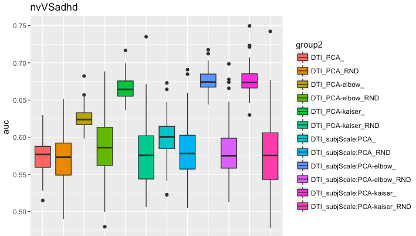

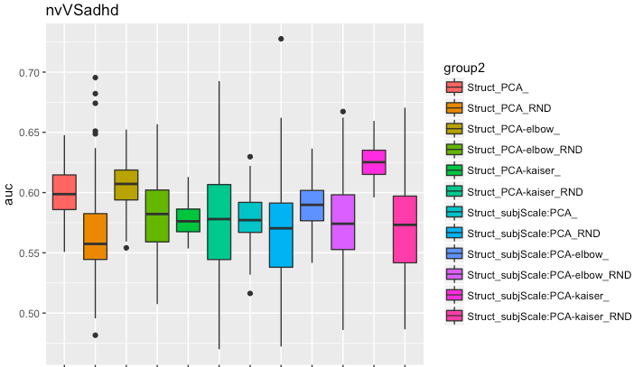


It looks like subjScale does help PCA, especially when we threshold how many PCS to use. Kaiser seems to be better, but elbow (after subjScale) is fine too. That's more pronounced in DTI, but it's also there for struct. But like before, it doesn't look like there are any meaningful interactions among datasets, and subjScale doesn't do as well when combining datasets.

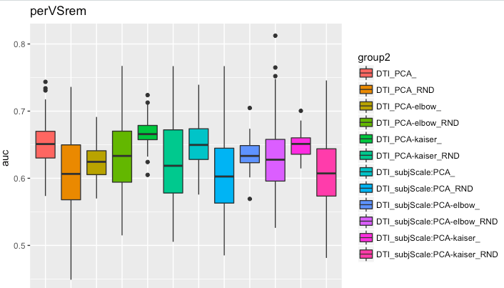


There is an interesting result for perVSrem in struct, but I'm not sure how special it is compired to no data transforms... worth checking for the main plot to send to Philip.

And also the clean fMRI tables transformed:

```bash
echo "target,pheno,var,seed,nfeat,model,auc,f1,acc,ratio" > dataTransformsFMRI_summary.csv;
dir=dataTransformsFMRI_rawCV;
for f in `ls -1 trash_${dir}/*o`; do
    phen=`head -n 2 $f | tail -1 | awk '{FS=" "; print $7}'`;
    phen2=`echo $phen | sed -e "s/,/::/g"`;
    target=`head -n 2 $f | tail -1 | awk '{FS=" "; print $9}'`;
    seed=`head -n 2 $f | tail -1 | awk '{FS=" "; print $11}'`;
    var=`head -n 2 $f | tail -1 | awk '{FS=" "; print $13}'`;
    model=`grep -A 1 model_id $f | tail -1 | awk '{FS=" "; print $2}' | cut -d"_" -f 1`;
    auc=`grep -A 1 model_id $f | tail -1 | awk '{FS=" "; print $3}'`;
    nfeat=`grep "Running model on" $f | awk '{FS=" "; print $5}'`;
    ratio=`grep -A 1 "Class distribution" $f | tail -1 | awk '{FS=" "; {for (i=2; i<=NF; i++) printf $i ";"}}'`;
    f1=`grep -A 2 "Maximum Metrics:" $f | tail -1 | awk '{FS=" "; print $5}'`;
    acc=`grep -A 5 "Maximum Metrics:" $f | tail -1 | awk '{FS=" "; print $5}'`;
    echo $target,$phen2,$var,$seed,$nfeat,$model,$auc,$f1,$acc,$ratio >> dataTransformsFMRI_summary.csv;
done;
sed -i -e "s/subjScale,dataScale/subjScale::dataScale/g" dataTransformsFMRI_summary.csv
```

```r
data = read.csv('~/tmp/dataTransformsFMRI_summary.csv')
data$pheno = gsub('/data/NCR_SBRB/baseline_prediction//', '', data$pheno)
data$group = ''
data[data$seed<0,]$group = 'RND'
data$group2 = sapply(1:nrow(data), function(x) { sprintf('%s_%s_%s_%s', data$pheno[x], data$var[x], data$model[x], data$group[x])} )
# then, for each target
idx = data$target=='nvVSper' & data$model=='DeepLearning'
p1<-ggplot(data[idx,], aes(x=group2, y=auc, fill=group2))
print(p1+geom_boxplot() + ggtitle(unique(data[idx,]$target)))
```

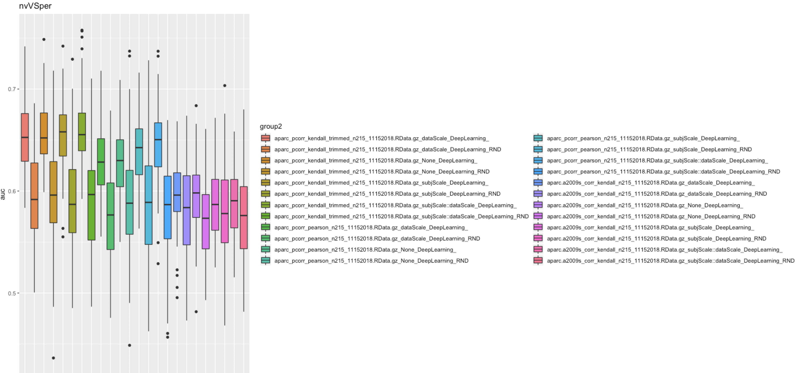

In DeepLEarning, aparc_pcorr_kendall_Trimmed does best, and better than its
random counterpat. 

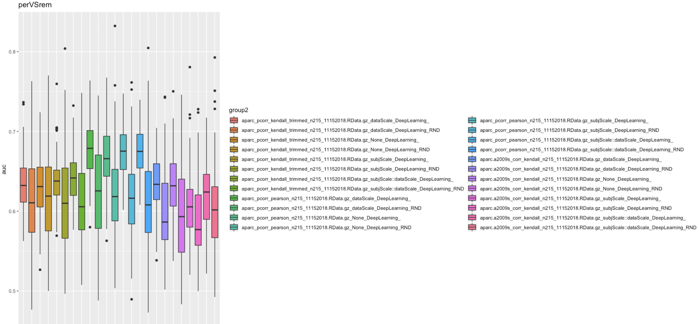

But for perVSrem, aparc_pcorr_pearson does a bit better, again better than its
random counterpart. Do we see the same pattern for GLM?

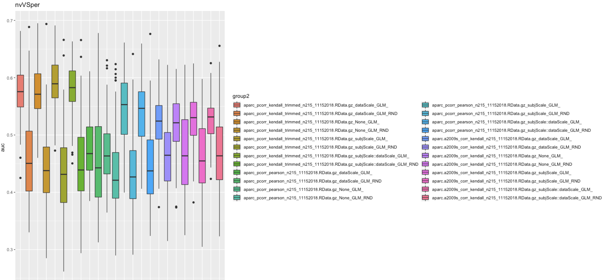

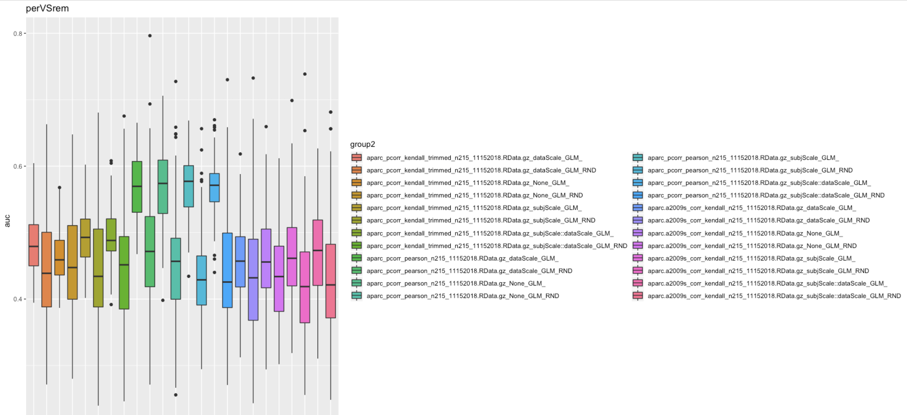


As usual, the GLM results are always significantly different than its random
counterpart, showing the power to overfit in DL. Still, its best results are not
better than what we see in DL.

# 2018-11-21 16:57:53

Based on our current results, it's worth running the PCA experiment in the best fMRI results:

```bash
job_name=dataTransformsfMRIPCA_rawCV;
mydir=/data/NCR_SBRB/baseline_prediction/;
swarm_file=swarm.automl_${job_name};
rm -rf $swarm_file;
for f in aparc_pcorr_kendall_trimmed_n215_11152018.RData.gz \
    aparc_pcorr_pearson_n215_11152018.RData.gz \
    aparc.a2009s_corr_kendall_n215_11152018.RData.gz \
    aparc_absDiff_pearson_n215_11202018.RData.gz; do
    for target in nvVSadhd perVSrem nvVSper; do
        for pp in PCA PCA-elbow PCA-kaiser \
            subjScale:PCA subjScale:PCA-elbow subjScale:PCA-kaiser; do
            algo=DeepLearning;
            for i in {1..100}; do
                myseed=$RANDOM;
                echo "Rscript --vanilla ~/research_code/automl/raw_multiDomain_autoValidation_oneAlgo.R ${mydir}/$f ${mydir}/long_clin_0918.csv ${target} ${mydir}/models_raw_dataTransforms/${USER} $myseed $algo $pp" >> $swarm_file;
                echo "Rscript --vanilla ~/research_code/automl/raw_multiDomain_autoValidation_oneAlgo.R ${mydir}/$f ${mydir}/long_clin_0918.csv ${target} ${mydir}/models_raw_dataTransforms/${USER} -$myseed $algo $pp" >> $swarm_file;
            done;
        done;
    done;
done
sed -i -e "s/^/unset http_proxy; /g" $swarm_file;
split -l 1000 $swarm_file ${job_name}_split;
for f in `/bin/ls ${job_name}_split??`; do
    echo "ERROR" > swarm_wait_${USER}
    while grep -q ERROR swarm_wait_${USER}; do
        echo "Trying $f"
        swarm -f $f -g 40 -t 16 --time 3:00:00 --partition norm --logdir trash_${job_name} --job-name ${job_name} -m R --gres=lscratch:10 2> swarm_wait_${USER};
        if grep -q ERROR swarm_wait_${USER}; then
            echo -e "\tError, sleeping..."
            sleep 10m;
        fi;
    done;
done
```

# 2018-11-23 10:24:45

Let's now compile them:

```bash
echo "target,pheno,var,seed,nfeat,model,auc,f1,acc,ratio" > dataTransformsFMRIPCA_summary.csv;
dir=dataTransformsfMRIPCA_rawCV;
for f in `ls -1 trash_${dir}/*o`; do
    phen=`head -n 2 $f | tail -1 | awk '{FS=" "; print $7}'`;
    phen2=`echo $phen | sed -e "s/,/::/g"`;
    target=`head -n 2 $f | tail -1 | awk '{FS=" "; print $9}'`;
    seed=`head -n 2 $f | tail -1 | awk '{FS=" "; print $11}'`;
    var=`head -n 2 $f | tail -1 | awk '{FS=" "; print $13}'`;
    model=`grep -A 1 model_id $f | tail -1 | awk '{FS=" "; print $2}' | cut -d"_" -f 1`;
    auc=`grep -A 1 model_id $f | tail -1 | awk '{FS=" "; print $3}'`;
    nfeat=`grep "Running model on" $f | awk '{FS=" "; print $5}'`;
    ratio=`grep -A 1 "Class distribution" $f | tail -1 | awk '{FS=" "; {for (i=2; i<=NF; i++) printf $i ";"}}'`;
    f1=`grep -A 2 "Maximum Metrics:" $f | tail -1 | awk '{FS=" "; print $5}'`;
    acc=`grep -A 5 "Maximum Metrics:" $f | tail -1 | awk '{FS=" "; print $5}'`;
    echo $target,$phen2,$var,$seed,$nfeat,$model,$auc,$f1,$acc,$ratio >> dataTransformsFMRIPCA_summary.csv;
done;
sed -i -e "s/gz,dti/gz::dti/g" dataTransformsFMRIPCA_summary.csv
```

```r
data = read.csv('~/tmp/dataTransformsFMRIPCA_summary.csv')
data$group = ''
data[data$seed<0,]$group = 'RND'
data$group2 = sapply(1:nrow(data), function(x) { sprintf('%s_%s_%s', data$phen[x], data$var[x], data$group[x])} )
idx = data$target=='nvVSadhd' & grepl(pattern = 'pearson', data$group2)
p1<-ggplot(data[idx,], aes(x=group2, y=auc, fill=group2))
print(p1+geom_boxplot() + ggtitle(unique(data[idx,]$target)))
```

Let's break it up into the two methods that worked best, just so the barplots
are more manageable:


aparc_pcorr_kendal_trimmed with PCA-elbow is by far the best transform at .725
AUC for nvVSadhd, but we still need to compare with the non-transformed data. 


For perVSrem, it is not as clear-cut, but aparc_pcorr_pearson_with PCA-kaiser
seems to be doing best, at .71 AUC. 