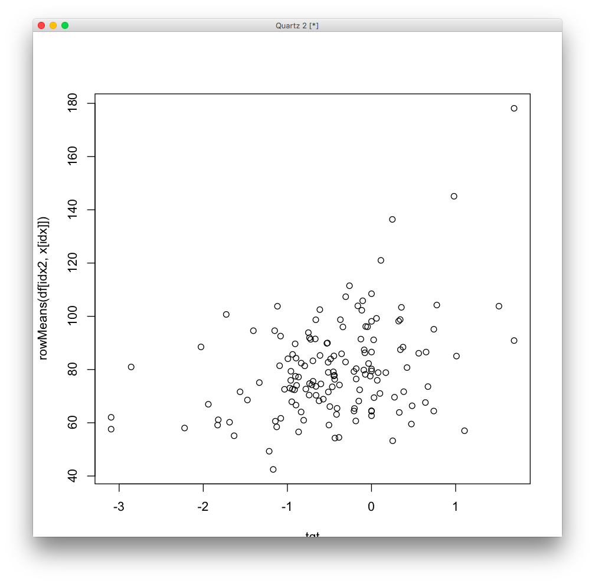
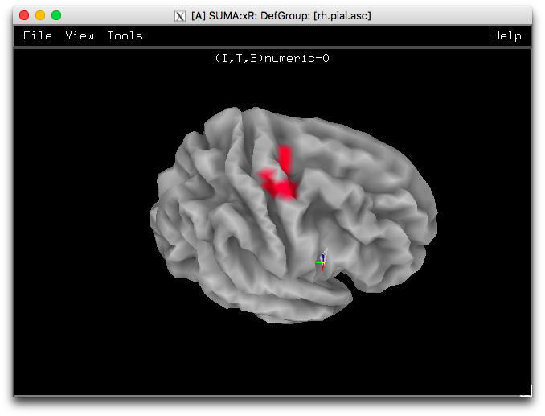
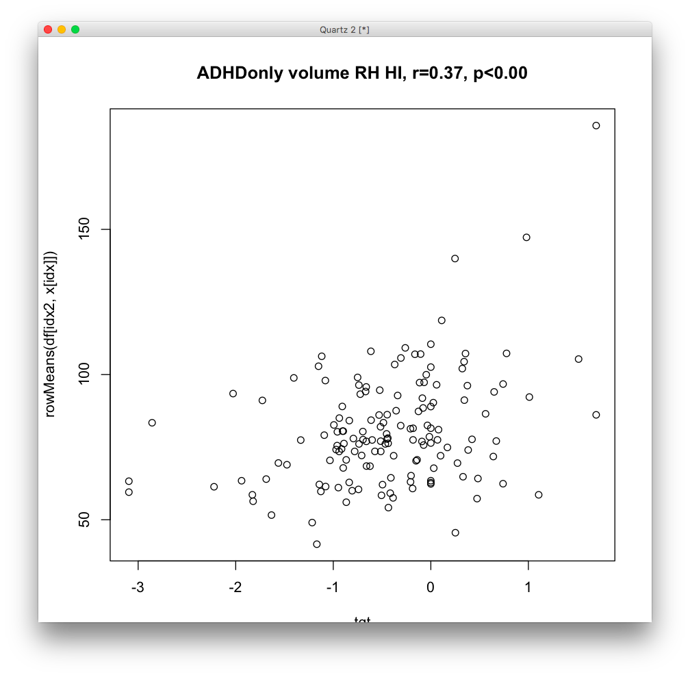
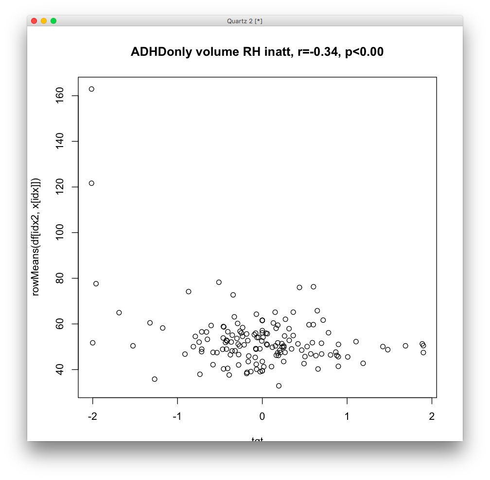
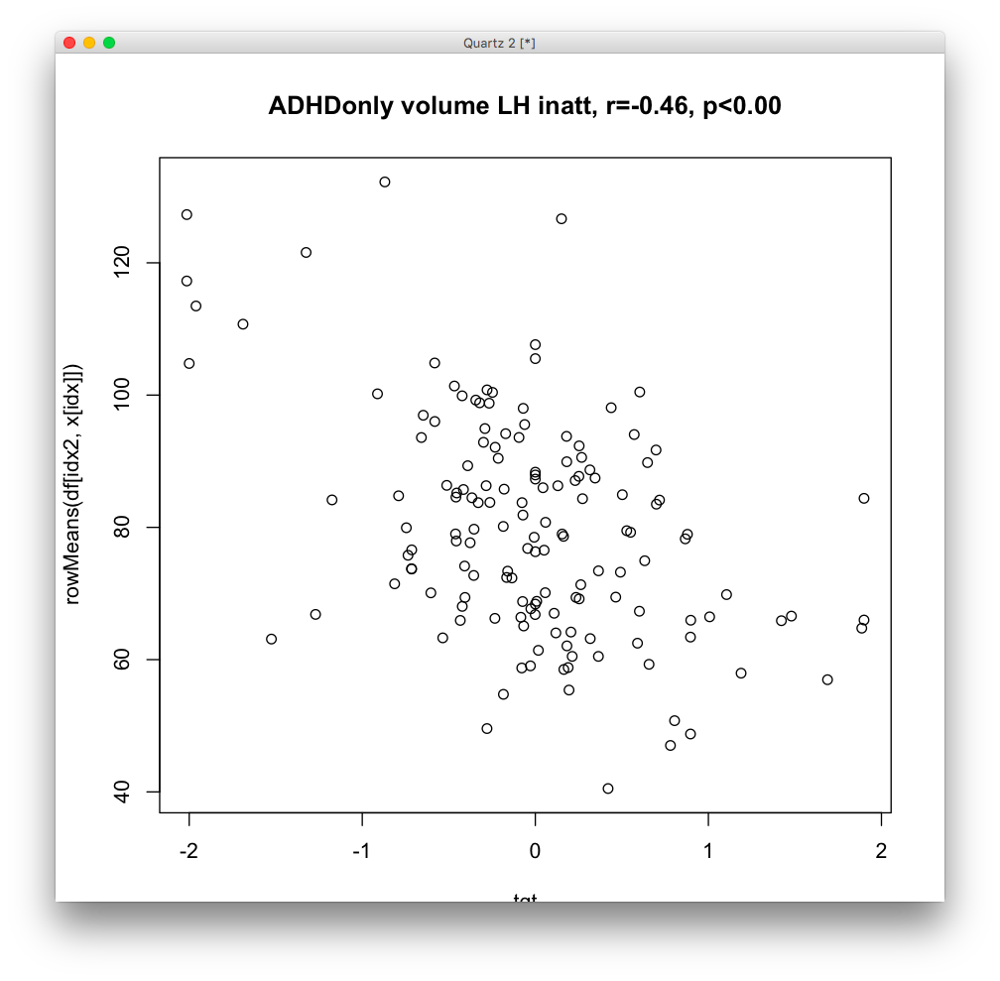
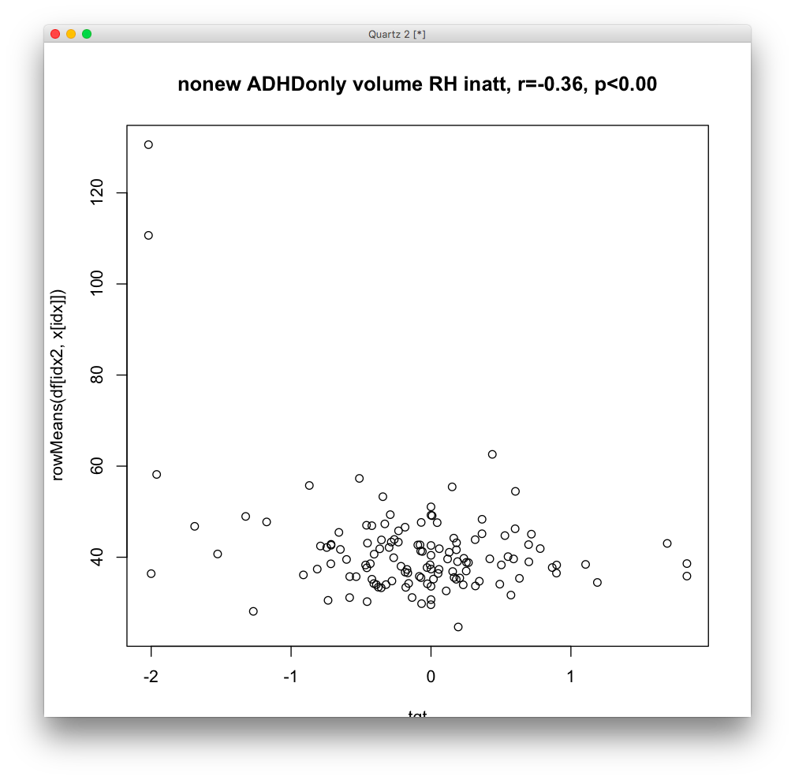

# 2018-11-29 16:03:41

Let's take a turn to run a simply descriptives analysis on these data. The
approach will be to look for regions or variables that are good for DX, inatt
and HI using the entire dataset. Let's employ the traditional ways for multiple
comparisons correction. Then, we take the good results and test them for
associations with outcome, slopes, and latent classes.

Regardless of yay or nay with that analysis, we can look for the last 3
assocations in the entire brain as well, just to see if variables not associated
with baseline status can be changing in outcome.

Finally, we can show our current ML results to test if non-linear relationships
on the data make life better. 

The final step, if any of these tests work on outcome, will be to use it to
predict a test set. That test set could be just the people Wendy is compiling,
or we could also reduce our initial set until right before the results
disappear, and use the remaining ones as testing. Not really an order there. We
could go chronologically, if it makes life simpler. Kinda like mimicing what
we're trying to do now with the phone interviews.

## DTI

Let's start with DTI, which is the most straight-forward one. But for all
neuroimaging analysis, we should probably decide if we're using 3dClustSim, or
going with a permutation analysis... let's do 3dClustSim for now, as we want to
stay open to new results and permutations might end up quite strict especially
in the unbalanced groups.

http://blog.cogneurostats.com/2013/03/08/correlating-brain-and-behavior-in-afni/

http://blog.cogneurostats.com/2016/10/26/performing-brain-behavior-correlations-with-3dttest/

https://afni.nimh.nih.gov/pub/dist/edu/latest/afni_handouts/Clusters_2017.pdf

https://afni.nimh.nih.gov/pub/dist/doc/program_help/3dttest++.html

Note from links above that it looks like 3dtest++ still has issues with
computing significant clusters for covariates (i.e. brain-behavior
correlations)...

Humpf, OK, let's just code it in R, and have it generate the results using
permuted data. This way we know exactly what it's doing... 

Also, might be a good idea to try the data transforms here as well, just to see
what we get.

# 2018-11-30 12:30:12

Now that we have functions to run at least the DTI, let's swarm it in the
cluster.

```bash
job_name=dti;
mydir=/data/NCR_SBRB/baseline_prediction/;
swarm_file=swarm.desc_${job_name};
rm -rf $swarm_file;
for f in `/bin/ls dti_??_voxelwise_n2??_09212018.RData.gz`; do
    for target in nvVSadhd SX_inatt_baseline SX_HI_baseline \
        ADHDonly_SX_inatt_baseline ADHDonly_SX_HI_baseline; do
        for pp in None subjScale log subjScale-log; do
            echo "Rscript --vanilla ~/research_code/baseline_prediction/descriptives/dti.R ${mydir}/${f} ${mydir}/long_clin_11302018.csv ${target} 42 $pp" >> $swarm_file;
            for i in {1..250}; do
                echo "Rscript --vanilla ~/research_code/baseline_prediction/descriptives/dti.R ${mydir}/${f} ${mydir}/long_clin_11302018.csv ${target} -${RANDOM} $pp" >> $swarm_file;
            done;
        done;
    done;
done
split -l 3000 $swarm_file ${job_name}_split;
for f in `/bin/ls ${job_name}_split??`; do
    echo "ERROR" > swarm_wait_${USER}
    while grep -q ERROR swarm_wait_${USER}; do
        echo "Trying $f"
        swarm -f $f -g 4 -t 2 --time 30:00 --partition quick --logdir trash_desc_${job_name} --job-name ${job_name} -m R,afni 2> swarm_wait_${USER};
        if grep -q ERROR swarm_wait_${USER}; then
            echo -e "\tError, sleeping..."
            sleep 10m;
        fi;
    done;
done
```

The structural analysis follows the same idea as the DTI analysis, except that
we call a different script because it needs to use SurfClust:

```bash
job_name=struct;
mydir=/data/NCR_SBRB/baseline_prediction/;
swarm_file=swarm.desc_${job_name};
rm -rf $swarm_file;
for f in `/bin/ls struct_*_11142018_260timeDiff12mo.RData.gz`; do
    for target in nvVSadhd SX_inatt_baseline SX_HI_baseline \
        ADHDonly_SX_inatt_baseline ADHDonly_SX_HI_baseline; do
        for pp in None subjScale log subjScale-log; do
            echo "Rscript --vanilla ~/research_code/baseline_prediction/descriptives/structural.R ${mydir}/${f} ${mydir}/long_clin_11302018.csv ${target} 42 $pp" >> $swarm_file;
            for i in {1..250}; do
                echo "Rscript --vanilla ~/research_code/baseline_prediction/descriptives/structural.R ${mydir}/${f} ${mydir}/long_clin_11302018.csv ${target} -${RANDOM} $pp" >> $swarm_file;
            done;
        done;
    done;
done
split -l 3000 $swarm_file ${job_name}_split;
for f in `/bin/ls ${job_name}_split??`; do
    echo "ERROR" > swarm_wait_${USER}
    while grep -q ERROR swarm_wait_${USER}; do
        echo "Trying $f"
        swarm -f $f -g 4 -t 2 --time 30:00 --partition norm --logdir trash_desc_${job_name} --job-name ${job_name} -m R,afni --gres=lscratch:2 2> swarm_wait_${USER};
        if grep -q ERROR swarm_wait_${USER}; then
            echo -e "\tError, sleeping..."
            sleep 10m;
        fi;
    done;
done
```

Note that we need lscratch here because read.xls uses it to convert the file to
csv!

For fMRI it's very similar, except that we can play with the MELODIC outputs
here, since we're doing a straight-up neuroimaging clustering analysis. Note
that we'll need bigger machines too, and more time, as the fmri voxelwise data
is much bigger.

Finally, I created a generic function to run all the crappy domains, and also
some of the fMRI transformations. I might need to expand that generic script for
fMRI though, if I want to include movement in the covariates.

So, while we wait for some stuff to run, we can go ahead and grab the top 5
clusters of each result:

```bash
myfile=dti_descriptives.txt
rm $myfile; touch $myfile;
for f in `/bin/ls /data/NCR_SBRB/tmp/dti_??_voxelwise_n2??_09212018/*_42_clusters.txt`; do
    echo $f >> $myfile;
    grep -v \# $f | head -n 5 >> $myfile;
done
```

So, some things that are good to know from these preliminary results. There's no
difference between None and log results. And it looks like there are some good
results, at least based on number of voxels. But we need to see what's actually
significant, and for that we need to wait for the random runs to finish
running...

```bash
/bin/ls -1 /data/NCR_SBRB/tmp/dti_??_voxelwise_n2??_09212018/*_42_clusters.txt > result_files.txt;
for root_file in `cat result_files.txt | sed -e 's/_42_clusters.txt//g'`; do
    collect_name=${root_file}_top_rnd_clusters.txt;
    echo $collect_name;
    if [ -e $collect_name ]; then
        rm $collect_name;
    fi;
    for f in `ls ${root_file}*rnd*clusters.txt`; do
        grep -v \# $f | head -n 1 >> $collect_name;
    done
done
tar -zcvf dti_top_rnd_clusters.tar.gz dti_??_voxelwise_n2??_09212018/*top_rnd_clusters.txt
```

Now we can just write something in R to compute the p-value for each of the
clusters in the descriptives file from above.

# 2018-12-03 10:26:58

```r
res_fname = '~/tmp/dti_descriptives.txt'
out_file = '~/tmp/pvals.txt'
res_lines = readLines(res_fname)
for (line in res_lines) {
  # starting new file summary
  if (grepl(pattern='clusters', line)) {
    root_fname = strsplit(line, '/')[[1]]
    dir_name = root_fname[length(root_fname)-1]
    root_fname = strsplit(root_fname[length(root_fname)], '_')[[1]]
    root_fname = paste0(root_fname[1:(length(root_fname)-2)], sep='', collapse='_')
    rnd_fname = sprintf('~/tmp/%s/%s_top_rnd_clusters.txt', dir_name, root_fname)
    rnd_results = read.table(rnd_fname)[, 1]
    nperms = length(rnd_results)
    cat(sprintf('%s: %s (%d perms)\n', dir_name, root_fname, nperms),
        file=out_file, append=T)
  } 
  else {
    parsed = strsplit(line, ' +')
    clus_size = as.numeric(parsed[[1]][2])
    pval = sum(rnd_results >= clus_size) / nperms
    cat(sprintf('Cluster size: %d, p<%.3f', clus_size, pval),
        file=out_file, append=T)
    if (pval < .05) {
      cat(' *', file=out_file, append=T)
    }
    if (pval < .01) {
      cat('*', file=out_file, append=T)
    }
    cat('\n', file=out_file, append=T)
  }
}
```

This spits out a whole lot of result. Unfortunately, the only significant or close to nominal ones were (cropped for better reading):

```
dti_ad_voxelwise_n223_09212018: SX_inatt_baseline_subjScale (499 perms)
Cluster size: 43, p<0.026 *
dti_ad_voxelwise_n223_09212018: SX_inatt_baseline_subjScale-log (250 perms)
Cluster size: 41, p<0.020 *
dti_fa_voxelwise_n272_09212018: SX_HI_baseline_subjScale (499 perms)
Cluster size: 40, p<0.034 *
```

Say that result is good (particularly the AD result, which seems robust), then where is it? And, going with the current idea, does it correlate with outcome as well, or is it mostly related to baseline?

## structural

And we run the same thing for structural runs, except that some file names change, and we have to deal with LH and RH:

```bash
myfile=struct_descriptives.txt
rm $myfile; touch $myfile;
for f in `/bin/ls /data/NCR_SBRB/tmp/struct_*_11142018_260timeDiff12mo/*_42_?h_ClstTable_e1_a1.0.1D`; do
    if ! grep -q 'rnd' $f; then
        echo $f >> $myfile;
        grep -v \# $f | head -n 5 >> $myfile;
    fi
done
```

```bash
/bin/ls -1 /data/NCR_SBRB/tmp/struct_*_11142018_260timeDiff12mo/*_42_?h_ClstTable_e1_a1.0.1D | grep -v rnd > result_files.txt;
sed -i -e 's/_42_lh_ClstTable_e1_a1.0.1D//g' result_files.txt;
sed -i -e 's/_42_rh_ClstTable_e1_a1.0.1D//g' result_files.txt;
for root_file in `cat result_files.txt`; do
    collect_name_lh=${root_file}_lh_top_rnd_clusters.txt;
    collect_name_rh=${root_file}_rh_top_rnd_clusters.txt;
    echo $collect_name_lh;
    echo $collect_name_rh;
    if [ -e $collect_name_lh ]; then
        rm $collect_name_lh $collect_name_rh;
    fi;
    for f in `ls ${root_file}_rnd*lh_ClstTable_e1_a1.0.1D`; do
        grep -v \# $f | head -n 1 >> $collect_name_lh;
    done
    for f in `ls ${root_file}_rnd*rh_ClstTable_e1_a1.0.1D`; do
        grep -v \# $f | head -n 1 >> $collect_name_rh;
    done
done
tar -zcvf struct_top_rnd_clusters.tar.gz struct_*_11142018_260timeDiff12mo/*top_rnd_clusters.txt
```

And finally, in R:

```r
res_fname = '~/tmp/struct_descriptives.txt'
res_lines = readLines(res_fname)
for (line in res_lines) {
  # starting new file summary
  if (grepl(pattern='data', line)) {
    root_fname = strsplit(line, '/')[[1]]
    dir_name = root_fname[length(root_fname)-1]
    root_fname = strsplit(root_fname[length(root_fname)], '_')[[1]]
    root_fname = paste0(root_fname[1:(length(root_fname)-5)], sep='', collapse='_')
    if (grepl(pattern='lh', line)) {
      rnd_fname = sprintf('~/tmp/%s/%s_lh_top_rnd_clusters.txt', dir_name, root_fname)
    } else {
      rnd_fname = sprintf('~/tmp/%s/%s_rh_top_rnd_clusters.txt', dir_name, root_fname)
    }
    rnd_results = read.table(rnd_fname)[, 3]
    nperms = length(rnd_results)
    if (grepl(pattern='lh', line)) {
      cat(sprintf('%s (LH): %s (%d perms)\n', dir_name, root_fname, nperms))
    } else {
      cat(sprintf('%s (RH): %s (%d perms)\n', dir_name, root_fname, nperms))
    }
  } 
  else {
    parsed = strsplit(line, ' +')
    clus_size = as.numeric(parsed[[1]][4])
    pval = sum(rnd_results >= clus_size) / nperms
    cat(sprintf('Cluster size: %.2f, p<%.3f', clus_size, pval))
    if (pval < .05) {
      cat(' *')
    }
    if (pval < .01) {
      cat('*')
    }
    cat('\n')
  }
}
```

We get these results:

```
struct_area_11142018_260timeDiff12mo (LH): nvVSadhd_log (248 perms)
Cluster size: 1303.41, p<0.008 **
struct_area_11142018_260timeDiff12mo (RH): nvVSadhd_log (248 perms)
Cluster size: 1632.22, p<0.012 *
struct_area_11142018_260timeDiff12mo (LH): nvVSadhd_None (250 perms)
Cluster size: 1279.53, p<0.040 *
struct_area_11142018_260timeDiff12mo (RH): nvVSadhd_None (250 perms)
Cluster size: 1727.71, p<0.024 *
struct_area_11142018_260timeDiff12mo (LH): SX_HI_baseline_log (247 perms)
Cluster size: 1939.40, p<0.004 **
Cluster size: 1215.41, p<0.020 *
Cluster size: 1091.86, p<0.036 *
struct_area_11142018_260timeDiff12mo (RH): SX_HI_baseline_log (247 perms)
Cluster size: 2534.08, p<0.000 **
Cluster size: 1458.02, p<0.012 *
Cluster size: 1068.31, p<0.045 *
struct_area_11142018_260timeDiff12mo (LH): SX_HI_baseline_None (248 perms)
Cluster size: 1827.40, p<0.000 **
Cluster size: 1249.68, p<0.012 *
Cluster size: 1074.18, p<0.036 *
struct_area_11142018_260timeDiff12mo (RH): SX_HI_baseline_None (248 perms)
Cluster size: 2754.37, p<0.004 **
Cluster size: 1510.89, p<0.012 *
struct_area_11142018_260timeDiff12mo (LH): SX_inatt_baseline_log (249 perms)
Cluster size: 1058.70, p<0.040 *
struct_area_11142018_260timeDiff12mo (LH): SX_inatt_baseline_None (249 perms)
Cluster size: 1273.39, p<0.032 *
struct_thickness_11142018_260timeDiff12mo (RH): ADHDonly_SX_inatt_baseline_log (250 perms)
Cluster size: 311.79, p<0.004 **
struct_thickness_11142018_260timeDiff12mo (RH): ADHDonly_SX_inatt_baseline_None (249 perms)
Cluster size: 311.79, p<0.016 *
struct_volume_11142018_260timeDiff12mo (LH): ADHDonly_SX_HI_baseline_log (249 perms)
Cluster size: 326.75, p<0.024 *
struct_volume_11142018_260timeDiff12mo (LH): nvVSadhd_log (250 perms)
Cluster size: 552.79, p<0.012 *
struct_volume_11142018_260timeDiff12mo (RH): nvVSadhd_log (250 perms)
Cluster size: 842.26, p<0.000 **
struct_volume_11142018_260timeDiff12mo (LH): nvVSadhd_None (250 perms)
Cluster size: 728.74, p<0.008 **
struct_volume_11142018_260timeDiff12mo (RH): nvVSadhd_None (250 perms)
Cluster size: 861.03, p<0.012 *
struct_volume_11142018_260timeDiff12mo (LH): SX_HI_baseline_log (246 perms)
Cluster size: 506.76, p<0.028 *
struct_volume_11142018_260timeDiff12mo (RH): SX_HI_baseline_log (246 perms)
Cluster size: 844.02, p<0.008 **
struct_volume_11142018_260timeDiff12mo (LH): SX_HI_baseline_None (250 perms)
Cluster size: 506.76, p<0.036 *
struct_volume_11142018_260timeDiff12mo (RH): SX_HI_baseline_None (250 perms)
Cluster size: 937.94, p<0.004 **
```

We have lots of results, but they're mostly showing that baseline and log don't differ much, as we had noticed before. It also looks like the cluster sizes with no transformation are a bit bigger, regardless of cluster significance, so let's go with that.

Like DTI, we still need to plot those results to see if they are in neat regions.

## fmri

It might be faster if I run permutations only for the results with big clusters... just to save some time. I'll do that starting with fMRI.

```bash
job_name=melodic;
mydir=/data/NCR_SBRB/baseline_prediction/;
swarm_file=swarm.desc_${job_name};
rm -rf $swarm_file;
for f in `/bin/ls melodic_*_IC*_09212018.RData.gz`; do
    for target in nvVSadhd SX_inatt_baseline SX_HI_baseline \
        ADHDonly_SX_inatt_baseline ADHDonly_SX_HI_baseline; do
        for pp in None subjScale log subjScale-log; do
            echo "Rscript --vanilla ~/research_code/baseline_prediction/descriptives/melodic.R ${mydir}/${f} ${mydir}/long_clin_11302018.csv ${target} 42 $pp" >> $swarm_file;
        done;
    done;
done
swarm -f $swarm_file -g 20 -t 2 --time 5:00:00 --partition norm --logdir trash_desc_${job_name} --job-name ${job_name} -m R,afni --gres=lscratch:2
```

# Whole brain outcome


Before I test the results on outcome, let's see if any regions in the whole brain analysis also work for outcome. I'm gonna skip the latent class groups for now because they not only involve the entire dataset, but also would involve extra coding in our functions. I can play with them later.

```bash
job_name=dtiOutcome;
mydir=/data/NCR_SBRB/baseline_prediction/;
swarm_file=swarm.desc_${job_name};
rm -rf $swarm_file;
for f in `/bin/ls dti_??_voxelwise_n2??_09212018.RData.gz`; do
    for nn in nonew_ ''; do
        for g in ADHDonly_ ''; do
            for pp in None subjScale; do
                for t in perVSrem nvVSper nvVSrem \
                    OLS_inatt_slope OLS_HI_slope OLS_total_slope; do
                    echo "Rscript --vanilla ~/research_code/baseline_prediction/descriptives/dti.R ${mydir}/${f} ${mydir}/long_clin_11302018.csv ${nn}${g}${t} 42 $pp" >> $swarm_file;
                done;
                for sx in inatt HI total; do
                    for t in nvVSimp nvVSnonimp impVSnonimp; do
                        echo "Rscript --vanilla ~/research_code/baseline_prediction/descriptives/dti.R ${mydir}/${f} ${mydir}/long_clin_11302018.csv ${nn}${g}${t}groupOLS_${sx}_slope_${t} 42 $pp" >> $swarm_file;
                    done;
                done;
            done;
        done;
    done;
done
swarm -f $swarm_file -g 4 -t 2 --time 30:00 --partition norm --logdir trash_desc_${job_name} --job-name ${job_name} -m R,afni --gres=lscratch:2
```

And let's also run structural:

```bash
job_name=structOutcome;
mydir=/data/NCR_SBRB/baseline_prediction/;
swarm_file=swarm.desc_${job_name};
rm -rf $swarm_file;
for f in `/bin/ls struct_*_11142018_260timeDiff12mo.RData.gz`; do
    for nn in nonew_ ''; do
        for g in ADHDonly_ ''; do
            for pp in None subjScale; do
                for t in perVSrem nvVSper nvVSrem \
                    OLS_inatt_slope OLS_HI_slope OLS_total_slope; do
                    echo "Rscript --vanilla ~/research_code/baseline_prediction/descriptives/structural.R ${mydir}/${f} ${mydir}/long_clin_11302018.csv ${nn}${g}${t} 42 $pp" >> $swarm_file;
                done;
                for sx in inatt HI total; do
                    for t in nvVSimp nvVSnonimp impVSnonimp; do
                        echo "Rscript --vanilla ~/research_code/baseline_prediction/descriptives/structural.R ${mydir}/${f} ${mydir}/long_clin_11302018.csv ${nn}${g}groupOLS_${sx}_slope_${t} 42 $pp" >> $swarm_file;
                    done;
                done;
            done;
        done;
    done;
done;
swarm -f $swarm_file -g 4 -t 2 --time 30:00 --partition norm --logdir trash_desc_${job_name} --job-name ${job_name} -m R,afni --gres=lscratch:2
```

Let's collect the results:

```bash
myfile=dti_descriptives_outcome.txt
rm $myfile; touch $myfile;
for f in `/bin/ls \
    /data/NCR_SBRB/tmp/dti_??_voxelwise_n2??_09212018/*VS*_42_clusters.txt \
    /data/NCR_SBRB/tmp/dti_??_voxelwise_n2??_09212018/*OLS*_42_clusters.txt`; do
    echo $f >> $myfile;
    grep -v \# $f | head -n 5 >> $myfile;
done
```

Based on those results, we should run the random tests for several of them.

```bash
job_name=dtiOutcome;
mydir=/data/NCR_SBRB/baseline_prediction/;
swarm_file=swarm.desc_${job_name};
rm -rf $swarm_file;
for f in `/bin/ls dti_??_voxelwise_n2??_09212018.RData.gz`; do
    for nn in nonew_ ''; do
        for pp in None subjScale; do
            for t in perVSrem nvVSper nvVSrem \
                OLS_inatt_slope OLS_HI_slope OLS_total_slope; do
                for i in {1..250}; do
                    echo "Rscript --vanilla ~/research_code/baseline_prediction/descriptives/dti.R ${mydir}/${f} ${mydir}/long_clin_11302018.csv ${nn}${t} -${RANDOM} $pp" >> $swarm_file;
                done;
            done;
            for t in perVSrem OLS_inatt_slope OLS_HI_slope OLS_total_slope; do
                for i in {1..250}; do
                    echo "Rscript --vanilla ~/research_code/baseline_prediction/descriptives/dti.R ${mydir}/${f} ${mydir}/long_clin_11302018.csv ${nn}ADHDonly_${t} -${RANDOM} $pp" >> $swarm_file;
                done;
            done;
        done;
    done;
done
split -l 3000 $swarm_file ${job_name}_split;
for f in `/bin/ls ${job_name}_split??`; do
    echo "ERROR" > swarm_wait_${USER}
    while grep -q ERROR swarm_wait_${USER}; do
        echo "Trying $f"
        swarm -f $f -g 4 -t 2 --time 30:00 --partition quick --logdir trash_desc_${job_name} --job-name ${job_name} -m R,afni 2> swarm_wait_${USER};
        if grep -q ERROR swarm_wait_${USER}; then
            echo -e "\tError, sleeping..."
            sleep 10m;
        fi;
    done;
done
```

And how did structural look?

```bash
myfile=struct_descriptives_outcome.txt
rm $myfile; touch $myfile;
for f in `/bin/ls /data/NCR_SBRB/tmp/struct_*_11142018_260timeDiff12mo/*VS*_42_?h_ClstTable_e1_a1.0.1D \
    /data/NCR_SBRB/tmp/struct_*_11142018_260timeDiff12mo/*OLS*_42_?h_ClstTable_e1_a1.0.1D`; do
    if ! grep -q 'rnd' $f; then
        echo $f >> $myfile;
        grep -v \# $f | head -n 5 >> $myfile;
    fi
done
```

Well, things are certainly clustering, but it's hard to tell if the sizes will be significant. Let's run the perms then.

```bash
job_name=structOutcome;
mydir=/data/NCR_SBRB/baseline_prediction/;
swarm_file=swarm.desc_${job_name};
rm -rf $swarm_file;
for f in `/bin/ls struct_*_11142018_260timeDiff12mo.RData.gz`; do
    for nn in nonew_ ''; do
        for pp in None subjScale; do
            for t in perVSrem nvVSper nvVSrem \
                OLS_inatt_slope OLS_HI_slope OLS_total_slope; do
                for i in {1..250}; do
                    echo "Rscript --vanilla ~/research_code/baseline_prediction/descriptives/structural.R ${mydir}/${f} ${mydir}/long_clin_11302018.csv ${nn}${t} -${RANDOM} $pp" >> $swarm_file;
                done;
            done;
            for t in perVSrem OLS_inatt_slope OLS_HI_slope OLS_total_slope; do
                for i in {1..250}; do
                    echo "Rscript --vanilla ~/research_code/baseline_prediction/descriptives/structural.R ${mydir}/${f} ${mydir}/long_clin_11302018.csv ${nn}ADHDonly_${t} -${RANDOM} $pp" >> $swarm_file;
                done;
            done;
        done;
    done;
done
split -l 3000 $swarm_file ${job_name}_split;
for f in `/bin/ls ${job_name}_split??`; do
    echo "ERROR" > swarm_wait_${USER}
    while grep -q ERROR swarm_wait_${USER}; do
        echo "Trying $f"
        swarm -f $f -g 4 -t 2 --time 30:00 --partition quick --logdir trash_desc_${job_name} --job-name ${job_name} -m R,afni 2> swarm_wait_${USER};
        if grep -q ERROR swarm_wait_${USER}; then
            echo -e "\tError, sleeping..."
            sleep 10m;
        fi;
    done;
done
```

**NOTE THAT I DIDN'T RUN THE IMPVSNONIMP BINARY TESTS FOR PERMUTATIONS, MOSTLY BECAUSE I'M NOT SURE IF IT WORKE FOR DTI. BUT IT THE OTHER RESULTS DON'T LOOK GOOD, I SHOULD RUN THOSE TOO**

OK, while those are running, let's investigate the MELODIC results. It doesn't look like the union mask results finished running, which is a shame. I'll have to increase the time and run those separately if nothing comes out of the intersection and fancy masks.

```bash
myfile=melodic_descriptives.txt
rm $myfile; touch $myfile;
for f in `/bin/ls /data/NCR_SBRB/tmp/melodic_*_IC*_09212018/*_42_clusters.txt`; do
    echo $f >> $myfile;
    grep -v \# $f | head -n 5 >> $myfile;
done
```

Well, there are many big clusters, but it's hard to get an idea of what random looks like. So, let's run the random ones, but not include the union ICs. If nothing comes out of this, we can run union and also its respective randomizations:

```bash
job_name=melodic;
mydir=/data/NCR_SBRB/baseline_prediction/;
swarm_file=swarm.desc_${job_name};
rm -rf $swarm_file;
for f in `/bin/ls melodic_*_IC*_09212018.RData.gz`; do
    for target in nvVSadhd SX_inatt_baseline SX_HI_baseline \
        ADHDonly_SX_inatt_baseline ADHDonly_SX_HI_baseline; do
        for pp in None subjScale; do
            for i in {1..250}; do
                echo "Rscript --vanilla ~/research_code/baseline_prediction/descriptives/melodic.R ${mydir}/${f} ${mydir}/long_clin_11302018.csv ${target} -${RANDOM} $pp" >> $swarm_file;
            done;
        done;
    done;
done
grep -v union $swarm_file > ${swarm_file}2;
split -l 3000 ${swarm_file}2 ${job_name}_split;
for f in `/bin/ls ${job_name}_split??`; do
    echo "ERROR" > swarm_wait_${USER}
    while grep -q ERROR swarm_wait_${USER}; do
        echo "Trying $f"
        swarm -f $f -g 5 -t 2 --time 5:00:00 --partition norm --logdir trash_desc_${job_name} --job-name ${job_name} -m R,afni --gres=lscratch:2 2> swarm_wait_${USER};
        if grep -q ERROR swarm_wait_${USER}; then
            echo -e "\tError, sleeping..."
            sleep 10m;
        fi;
    done;
done
```

# 2018-12-04 10:44:24

Let's compute p-values for the outcome results in DTI:


```bash
/bin/ls -1 /data/NCR_SBRB/tmp/dti_??_voxelwise_n2??_09212018/*VS*_42_clusters.txt \
    /data/NCR_SBRB/tmp/dti_??_voxelwise_n2??_09212018/*OLS*_42_clusters.txt > result_files.txt;
for root_file in `cat result_files.txt | sed -e 's/_42_clusters.txt//g'`; do
    collect_name=${root_file}_top_rnd_clusters.txt;
    echo $collect_name;
    if [ -e $collect_name ]; then
        rm $collect_name;
    fi;
    for f in `ls ${root_file}*rnd*clusters.txt`; do
        grep -v \# $f | head -n 1 >> $collect_name;
    done
done
tar -zcvf dti_top_rnd_clusters.tar.gz dti_??_voxelwise_n2??_09212018/*top_rnd_clusters.txt
```

Now we can just write something in R to compute the p-value for each of the
clusters in the descriptives file from above.

```r
res_fname = '~/tmp/dti_descriptives_outcome.txt'
out_file = '~/tmp/pvals.txt'
res_lines = readLines(res_fname)
for (line in res_lines) {
  # starting new file summary
  if (grepl(pattern='clusters', line)) {
    root_fname = strsplit(line, '/')[[1]]
    dir_name = root_fname[length(root_fname)-1]
    root_fname = strsplit(root_fname[length(root_fname)], '_')[[1]]
    root_fname = paste0(root_fname[1:(length(root_fname)-2)], sep='', collapse='_')
    rnd_fname = sprintf('~/tmp/%s/%s_top_rnd_clusters.txt', dir_name, root_fname)
    if (file.exists(rnd_fname)) {
        rnd_results = read.table(rnd_fname)[, 1]
        nperms = length(rnd_results)
    } else {
        rnd_results = NA
        nperms = NA
    }
    cat(sprintf('%s: %s (%d perms)\n', dir_name, root_fname, nperms),
        file=out_file, append=T)
  } 
  else {
    parsed = strsplit(line, ' +')
    clus_size = as.numeric(parsed[[1]][2])
    pval = sum(rnd_results >= clus_size) / nperms
    cat(sprintf('Cluster size: %d, p<%.3f', clus_size, pval),
        file=out_file, append=T)
    if (pval < .05) {
      cat(' *', file=out_file, append=T)
    }
    if (pval < .01) {
      cat('*', file=out_file, append=T)
    }
    cat('\n', file=out_file, append=T)
  }
}
```

And there are some results as well:

```bash
sudregp@HG-02070684-DM2:~$ grep -B 1 "*" tmp/pvals.txt 
dti_ad_voxelwise_n272_09212018: nonew_ADHDonly_OLS_inatt_slope_None (249 perms)
Cluster size: 33, p<0.040 *
--
dti_ad_voxelwise_n272_09212018: nonew_ADHDonly_OLS_inatt_slope_subjScale (248 perms)
Cluster size: 27, p<0.048 *
--
dti_ad_voxelwise_n272_09212018: OLS_inatt_slope_None (250 perms)
Cluster size: 44, p<0.044 *
--
dti_fa_voxelwise_n223_09212018: ADHDonly_OLS_inatt_slope_subjScale (249 perms)
Cluster size: 32, p<0.044 *
--
dti_fa_voxelwise_n272_09212018: nonew_nvVSper_subjScale (250 perms)
Cluster size: 44, p<0.036 *
--
dti_fa_voxelwise_n272_09212018: nvVSper_subjScale (250 perms)
Cluster size: 51, p<0.024 *
--
dti_rd_voxelwise_n272_09212018: nonew_OLS_HI_slope_None (249 perms)
Cluster size: 75, p<0.004 **
--
dti_rd_voxelwise_n272_09212018: nonew_OLS_inatt_slope_None (250 perms)
Cluster size: 49, p<0.044 *
--
dti_rd_voxelwise_n272_09212018: OLS_HI_slope_None (250 perms)
Cluster size: 79, p<0.012 *
```

Sure, we'll need to run more permutations, and many of these won't survive if we
correct across modalities. Still, somewhat cool that we have some results!

But do note that most of the results use the 272 dataset, which might be saying
something about the number of subjects we need to actually see osme result here.

But let's do something similar for structural:

```bash
/bin/ls -1 /data/NCR_SBRB/tmp/struct_*_11142018_260timeDiff12mo/*VS*_42_?h_ClstTable_e1_a1.0.1D \
    /data/NCR_SBRB/tmp/struct_*_11142018_260timeDiff12mo/*OLS*_42_?h_ClstTable_e1_a1.0.1D | grep -v rnd > result_files.txt;
sed -i -e 's/_42_lh_ClstTable_e1_a1.0.1D//g' result_files.txt;
sed -i -e 's/_42_rh_ClstTable_e1_a1.0.1D//g' result_files.txt;
for root_file in `cat result_files.txt`; do
    collect_name_lh=${root_file}_lh_top_rnd_clusters.txt;
    collect_name_rh=${root_file}_rh_top_rnd_clusters.txt;
    echo $collect_name_lh;
    echo $collect_name_rh;
    if [ -e $collect_name_lh ]; then
        rm $collect_name_lh $collect_name_rh;
    fi;
    for f in `ls ${root_file}_rnd*lh_ClstTable_e1_a1.0.1D`; do
        grep -v \# $f | head -n 1 >> $collect_name_lh;
    done
    for f in `ls ${root_file}_rnd*rh_ClstTable_e1_a1.0.1D`; do
        grep -v \# $f | head -n 1 >> $collect_name_rh;
    done
done
tar -zcvf struct_top_rnd_clusters.tar.gz struct_*_11142018_260timeDiff12mo/*top_rnd_clusters.txt
```

And finally, in R:

```r
res_fname = '~/tmp/struct_descriptives_outcome.txt'
out_file = '~/tmp/pvals.txt'
res_lines = readLines(res_fname)
for (line in res_lines) {
  # starting new file summary
  if (grepl(pattern='data', line)) {
    root_fname = strsplit(line, '/')[[1]]
    dir_name = root_fname[length(root_fname)-1]
    root_fname = strsplit(root_fname[length(root_fname)], '_')[[1]]
    root_fname = paste0(root_fname[1:(length(root_fname)-5)], sep='', collapse='_')
    if (grepl(pattern='lh', line)) {
      rnd_fname = sprintf('~/tmp/%s/%s_lh_top_rnd_clusters.txt', dir_name, root_fname)
    } else {
      rnd_fname = sprintf('~/tmp/%s/%s_rh_top_rnd_clusters.txt', dir_name, root_fname)
    }
    if (file.exists(rnd_fname)) {
        rnd_results = read.table(rnd_fname)[, 3]
        nperms = length(rnd_results)
    } else {
        rnd_results = NA
        nperms = NA
    }
    if (grepl(pattern='lh', line)) {
      cat(sprintf('%s (LH): %s (%d perms)\n', dir_name, root_fname, nperms),
          file=out_file, append=T)
    } else {
      cat(sprintf('%s (RH): %s (%d perms)\n', dir_name, root_fname, nperms),
          file=out_file, append=T)
    }
  } 
  else {
    parsed = strsplit(line, ' +')
    clus_size = as.numeric(parsed[[1]][4])
    pval = sum(rnd_results >= clus_size) / nperms
    cat(sprintf('Cluster size: %.2f, p<%.3f', clus_size, pval),
        file=out_file, append=T)
    if ( !is.na(pval) && pval < .05) {
      cat(' *', file=out_file, append=T)
    }
    if ( !is.na(pval) && pval < .01) {
      cat('*', file=out_file, append=T)
    }
    cat('\n', file=out_file, append=T)
  }
}
```

Again, lots of interesting results:

```bash
sudregp@HG-02070684-DM2:~$ grep -B 1 "*" tmp/pvals.txt

struct_area_11142018_260timeDiff12mo (RH): ADHDonly_OLS_HI_slope_None (249 perms)
Cluster size: 841.63, p<0.040 *
--
struct_area_11142018_260timeDiff12mo (RH): ADHDonly_OLS_HI_slope_subjScale (249 perms)
Cluster size: 692.90, p<0.044 *
--
struct_area_11142018_260timeDiff12mo (LH): ADHDonly_OLS_inatt_slope_None (249 perms)
Cluster size: 1048.74, p<0.016 *
--
struct_area_11142018_260timeDiff12mo (RH): ADHDonly_OLS_inatt_slope_None (249 perms)
Cluster size: 1062.79, p<0.028 *
--
struct_area_11142018_260timeDiff12mo (RH): nonew_ADHDonly_OLS_HI_slope_None (248 perms)
Cluster size: 995.08, p<0.004 **
--
struct_area_11142018_260timeDiff12mo (RH): nonew_ADHDonly_OLS_HI_slope_subjScale (249 perms)
Cluster size: 751.48, p<0.004 **
--
struct_area_11142018_260timeDiff12mo (RH): nonew_ADHDonly_OLS_inatt_slope_None (250 perms)
Cluster size: 692.31, p<0.032 *
Cluster size: 579.43, p<0.044 *
--
struct_area_11142018_260timeDiff12mo (RH): nonew_nvVSrem_None (250 perms)
Cluster size: 1315.12, p<0.012 *
--
struct_area_11142018_260timeDiff12mo (RH): nonew_nvVSrem_subjScale (250 perms)
Cluster size: 1010.10, p<0.020 *
--
struct_area_11142018_260timeDiff12mo (RH): nonew_OLS_HI_slope_None (250 perms)
Cluster size: 1742.82, p<0.008 **
--
struct_area_11142018_260timeDiff12mo (RH): nonew_OLS_HI_slope_subjScale (250 perms)
Cluster size: 1133.07, p<0.004 **
--
struct_area_11142018_260timeDiff12mo (RH): nonew_OLS_inatt_slope_None (249 perms)
Cluster size: 1437.90, p<0.028 *
--
struct_area_11142018_260timeDiff12mo (LH): nvVSadhd_log (248 perms)
Cluster size: 1303.41, p<0.008 **
--
struct_area_11142018_260timeDiff12mo (RH): nvVSadhd_log (248 perms)
Cluster size: 1632.22, p<0.012 *
--
struct_area_11142018_260timeDiff12mo (LH): nvVSadhd_None (250 perms)
Cluster size: 1279.53, p<0.040 *
--
struct_area_11142018_260timeDiff12mo (RH): nvVSadhd_None (250 perms)
Cluster size: 1727.71, p<0.024 *
--
struct_area_11142018_260timeDiff12mo (RH): nvVSrem_None (248 perms)
Cluster size: 1315.12, p<0.040 *
--
struct_area_11142018_260timeDiff12mo (RH): nvVSrem_subjScale (249 perms)
Cluster size: 1010.10, p<0.012 *
--
struct_area_11142018_260timeDiff12mo (RH): OLS_HI_slope_None (247 perms)
Cluster size: 1552.68, p<0.012 *
--
struct_area_11142018_260timeDiff12mo (RH): OLS_HI_slope_subjScale (250 perms)
Cluster size: 908.16, p<0.012 *
--
struct_area_11142018_260timeDiff12mo (LH): OLS_inatt_slope_None (249 perms)
Cluster size: 1627.58, p<0.020 *
--
struct_area_11142018_260timeDiff12mo (RH): OLS_inatt_slope_None (249 perms)
Cluster size: 1420.76, p<0.036 *
--
struct_thickness_11142018_260timeDiff12mo (LH): ADHDonly_OLS_inatt_slope_None (248 perms)
Cluster size: 273.30, p<0.032 *
--
struct_thickness_11142018_260timeDiff12mo (RH): ADHDonly_OLS_inatt_slope_None (248 perms)
Cluster size: 389.19, p<0.012 *
--
struct_thickness_11142018_260timeDiff12mo (RH): nonew_ADHDonly_OLS_HI_slope_None (248 perms)
Cluster size: 225.26, p<0.036 *
--
struct_thickness_11142018_260timeDiff12mo (LH): nonew_ADHDonly_OLS_inatt_slope_None (249 perms)
Cluster size: 210.05, p<0.028 *
--
struct_thickness_11142018_260timeDiff12mo (LH): nonew_OLS_HI_slope_None (250 perms)
Cluster size: 360.90, p<0.040 *
--
struct_thickness_11142018_260timeDiff12mo (RH): nonew_OLS_inatt_slope_None (249 perms)
Cluster size: 397.49, p<0.028 *
--
struct_thickness_11142018_260timeDiff12mo (RH): nonew_OLS_inatt_slope_subjScale (249 perms)
Cluster size: 397.49, p<0.020 *
--
struct_thickness_11142018_260timeDiff12mo (LH): OLS_HI_slope_None (250 perms)
Cluster size: 452.84, p<0.008 **
--
struct_thickness_11142018_260timeDiff12mo (LH): OLS_HI_slope_subjScale (248 perms)
Cluster size: 459.04, p<0.024 *
--
struct_thickness_11142018_260timeDiff12mo (RH): OLS_inatt_slope_None (250 perms)
Cluster size: 468.09, p<0.028 *
--
struct_thickness_11142018_260timeDiff12mo (RH): OLS_inatt_slope_subjScale (248 perms)
Cluster size: 448.87, p<0.012 *
--
struct_volume_11142018_260timeDiff12mo (RH): ADHDonly_OLS_HI_slope_None (249 perms)
Cluster size: 1006.68, p<0.000 **
--
struct_volume_11142018_260timeDiff12mo (RH): ADHDonly_OLS_HI_slope_subjScale (250 perms)
Cluster size: 614.54, p<0.004 **
--
struct_volume_11142018_260timeDiff12mo (LH): ADHDonly_OLS_inatt_slope_None (249 perms)
Cluster size: 728.22, p<0.004 **
Cluster size: 492.98, p<0.012 *
--
struct_volume_11142018_260timeDiff12mo (RH): ADHDonly_OLS_inatt_slope_None (249 perms)
Cluster size: 769.79, p<0.000 **
--
struct_volume_11142018_260timeDiff12mo (LH): ADHDonly_OLS_inatt_slope_subjScale (249 perms)
Cluster size: 509.24, p<0.008 **
--
struct_volume_11142018_260timeDiff12mo (RH): ADHDonly_OLS_inatt_slope_subjScale (249 perms)
Cluster size: 546.76, p<0.004 **
--
struct_volume_11142018_260timeDiff12mo (RH): nonew_ADHDonly_OLS_HI_slope_None (250 perms)
Cluster size: 1020.10, p<0.000 **
--
struct_volume_11142018_260timeDiff12mo (RH): nonew_ADHDonly_OLS_HI_slope_subjScale (248 perms)
Cluster size: 628.92, p<0.000 **
--
struct_volume_11142018_260timeDiff12mo (LH): nonew_ADHDonly_OLS_inatt_slope_None (248 perms)
Cluster size: 598.67, p<0.000 **
Cluster size: 359.05, p<0.008 **
--
struct_volume_11142018_260timeDiff12mo (RH): nonew_ADHDonly_OLS_inatt_slope_None (248 perms)
Cluster size: 740.79, p<0.004 **
--
struct_volume_11142018_260timeDiff12mo (LH): nonew_ADHDonly_OLS_inatt_slope_subjScale (250 perms)
Cluster size: 450.98, p<0.012 *
--
struct_volume_11142018_260timeDiff12mo (RH): nonew_ADHDonly_OLS_inatt_slope_subjScale (250 perms)
Cluster size: 447.35, p<0.000 **
--
struct_volume_11142018_260timeDiff12mo (RH): nonew_nvVSrem_None (250 perms)
Cluster size: 1009.11, p<0.004 **
--
struct_volume_11142018_260timeDiff12mo (RH): nonew_nvVSrem_subjScale (250 perms)
Cluster size: 733.58, p<0.028 *
--
struct_volume_11142018_260timeDiff12mo (RH): nonew_OLS_HI_slope_None (249 perms)
Cluster size: 1352.98, p<0.000 **
--
struct_volume_11142018_260timeDiff12mo (RH): nonew_OLS_HI_slope_subjScale (249 perms)
Cluster size: 896.88, p<0.004 **
--
struct_volume_11142018_260timeDiff12mo (LH): nonew_OLS_inatt_slope_None (249 perms)
Cluster size: 642.39, p<0.008 **
--
struct_volume_11142018_260timeDiff12mo (RH): nonew_OLS_inatt_slope_None (249 perms)
Cluster size: 846.94, p<0.008 **
--
struct_volume_11142018_260timeDiff12mo (LH): nonew_OLS_inatt_slope_subjScale (249 perms)
Cluster size: 461.62, p<0.044 *
--
struct_volume_11142018_260timeDiff12mo (RH): nonew_OLS_inatt_slope_subjScale (249 perms)
Cluster size: 674.01, p<0.012 *
--
struct_volume_11142018_260timeDiff12mo (LH): nvVSadhd_log (250 perms)
Cluster size: 552.79, p<0.012 *
--
struct_volume_11142018_260timeDiff12mo (RH): nvVSadhd_log (250 perms)
Cluster size: 842.26, p<0.000 **
--
struct_volume_11142018_260timeDiff12mo (LH): nvVSadhd_None (250 perms)
Cluster size: 728.74, p<0.008 **
--
struct_volume_11142018_260timeDiff12mo (RH): nvVSadhd_None (250 perms)
Cluster size: 861.03, p<0.012 *
--
struct_volume_11142018_260timeDiff12mo (LH): nvVSper_None (250 perms)
Cluster size: 526.39, p<0.048 *
--
struct_volume_11142018_260timeDiff12mo (RH): nvVSrem_None (249 perms)
Cluster size: 1009.11, p<0.000 **
--
struct_volume_11142018_260timeDiff12mo (RH): nvVSrem_subjScale (250 perms)
Cluster size: 733.58, p<0.016 *
--
struct_volume_11142018_260timeDiff12mo (RH): OLS_HI_slope_None (250 perms)
Cluster size: 1151.93, p<0.000 **
--
struct_volume_11142018_260timeDiff12mo (RH): OLS_HI_slope_subjScale (247 perms)
Cluster size: 717.01, p<0.016 *
--
struct_volume_11142018_260timeDiff12mo (LH): OLS_inatt_slope_None (247 perms)
Cluster size: 767.86, p<0.012 *
Cluster size: 626.10, p<0.024 *
--
struct_volume_11142018_260timeDiff12mo (RH): OLS_inatt_slope_None (247 perms)
Cluster size: 891.56, p<0.000 **
--
struct_volume_11142018_260timeDiff12mo (LH): OLS_inatt_slope_subjScale (249 perms)
Cluster size: 505.37, p<0.032 *
--
struct_volume_11142018_260timeDiff12mo (RH): OLS_inatt_slope_subjScale (249 perms)
Cluster size: 600.50, p<0.016 *
```

Wow, way more results than I was expecting. That's a good thing, though? Let's
look at the actual plots before we say much. And once again, no data
transformation was better than using subjScale.

But it is somewhat concerning that perVSrem never came up as a good result, so I
wonder if there is something wrong with the regressions?

Well, let's do some plotting.

# Compiling results

So, the story is to first find regions in the brain related to baseline DX or
SX, using the standard approaches. So, here are the formulas I'm using:

**structural:** ```y ~ %s + Sex...Subjects + ext_avg_freesurfer5.3 +
int_avg_freesurfer5.3 + mprage_QC + age_at_scan + I(age_at_scan^2)```

**DTI:** ```y ~ %s + Sex + mvmt + I(mvmt^2) + age_at_scan + I(age_at_scan^2)```, where
mvmt is ```rowMeans(scale(norm.trans), scale(norm.rot))```

**FMRI:** ```y ~ %s + Sex...Subjects + enormGoodTRs_fmri01 + I(enormGoodTRs_fmri01^2) + age_at_scan + I(age_at_scan^2)```

And I'm using LME, with nuclear ID as the random term, and y is the voxel value.

## DTI

In DTI, the baseline results weren't great. We had a couple in AD223, and one in
FA272, which would be better to use given the outcome results. But what if we
focused on the outcome results right away? 

```
dti_ad_voxelwise_n272_09212018: nonew_ADHDonly_OLS_inatt_slope_None (249 perms)
Cluster size: 33, p<0.040 *
--
dti_rd_voxelwise_n272_09212018: nonew_OLS_HI_slope_None (249 perms)
Cluster size: 75, p<0.004 **
--
dti_rd_voxelwise_n272_09212018: nonew_OLS_inatt_slope_None (250 perms)
Cluster size: 49, p<0.044 *
```

I did some filtering on the previous results trying to make some sense of them.
I could even remove the AD result too, as it's ADHDonly. But let's keep it for
now.

Let's plot them:

```bash
3dclust -NN1 1 -orient LPI -savemask mymask.nii nonew_OLS_HI_slope_None_42+orig
3dmaskdump -mask /data/NCR_SBRB/baseline_prediction/mean_272_fa_skeleton_mask.nii.gz mymask.nii > out.txt
```

```r
load('/data/NCR_SBRB/baseline_prediction/dti_rd_voxelwise_n272_09212018.RData.gz')
a = read.table('/data/NCR_SBRB/tmp/dti_rd_voxelwise_n272_09212018/out.txt')[,4]
idx = which(a==1)
clin = read.csv('/data/NCR_SBRB/baseline_prediction/long_clin_11302018.csv')
df = merge(clin, data, by='MRN')
x = colnames(df)[grepl(pattern = '^v', colnames(df))]
plot(df$OLS_HI_slope, rowMeans(df[,x[idx]]))
```


Now, even though I'm not sure the slope 0 column is driving the result, it looks
ugly. So, maybe we should focus only on ADHDonly results. Which gives us:

```bash
dti_ad_voxelwise_n272_09212018: nonew_ADHDonly_OLS_inatt_slope_None (249 perms)
Cluster size: 33, p<0.040 *
--
dti_ad_voxelwise_n272_09212018: nonew_ADHDonly_OLS_inatt_slope_subjScale (248 perms)
Cluster size: 27, p<0.048 *
--
dti_fa_voxelwise_n223_09212018: ADHDonly_OLS_inatt_slope_subjScale (249 perms)
Cluster size: 32, p<0.044 *
--
dti_fa_voxelwise_n272_09212018: nonew_nvVSper_subjScale (250 perms)
Cluster size: 44, p<0.036 *
--
dti_fa_voxelwise_n272_09212018: nvVSper_subjScale (250 perms)
Cluster size: 51, p<0.024 *
--
```

And in a way it also goes with the baseline results:

```
dti_ad_voxelwise_n223_09212018: SX_inatt_baseline_subjScale (499 perms)
Cluster size: 43, p<0.026 *
dti_ad_voxelwise_n223_09212018: SX_inatt_baseline_subjScale-log (250 perms)
Cluster size: 41, p<0.020 *
dti_fa_voxelwise_n272_09212018: SX_HI_baseline_subjScale (499 perms)
Cluster size: 40, p<0.034 *
```

## structural

Let's see if we can summarize the structural baseline results a bit more:

```
struct_area_11142018_260timeDiff12mo (LH): nvVSadhd_None (250 perms)
Cluster size: 1279.53, p<0.040 *
struct_area_11142018_260timeDiff12mo (RH): nvVSadhd_None (250 perms)
Cluster size: 1727.71, p<0.024 *
struct_area_11142018_260timeDiff12mo (LH): SX_HI_baseline_None (248 perms)
Cluster size: 1827.40, p<0.000 **
Cluster size: 1249.68, p<0.012 *
Cluster size: 1074.18, p<0.036 *
struct_area_11142018_260timeDiff12mo (RH): SX_HI_baseline_None (248 perms)
Cluster size: 2754.37, p<0.004 **
Cluster size: 1510.89, p<0.012 *
struct_area_11142018_260timeDiff12mo (LH): SX_inatt_baseline_None (249 perms)
Cluster size: 1273.39, p<0.032 *

struct_thickness_11142018_260timeDiff12mo (RH): ADHDonly_SX_inatt_baseline_None (249 perms)
Cluster size: 311.79, p<0.016 *

struct_volume_11142018_260timeDiff12mo (LH): nvVSadhd_None (250 perms)
Cluster size: 728.74, p<0.008 **
struct_volume_11142018_260timeDiff12mo (RH): nvVSadhd_None (250 perms)
Cluster size: 861.03, p<0.012 *
struct_volume_11142018_260timeDiff12mo (LH): SX_HI_baseline_None (250 perms)
Cluster size: 506.76, p<0.036 *
struct_volume_11142018_260timeDiff12mo (RH): SX_HI_baseline_None (250 perms)
Cluster size: 937.94, p<0.004 **
```

Removed the log ones first. Most of results are related to area, and some
volume. Before we filter any further, let's see what's in the outcome set:

```
struct_area_11142018_260timeDiff12mo (RH): ADHDonly_OLS_HI_slope_None (249 perms)
Cluster size: 841.63, p<0.040 *
struct_area_11142018_260timeDiff12mo (LH): ADHDonly_OLS_inatt_slope_None (249 perms)
Cluster size: 1048.74, p<0.016 *
struct_area_11142018_260timeDiff12mo (RH): ADHDonly_OLS_inatt_slope_None (249 perms)
Cluster size: 1062.79, p<0.028 *
struct_area_11142018_260timeDiff12mo (RH): nonew_ADHDonly_OLS_HI_slope_None (248 perms)
Cluster size: 995.08, p<0.004 **
struct_area_11142018_260timeDiff12mo (RH): nonew_ADHDonly_OLS_inatt_slope_None (250 perms)
Cluster size: 692.31, p<0.032 *
Cluster size: 579.43, p<0.044 *
struct_area_11142018_260timeDiff12mo (RH): nonew_nvVSrem_None (250 perms)
Cluster size: 1315.12, p<0.012 *
struct_area_11142018_260timeDiff12mo (RH): nonew_OLS_HI_slope_None (250 perms)
Cluster size: 1742.82, p<0.008 **
struct_area_11142018_260timeDiff12mo (RH): nonew_OLS_inatt_slope_None (249 perms)
Cluster size: 1437.90, p<0.028 *
struct_area_11142018_260timeDiff12mo (RH): nvVSrem_None (248 perms)
Cluster size: 1315.12, p<0.040 *
struct_area_11142018_260timeDiff12mo (RH): OLS_HI_slope_None (247 perms)
Cluster size: 1552.68, p<0.012 *
struct_area_11142018_260timeDiff12mo (LH): OLS_inatt_slope_None (249 perms)
Cluster size: 1627.58, p<0.020 *
struct_area_11142018_260timeDiff12mo (RH): OLS_inatt_slope_None (249 perms)
Cluster size: 1420.76, p<0.036 *

struct_thickness_11142018_260timeDiff12mo (LH): ADHDonly_OLS_inatt_slope_None (248 perms)
Cluster size: 273.30, p<0.032 *
struct_thickness_11142018_260timeDiff12mo (RH): ADHDonly_OLS_inatt_slope_None (248 perms)
Cluster size: 389.19, p<0.012 *
struct_thickness_11142018_260timeDiff12mo (RH): nonew_ADHDonly_OLS_HI_slope_None (248 perms)
Cluster size: 225.26, p<0.036 *
struct_thickness_11142018_260timeDiff12mo (LH): nonew_ADHDonly_OLS_inatt_slope_None (249 perms)
Cluster size: 210.05, p<0.028 *
struct_thickness_11142018_260timeDiff12mo (LH): nonew_OLS_HI_slope_None (250 perms)
Cluster size: 360.90, p<0.040 *
struct_thickness_11142018_260timeDiff12mo (RH): nonew_OLS_inatt_slope_None (249 perms)
Cluster size: 397.49, p<0.028 *
struct_thickness_11142018_260timeDiff12mo (LH): OLS_HI_slope_None (250 perms)
Cluster size: 452.84, p<0.008 **
struct_thickness_11142018_260timeDiff12mo (RH): OLS_inatt_slope_None (250 perms)
Cluster size: 468.09, p<0.028 *

struct_volume_11142018_260timeDiff12mo (RH): ADHDonly_OLS_HI_slope_None (249 perms)
Cluster size: 1006.68, p<0.000 **
struct_volume_11142018_260timeDiff12mo (LH): ADHDonly_OLS_inatt_slope_None (249 perms)
Cluster size: 728.22, p<0.004 **
Cluster size: 492.98, p<0.012 *
struct_volume_11142018_260timeDiff12mo (RH): ADHDonly_OLS_inatt_slope_None (249 perms)
Cluster size: 769.79, p<0.000 **
struct_volume_11142018_260timeDiff12mo (RH): nonew_ADHDonly_OLS_HI_slope_None (250 perms)
Cluster size: 1020.10, p<0.000 **
struct_volume_11142018_260timeDiff12mo (LH): nonew_ADHDonly_OLS_inatt_slope_None (248 perms)
Cluster size: 598.67, p<0.000 **
Cluster size: 359.05, p<0.008 **
struct_volume_11142018_260timeDiff12mo (RH): nonew_ADHDonly_OLS_inatt_slope_None (248 perms)
Cluster size: 740.79, p<0.004 **
struct_volume_11142018_260timeDiff12mo (RH): nonew_nvVSrem_None (250 perms)
Cluster size: 1009.11, p<0.004 **
struct_volume_11142018_260timeDiff12mo (RH): nonew_OLS_HI_slope_None (249 perms)
Cluster size: 1352.98, p<0.000 **
struct_volume_11142018_260timeDiff12mo (LH): nonew_OLS_inatt_slope_None (249 perms)
Cluster size: 642.39, p<0.008 **
struct_volume_11142018_260timeDiff12mo (RH): nonew_OLS_inatt_slope_None (249 perms)
Cluster size: 846.94, p<0.008 **
struct_volume_11142018_260timeDiff12mo (LH): nvVSper_None (250 perms)
Cluster size: 526.39, p<0.048 *
struct_volume_11142018_260timeDiff12mo (RH): nvVSrem_None (249 perms)
Cluster size: 1009.11, p<0.000 **
struct_volume_11142018_260timeDiff12mo (RH): OLS_HI_slope_None (250 perms)
Cluster size: 1151.93, p<0.000 **
struct_volume_11142018_260timeDiff12mo (LH): OLS_inatt_slope_None (247 perms)
Cluster size: 767.86, p<0.012 *
Cluster size: 626.10, p<0.024 *
struct_volume_11142018_260timeDiff12mo (RH): OLS_inatt_slope_None (247 perms)
Cluster size: 891.56, p<0.000 **
```

So, removed the subjScale results. And we do have quite a few results correlated
within ADHD only. Let's plot those:

```bash
awk 'NR>=13 && NR<2575' struct_volume_11142018_260timeDiff12mo/ADHDonly_OLS_HI_slope_None_42_rh_ClstMsk_e1_a1.0.niml.dset > clusters.txt
```

```r
clin = read.csv('/data/NCR_SBRB/baseline_prediction/long_clin_11302018.csv')
load('/data/NCR_SBRB/baseline_prediction/struct_volume_11142018_260timeDiff12mo.RData.gz')
df = merge(clin, data, by='MRN')
x = colnames(df)[grepl(pattern = '^v_rh', colnames(df))]
a = read.table('/data/NCR_SBRB/tmp/clusters.txt')[,1]
idx = which(a==1)
idx2 = df$diag_group != 'unaffect'
plot(df[idx2,]$OLS_HI_slope, rowMeans(df[idx2, x[idx]]))
```


So, it looks like that one scan is driving the result... **ARRRGH!! I forgot to
winsorize the SX!** Gotta re-run everything related to outcome :(

# Re-running winsozired outcome

```bash
job_name=dtiOutcome;
mydir=/data/NCR_SBRB/baseline_prediction/;
swarm_file=swarm.desc_${job_name};
rm -rf $swarm_file;
for f in `/bin/ls dti_??_voxelwise_n2??_09212018.RData.gz`; do
    for pp in None subjScale; do
        for nn in nonew_ ''; do
            g='';
            for t in OLS_inatt_slope OLS_HI_slope; do
                echo "Rscript --vanilla ~/research_code/baseline_prediction/descriptives/dti.R ${mydir}/${f} ${mydir}/long_clin_11302018.csv ${nn}${g}${t} 42 winsorize_${pp}" >> $swarm_file;
                for i in {1..250}; do
                    echo "Rscript --vanilla ~/research_code/baseline_prediction/descriptives/dti.R ${mydir}/${f} ${mydir}/long_clin_11302018.csv ${nn}${g}${t} -${RANDOM} winsorize_${pp}" >> $swarm_file;
                done;
            done;
            for sx in inatt HI; do
                for t in nvVSimp nvVSnonimp impVSnonimp; do
                    echo "Rscript --vanilla ~/research_code/baseline_prediction/descriptives/dti.R ${mydir}/${f} ${mydir}/long_clin_11302018.csv ${nn}${g}${t}groupOLS_${sx}_slope_${t} 42 winsorize_${pp}" >> $swarm_file;
                    for i in {1..250}; do
                        echo "Rscript --vanilla ~/research_code/baseline_prediction/descriptives/dti.R ${mydir}/${f} ${mydir}/long_clin_11302018.csv ${nn}${g}${t}groupOLS_${sx}_slope_${t} -${RANDOM} winsorize_${pp}" >> $swarm_file;
                    done;
                done;
            done;
            g='ADHDonly_';
            for t in OLS_inatt_slope OLS_HI_slope; do
                echo "Rscript --vanilla ~/research_code/baseline_prediction/descriptives/dti.R ${mydir}/${f} ${mydir}/long_clin_11302018.csv ${nn}${g}${t} 42 winsorize_${pp}" >> $swarm_file;
                for i in {1..250}; do
                    echo "Rscript --vanilla ~/research_code/baseline_prediction/descriptives/dti.R ${mydir}/${f} ${mydir}/long_clin_11302018.csv ${nn}${g}${t} -${RANDOM} winsorize_${pp}" >> $swarm_file;
                done;
            done;
            for sx in inatt HI; do
                t='impVSnonimp';
                echo "Rscript --vanilla ~/research_code/baseline_prediction/descriptives/dti.R ${mydir}/${f} ${mydir}/long_clin_11302018.csv ${nn}${g}${t}groupOLS_${sx}_slope_${t} 42 winsorize_${pp}" >> $swarm_file;
                for i in {1..250}; do
                    echo "Rscript --vanilla ~/research_code/baseline_prediction/descriptives/dti.R ${mydir}/${f} ${mydir}/long_clin_11302018.csv ${nn}${g}${t}groupOLS_${sx}_slope_${t} -${RANDOM} winsorize_${pp}" >> $swarm_file;
                done;
            done;
        done;
    done;
done
split -l 3000 $swarm_file ${job_name}_split;
for f in `/bin/ls ${job_name}_split??`; do
    echo "ERROR" > swarm_wait_${USER}
    while grep -q ERROR swarm_wait_${USER}; do
        echo "Trying $f"
        swarm -f $f -g 4 -t 2 --time 30:00 --partition quick --logdir trash_desc_${job_name} --job-name ${job_name} -m R,afni 2> swarm_wait_${USER};
        if grep -q ERROR swarm_wait_${USER}; then
            echo -e "\tError, sleeping..."
            sleep 10m;
        fi;
    done;
done
```

Also, structural:

```bash
job_name=structOutcome;
mydir=/data/NCR_SBRB/baseline_prediction/;
swarm_file=swarm.desc_${job_name};
rm -rf $swarm_file;
for f in `/bin/ls struct_*_11142018_260timeDiff12mo.RData.gz`; do
    for pp in None subjScale; do
        for nn in nonew_ ''; do
            g='';
            for t in OLS_inatt_slope OLS_HI_slope; do
                echo "Rscript --vanilla ~/research_code/baseline_prediction/descriptives/structural.R ${mydir}/${f} ${mydir}/long_clin_11302018.csv ${nn}${g}${t} 42 winsorize_${pp}" >> $swarm_file;
                for i in {1..250}; do
                    echo "Rscript --vanilla ~/research_code/baseline_prediction/descriptives/structural.R ${mydir}/${f} ${mydir}/long_clin_11302018.csv ${nn}${g}${t} -${RANDOM} winsorize_${pp}" >> $swarm_file;
                done;
            done;
            for sx in inatt HI; do
                for t in nvVSimp nvVSnonimp impVSnonimp; do
                    echo "Rscript --vanilla ~/research_code/baseline_prediction/descriptives/structural.R ${mydir}/${f} ${mydir}/long_clin_11302018.csv ${nn}${g}${t}groupOLS_${sx}_slope_${t} 42 winsorize_${pp}" >> $swarm_file;
                    for i in {1..250}; do
                        echo "Rscript --vanilla ~/research_code/baseline_prediction/descriptives/structural.R ${mydir}/${f} ${mydir}/long_clin_11302018.csv ${nn}${g}${t}groupOLS_${sx}_slope_${t} -${RANDOM} winsorize_${pp}" >> $swarm_file;
                    done;
                done;
            done;
            g='ADHDonly_';
            for t in OLS_inatt_slope OLS_HI_slope; do
                echo "Rscript --vanilla ~/research_code/baseline_prediction/descriptives/structural.R ${mydir}/${f} ${mydir}/long_clin_11302018.csv ${nn}${g}${t} 42 winsorize_${pp}" >> $swarm_file;
                for i in {1..250}; do
                    echo "Rscript --vanilla ~/research_code/baseline_prediction/descriptives/structural.R ${mydir}/${f} ${mydir}/long_clin_11302018.csv ${nn}${g}${t} -${RANDOM} winsorize_${pp}" >> $swarm_file;
                done;
            done;
            for sx in inatt HI; do
                t='impVSnonimp';
                echo "Rscript --vanilla ~/research_code/baseline_prediction/descriptives/structural.R ${mydir}/${f} ${mydir}/long_clin_11302018.csv ${nn}${g}${t}groupOLS_${sx}_slope_${t} 42 winsorize_${pp}" >> $swarm_file;
                for i in {1..250}; do
                    echo "Rscript --vanilla ~/research_code/baseline_prediction/descriptives/structural.R ${mydir}/${f} ${mydir}/long_clin_11302018.csv ${nn}${g}${t}groupOLS_${sx}_slope_${t} -${RANDOM} winsorize_${pp}" >> $swarm_file;
                done;
            done;
        done;
    done;
done
split -l 3000 $swarm_file ${job_name}_split;
for f in `/bin/ls ${job_name}_split??`; do
    echo "ERROR" > swarm_wait_${USER}
    while grep -q ERROR swarm_wait_${USER}; do
        echo "Trying $f"
        swarm -f $f -g 4 -t 2 --time 30:00 --partition quick --logdir trash_desc_${job_name} --job-name ${job_name} -m R,afni 2> swarm_wait_${USER};
        if grep -q ERROR swarm_wait_${USER}; then
            echo -e "\tError, sleeping..."
            sleep 10m;
        fi;
    done;
done
```

# 2018-12-05 09:45:39

Let's now collect the winsorized results, and also start running them for MELODIC as well.

For collection, I'm using the exact same code as the beginning of this note, so I can have all results in the same .txt file.

To run the MELODIC outcome results, we do (ignoring union again... will run it later if no results come out of inter and fancy pipelines):

```bash
job_name=melodicOutcome;
mydir=/data/NCR_SBRB/baseline_prediction/;
swarm_file=swarm.desc_${job_name};
rm -rf $swarm_file;
for f in `/bin/ls melodic_*_IC*_09212018.RData.gz`; do
    for pp in None subjScale; do
        for nn in nonew_ ''; do
            g='';
            for t in OLS_inatt_slope OLS_HI_slope; do
                echo "Rscript --vanilla ~/research_code/baseline_prediction/descriptives/melodic.R ${mydir}/${f} ${mydir}/long_clin_11302018.csv ${nn}${g}${t} 42 winsorize_${pp}" >> $swarm_file;
                for i in {1..250}; do
                    echo "Rscript --vanilla ~/research_code/baseline_prediction/descriptives/melodic.R ${mydir}/${f} ${mydir}/long_clin_11302018.csv ${nn}${g}${t} -${RANDOM} winsorize_${pp}" >> $swarm_file;
                done;
            done;
            for sx in inatt HI; do
                for t in nvVSimp nvVSnonimp impVSnonimp; do
                    echo "Rscript --vanilla ~/research_code/baseline_prediction/descriptives/melodic.R ${mydir}/${f} ${mydir}/long_clin_11302018.csv ${nn}${g}${t}groupOLS_${sx}_slope_${t} 42 winsorize_${pp}" >> $swarm_file;
                    for i in {1..250}; do
                        echo "Rscript --vanilla ~/research_code/baseline_prediction/descriptives/melodic.R ${mydir}/${f} ${mydir}/long_clin_11302018.csv ${nn}${g}${t}groupOLS_${sx}_slope_${t} -${RANDOM} winsorize_${pp}" >> $swarm_file;
                    done;
                done;
            done;
            for t in nvVSper nvVSrem perVSrem; do
                echo "Rscript --vanilla ~/research_code/baseline_prediction/descriptives/melodic.R ${mydir}/${f} ${mydir}/long_clin_11302018.csv ${nn}${g}${t} 42 ${pp}" >> $swarm_file;
                for i in {1..250}; do
                    echo "Rscript --vanilla ~/research_code/baseline_prediction/descriptives/melodic.R ${mydir}/${f} ${mydir}/long_clin_11302018.csv ${nn}${g}${t} -${RANDOM} ${pp}" >> $swarm_file;
                done;
            done;
            g='ADHDonly_';
            for t in OLS_inatt_slope OLS_HI_slope; do
                echo "Rscript --vanilla ~/research_code/baseline_prediction/descriptives/melodic.R ${mydir}/${f} ${mydir}/long_clin_11302018.csv ${nn}${g}${t} 42 winsorize_${pp}" >> $swarm_file;
                for i in {1..250}; do
                    echo "Rscript --vanilla ~/research_code/baseline_prediction/descriptives/melodic.R ${mydir}/${f} ${mydir}/long_clin_11302018.csv ${nn}${g}${t} -${RANDOM} winsorize_${pp}" >> $swarm_file;
                done;
            done;
            for sx in inatt HI; do
                t='impVSnonimp';
                echo "Rscript --vanilla ~/research_code/baseline_prediction/descriptives/melodic.R ${mydir}/${f} ${mydir}/long_clin_11302018.csv ${nn}${g}${t}groupOLS_${sx}_slope_${t} 42 winsorize_${pp}" >> $swarm_file;
                for i in {1..250}; do
                    echo "Rscript --vanilla ~/research_code/baseline_prediction/descriptives/melodic.R ${mydir}/${f} ${mydir}/long_clin_11302018.csv ${nn}${g}${t}groupOLS_${sx}_slope_${t} -${RANDOM} winsorize_${pp}" >> $swarm_file;
                done;
            done;
        done;
    done;
done
grep -v union $swarm_file > ${swarm_file}2;
split -l 3000 ${swarm_file}2 ${job_name}_split;
for f in `/bin/ls ${job_name}_split??`; do
    echo "ERROR" > swarm_wait_${USER}
    while grep -q ERROR swarm_wait_${USER}; do
        echo "Trying $f"
        swarm -f $f -g 8 -t 2 --time 5:00:00 --partition norm --logdir trash_desc_${job_name} --job-name ${job_name} -m R,afni 2> swarm_wait_${USER};
        if grep -q ERROR swarm_wait_${USER}; then
            echo -e "\tError, sleeping..."
            sleep 10m;
        fi;
    done;
done
```

## DTI

```
dti_ad_voxelwise_n223_09212018: SX_inatt_baseline_subjScale (500 perms)
Cluster size: 43, p<0.026 *
---
dti_ad_voxelwise_n272_09212018: nonew_ADHDonly_OLS_inatt_slope_winsorize_None (250 perms)
Cluster size: 33, p<0.040 *
--
dti_ad_voxelwise_n272_09212018: OLS_inatt_slope_winsorize_None (250 perms)
Cluster size: 45, p<0.032 *
--
dti_fa_voxelwise_n223_09212018: ADHDonly_OLS_inatt_slope_winsorize_subjScale (250 perms)
Cluster size: 27, p<0.048 *
--
dti_fa_voxelwise_n272_09212018: nonew_nvVSper_subjScale (250 perms)
Cluster size: 44, p<0.036 *
--
dti_fa_voxelwise_n272_09212018: nvVSper_subjScale (250 perms)
Cluster size: 51, p<0.024 *
--
dti_fa_voxelwise_n272_09212018: SX_HI_baseline_subjScale (500 perms)
Cluster size: 40, p<0.036 *
--
dti_rd_voxelwise_n272_09212018: nonew_OLS_HI_slope_winsorize_None (250 perms)
Cluster size: 71, p<0.024 *
--
dti_rd_voxelwise_n272_09212018: OLS_HI_slope_winsorize_None (250 perms)
Cluster size: 71, p<0.008 **
```

Above are all the results, after removing some log transforms, then the OLS results driven by outliers (non-winsorized).

## Structural

```
struct_area_11142018_260timeDiff12mo (LH): ADHDonly_OLS_inatt_slope_winsorize_None (250 perms)
Cluster size: 930.60, p<0.024 *
--
struct_area_11142018_260timeDiff12mo (RH): nonew_ADHDonly_OLS_HI_slope_winsorize_None (249 perms)
Cluster size: 743.72, p<0.004 **
--
struct_area_11142018_260timeDiff12mo (RH): nonew_nvVSrem_None (250 perms)
Cluster size: 1315.12, p<0.012 *
--
struct_area_11142018_260timeDiff12mo (RH): nonew_OLS_HI_slope_winsorize_None (250 perms)
Cluster size: 1311.63, p<0.020 *
--
struct_area_11142018_260timeDiff12mo (LH): nvVSadhd_None (250 perms)
Cluster size: 1279.53, p<0.040 *
--
struct_area_11142018_260timeDiff12mo (RH): nvVSadhd_None (250 perms)
Cluster size: 1727.71, p<0.024 *
--
struct_area_11142018_260timeDiff12mo (RH): nvVSrem_None (248 perms)
Cluster size: 1315.12, p<0.040 *
--
struct_area_11142018_260timeDiff12mo (RH): OLS_HI_slope_winsorize_None (250 perms)
Cluster size: 1133.55, p<0.044 *
--
struct_area_11142018_260timeDiff12mo (LH): OLS_inatt_slope_winsorize_None (249 perms)
Cluster size: 1296.21, p<0.028 *
Cluster size: 1011.36, p<0.044 *
--
struct_area_11142018_260timeDiff12mo (LH): SX_HI_baseline_None (248 perms)
Cluster size: 1827.40, p<0.000 **
Cluster size: 1249.68, p<0.012 *
Cluster size: 1074.18, p<0.036 *
--
struct_area_11142018_260timeDiff12mo (RH): SX_HI_baseline_None (248 perms)
Cluster size: 2754.37, p<0.004 **
Cluster size: 1510.89, p<0.012 *
--
struct_area_11142018_260timeDiff12mo (LH): SX_inatt_baseline_None (249 perms)
Cluster size: 1273.39, p<0.032 *
--
struct_thickness_11142018_260timeDiff12mo (RH): ADHDonly_SX_inatt_baseline_None (249 perms)
Cluster size: 311.79, p<0.016 *
--
struct_thickness_11142018_260timeDiff12mo (RH): OLS_inatt_slope_winsorize_None (249 perms)
Cluster size: 438.50, p<0.028 *
--
struct_volume_11142018_260timeDiff12mo (RH): ADHDonly_OLS_HI_slope_winsorize_None (249 perms)
Cluster size: 496.51, p<0.004 **
--
struct_volume_11142018_260timeDiff12mo (LH): ADHDonly_OLS_inatt_slope_winsorize_None (250 perms)
Cluster size: 895.28, p<0.000 **
--
struct_volume_11142018_260timeDiff12mo (RH): ADHDonly_OLS_inatt_slope_winsorize_None (250 perms)
Cluster size: 569.00, p<0.000 **
--
struct_volume_11142018_260timeDiff12mo (RH): nonew_ADHDonly_OLS_HI_slope_winsorize_None (247 perms)
Cluster size: 632.68, p<0.000 **
--
struct_volume_11142018_260timeDiff12mo (LH): nonew_ADHDonly_OLS_inatt_slope_winsorize_None (249 perms)
Cluster size: 432.36, p<0.008 **
--
struct_volume_11142018_260timeDiff12mo (RH): nonew_ADHDonly_OLS_inatt_slope_winsorize_None (249 perms)
Cluster size: 299.92, p<0.024 *
--
struct_volume_11142018_260timeDiff12mo (RH): nonew_nvVSrem_None (250 perms)
Cluster size: 1009.11, p<0.004 **
--
struct_volume_11142018_260timeDiff12mo (RH): nonew_OLS_HI_slope_winsorize_None (247 perms)
Cluster size: 1386.25, p<0.000 **
--
struct_volume_11142018_260timeDiff12mo (LH): nonew_OLS_inatt_slope_winsorize_None (249 perms)
Cluster size: 549.75, p<0.012 *
--
struct_volume_11142018_260timeDiff12mo (LH): nvVSadhd_None (250 perms)
Cluster size: 728.74, p<0.008 **
--
struct_volume_11142018_260timeDiff12mo (RH): nvVSadhd_None (250 perms)
Cluster size: 861.03, p<0.012 *
--
struct_volume_11142018_260timeDiff12mo (LH): nvVSper_None (250 perms)
Cluster size: 526.39, p<0.048 *
--
struct_volume_11142018_260timeDiff12mo (RH): nvVSrem_None (249 perms)
Cluster size: 1009.11, p<0.000 **
--
struct_volume_11142018_260timeDiff12mo (RH): OLS_HI_slope_winsorize_None (249 perms)
Cluster size: 992.11, p<0.000 **
--
struct_volume_11142018_260timeDiff12mo (LH): OLS_inatt_slope_winsorize_None (250 perms)
Cluster size: 675.22, p<0.008 **
--
struct_volume_11142018_260timeDiff12mo (LH): SX_HI_baseline_None (250 perms)
Cluster size: 506.76, p<0.036 *
--
struct_volume_11142018_260timeDiff12mo (RH): SX_HI_baseline_None (250 perms)
Cluster size: 937.94, p<0.004 **
```

Same cleaning as in DTI. When given the option, I kept the None clusters instead of the subjScale because None clusters were usually bigger.

Let's do some plotting to make sure it's not driven by outliers again:

```bash
awk 'NR>=13 && NR<2575' struct_volume_11142018_260timeDiff12mo/nonew_ADHDonly_OLS_HI_slope_winsorize_None_42_rh_ClstMsk_e1_a1.0.niml.dset > clusters.txt
```

```r
winsorize = function(x, cut = 0.01){
  cut_point_top <- quantile(x, 1 - cut, na.rm = T)
  cut_point_bottom <- quantile(x, cut, na.rm = T)
  i = which(x >= cut_point_top) 
  x[i] = cut_point_top
  j = which(x <= cut_point_bottom) 
  x[j] = cut_point_bottom
  return(x)
}
clin = read.csv('/data/NCR_SBRB/baseline_prediction/long_clin_11302018.csv')
load('/data/NCR_SBRB/baseline_prediction/struct_volume_11142018_260timeDiff12mo.RData.gz')
df = merge(clin, data, by='MRN')
x = colnames(df)[grepl(pattern = '^v_rh', colnames(df))]
a = read.table('/data/NCR_SBRB/tmp/clusters.txt')[,1]
idx = which(a==1)
idx2 = df$diag_group != 'unaffect'
tgt = winsorize(df[idx2,]$OLS_HI_slope)
plot(tgt, rowMeans(df[idx2, x[idx]]))
```



Well, we still have a few outliers, but it looks more well behaved then before. Also, as expected, tgt is mostly negative, showing that SX is going down. Specifically, the smaller the volume at baseline, the more the kid got better. Which is honestly what one would predict: if we go by Philip's cortical trajectories paper, if the trajectories need to normalize to the normal level, the more steps one needs to take, the harder it will be.

Let's be even more selective on our results, plot them in the brain, and see if we can come uo with a story. Also, it'd be neat if when plotting NVs at baseline, they'd be closer to the kids that get better.

These are the results I want to focus on to tell the story. Partly, because if they're around the same regions, it'll be a neat story to tell. 

```
struct_volume_11142018_260timeDiff12mo (LH): SX_HI_baseline_None (250 perms)
Cluster size: 506.76, p<0.036 *
--
struct_volume_11142018_260timeDiff12mo (RH): SX_HI_baseline_None (250 perms)
Cluster size: 937.94, p<0.004 **
--
struct_volume_11142018_260timeDiff12mo (RH): nonew_ADHDonly_OLS_HI_slope_winsorize_None (247 perms)
Cluster size: 632.68, p<0.000 **
--
struct_volume_11142018_260timeDiff12mo (LH): nonew_ADHDonly_OLS_inatt_slope_winsorize_None (249 perms)
Cluster size: 432.36, p<0.008 **
--
struct_volume_11142018_260timeDiff12mo (RH): nonew_ADHDonly_OLS_inatt_slope_winsorize_None (249 perms)
Cluster size: 299.92, p<0.024 *
```

Is this RH region the same? 

```bash
# single out the one region
awk '{ if ($1 != 1 ) print 0; else print 1 }' clusters.txt > clus1.txt
```

This is OLS region:



And this is SX_HI at baseline:


Nope... very different.

So, we could make this into a recovery paper then. It would be nice if we had some results for perVSrem, but that's not the case... 

In this case, let's focus on all regions that show some sort of recovery:

```bash
$ grep -B 1 \* pvals.txt | grep winso | grep nonew | grep None | grep ADHDonly

struct_area_11142018_260timeDiff12mo (RH): nonew_ADHDonly_OLS_HI_slope_winsorize_None (249 perms)
struct_volume_11142018_260timeDiff12mo (RH): nonew_ADHDonly_OLS_HI_slope_winsorize_None (247 perms)
struct_volume_11142018_260timeDiff12mo (LH): nonew_ADHDonly_OLS_inatt_slope_winsorize_None (249 perms)
struct_volume_11142018_260timeDiff12mo (RH): nonew_ADHDonly_OLS_inatt_slope_winsorize_None (249 perms)

$ grep -B 1 \* pvals.txt | grep winso | grep -v nonew | grep None | grep ADHDonly
struct_area_11142018_260timeDiff12mo (LH): ADHDonly_OLS_inatt_slope_winsorize_None (250 perms)
struct_volume_11142018_260timeDiff12mo (RH): ADHDonly_OLS_HI_slope_winsorize_None (249 perms)
struct_volume_11142018_260timeDiff12mo (LH): ADHDonly_OLS_inatt_slope_winsorize_None (250 perms)
struct_volume_11142018_260timeDiff12mo (RH): ADHDonly_OLS_inatt_slope_winsorize_None (250 perms)
```

These are quite similar, so let's stick to the nonew just to make life easier.

For DTI:

```bash
odlw02056472:tmp sudregp$ grep -B 1 \* pvals.txt | grep winso | grep nonew | grep ADHDonly
dti_ad_voxelwise_n272_09212018: nonew_ADHDonly_OLS_inatt_slope_winsorize_None (250 perms)
odlw02056472:tmp sudregp$ grep -B 1 \* pvals.txt | grep winso | grep -v nonew | grep ADHDonly
dti_fa_voxelwise_n223_09212018: ADHDonly_OLS_inatt_slope_winsorize_subjScale (250 perms)
```

Very different datasets. Might need th MELODIC results to help decide this. It'd be nice to just go with FA in DTI, especially if it's a nice region. And the nonew results in volume are quite the same. Maybe making the scatterplots would help as well?

```r
> a = read.table('~/tmp/clusters.txt')[,1]
> idx = which(a==1)
> tgt = winsorize(df[idx2,]$OLS_HI_slope)
> b = cor.test(tgt, rowMeans(df[idx2, x[idx]]))
> plot(tgt, rowMeans(df[idx2, x[idx]]))
> title(sprintf('ADHDonly volume RH HI, r=%.2f, p<%.2f', b$estimate, b$p.value))
```




It looks like we have some structural outliers odminating this again! I wonder if I should do a non-parametric regression first, and only deal with family relations afterwards... Or at least check if it's the same scan screwing up everything and just remove that?



This one doesn't look so bad, though. LEt's make the nonew pictures too, just in case:

```r
idx2 = df$diag_group != 'unaffect' & df$diag_group != 'new_onset'
```





# TODO

* monitor randomization for baseline melodic
* monitor runs for outcome melodic
* if needed, run baseline and outcome melodic union with 1 day of walltime
* run baby stats on average of dti baseline clusters
* run baby stats on average of structural baseline clusters
* visualize dti baseline clusters
* visualize structural baseline clusters
* visualize dti outcome clusters
* visualize structural outcome clusters
* crappy domains descriptives
* rsfmri connectivity matrices
* rsfmri icasso
* Q: should we run this only with slopes computed in the time point of second scan?


---


job_name=melodicOutcome;
for f in `/bin/ls ${job_name}_splitb?`; do
    sed -i -e "s/sudregp/shawp/g" $f
    echo "ERROR" > swarm_wait_${USER}
    while grep -q ERROR swarm_wait_${USER}; do
        echo "Trying $f"
        swarm -f $f -g 8 -t 2 --time 5:00:00 --partition norm --logdir trash_desc_${job_name} --job-name ${job_name} -m R,afni 2> swarm_wait_${USER};
        if grep -q ERROR swarm_wait_${USER}; then
            echo -e "\tError, sleeping..."
            sleep 10m;
        fi;
    done;
done


res_fname = '~/tmp/dti_descriptives.txt'
out_file = '~/tmp/pvals.txt'
res_lines = readLines(res_fname)
for (line in res_lines) {
  # starting new file summary
  if (grepl(pattern='clusters', line)) {
    root_fname = strsplit(line, '/')[[1]]
    dir_name = root_fname[length(root_fname)-1]
    root_fname = strsplit(root_fname[length(root_fname)], '_')[[1]]
    root_fname = paste0(root_fname[1:(length(root_fname)-2)], sep='', collapse='_')
    rnd_fname = sprintf('~/tmp/%s/%s_top_rnd_clusters.txt', dir_name, root_fname)
    if (file.exists(rnd_fname)) {
        rnd_results = read.table(rnd_fname)[, 1]
        nperms = length(rnd_results)
    } else {
        rnd_results = NA
        nperms = NA
    }
    cat(sprintf('%s: %s (%d perms)\n', dir_name, root_fname, nperms),
        file=out_file, append=T)
  } 
  else {
    parsed = strsplit(line, ' +')
    clus_size = as.numeric(parsed[[1]][2])
    pval = sum(rnd_results >= clus_size) / nperms
    cat(sprintf('Cluster size: %d, p<%.3f', clus_size, pval),
        file=out_file, append=T)
    if (!is.na(pval) && pval < .05) {
      cat(' *', file=out_file, append=T)
    }
    if (!is.na(pval) && pval < .01) {
      cat('*', file=out_file, append=T)
    }
    cat('\n', file=out_file, append=T)
  }
}


res_fname = '~/tmp/struct_descriptives.txt'
out_file = '~/tmp/pvals.txt'
res_lines = readLines(res_fname)
for (line in res_lines) {
  # starting new file summary
  if (grepl(pattern='data', line)) {
    root_fname = strsplit(line, '/')[[1]]
    dir_name = root_fname[length(root_fname)-1]
    root_fname = strsplit(root_fname[length(root_fname)], '_')[[1]]
    root_fname = paste0(root_fname[1:(length(root_fname)-5)], sep='', collapse='_')
    if (grepl(pattern='lh', line)) {
      rnd_fname = sprintf('~/tmp/%s/%s_lh_top_rnd_clusters.txt', dir_name, root_fname)
    } else {
      rnd_fname = sprintf('~/tmp/%s/%s_rh_top_rnd_clusters.txt', dir_name, root_fname)
    }
    if (file.exists(rnd_fname)) {
        rnd_results = read.table(rnd_fname)[, 3]
        nperms = length(rnd_results)
    } else {
        rnd_results = NA
        nperms = NA
    }
    if (grepl(pattern='lh', line)) {
      cat(sprintf('%s (LH): %s (%d perms)\n', dir_name, root_fname, nperms),
          file=out_file, append=T)
    } else {
      cat(sprintf('%s (RH): %s (%d perms)\n', dir_name, root_fname, nperms),
          file=out_file, append=T)
    }
  } 
  else {
    parsed = strsplit(line, ' +')
    clus_size = as.numeric(parsed[[1]][4])
    pval = sum(rnd_results >= clus_size) / nperms
    cat(sprintf('Cluster size: %.2f, p<%.3f', clus_size, pval),
        file=out_file, append=T)
    if ( !is.na(pval) && pval < .05) {
      cat(' *', file=out_file, append=T)
    }
    if ( !is.na(pval) && pval < .01) {
      cat('*', file=out_file, append=T)
    }
    cat('\n', file=out_file, append=T)
  }
}