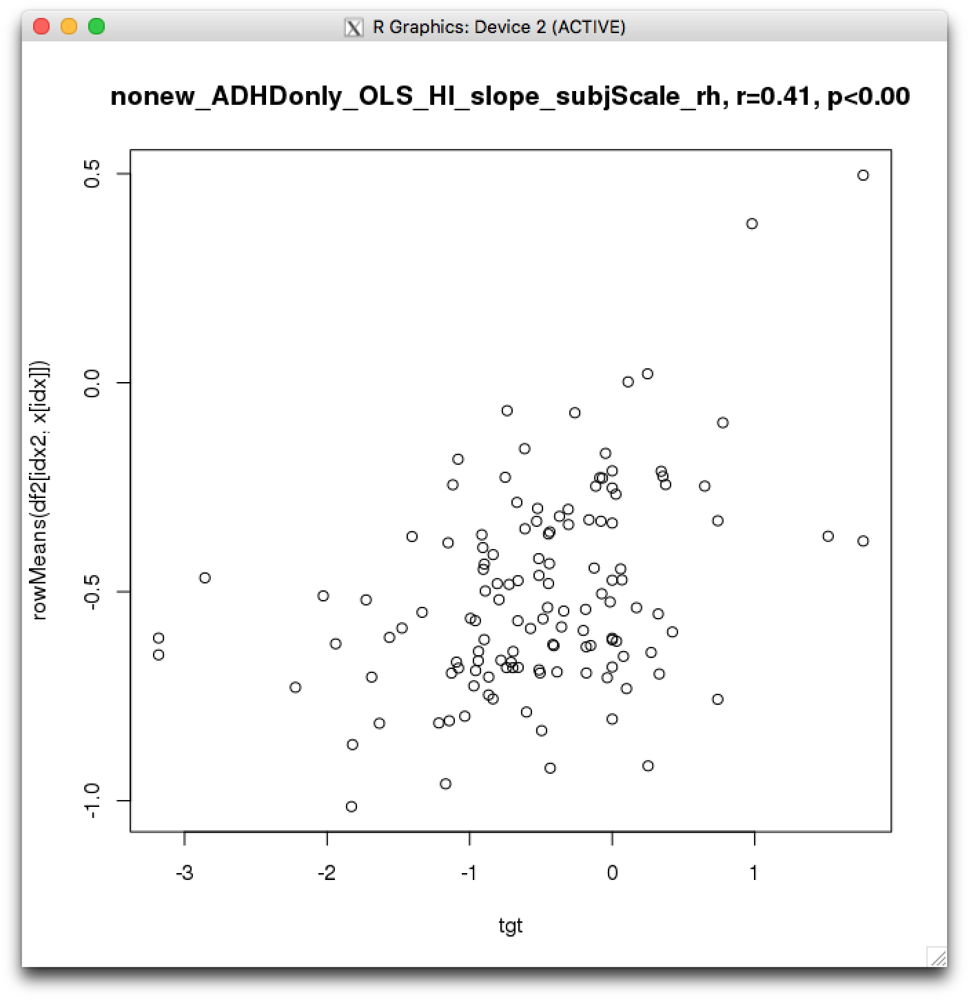
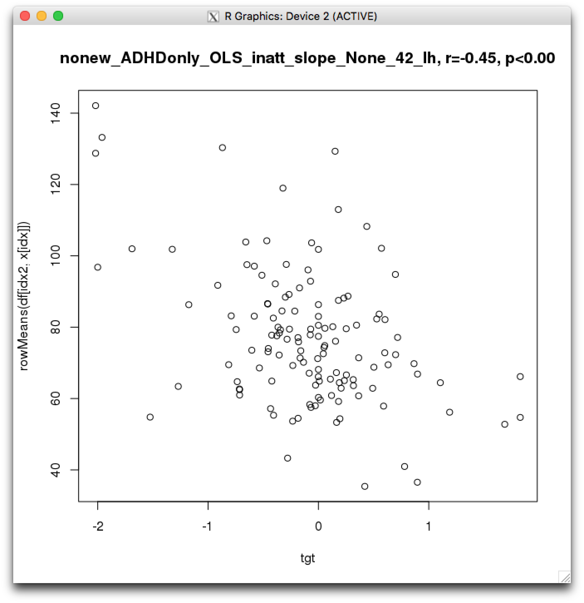

# 2018-12-06 10:20:19

Given the latest results with the descriptives, I got curious about whether
using a robust lme method wouldn't be better, as it would protect against
outliers. Not that all our results have outliers, but some do and it would be
better to avoid those, if still keeping the same results that are good. 

First, let's check whether that solves our issue.

I played a bit with robustlmm and rlme. The latter didn't quite work. And
robustlme did work, but getting p-values for the fixed estimates is non-trivial.
We could just approximate the t-stats and get a p-value from that. But I think
that at this time it might be just easier to ignore results that seem driven by
outliers. 

I tried running MDS, but the maskids that came out as outliers weren't the same
as the ones in the structural result. The other option is to filter outliers as
NAs, and use the regular LME, as it omits NAs...

Let's try that.

It didn't quite work, as many of the p-values were being stored as NAs,
regardless of how I chose to deal with NAs. Even if I just send the good data,
maybe it doesn't have enough data to compute the p-values?

Another option is to also look at the subjScale pipeline, because there's a
chance that they wouldn't be outliers after that transform, and those results
mostly tracked the no transformation results. Just a bit smaller.

So, two questions:

1) Are subjScale results around the same region as None?
2) Are subjScale less succeptible to outliers, when compared to None?

# 2018-12-07 12:41:21

Let's work on answering those questions. They mostly apply to structural results though, because that's where I saw those results with outliers. Haven't checked DTI scatterplots yet.

After some filtering, we're looking at:

```
struct_area_11142018_260timeDiff12mo (RH): nonew_ADHDonly_OLS_HI_slope_winsorize_None (249 perms)
Cluster size: 743.72, p<0.004 **
--
struct_area_11142018_260timeDiff12mo (RH): nonew_ADHDonly_OLS_HI_slope_winsorize_subjScale (249 perms)
Cluster size: 517.75, p<0.020 *
--
struct_area_11142018_260timeDiff12mo (RH): nonew_OLS_HI_slope_winsorize_None (250 perms)
Cluster size: 1311.63, p<0.020 *
--
struct_area_11142018_260timeDiff12mo (RH): nonew_OLS_HI_slope_winsorize_subjScale (250 perms)
Cluster size: 1083.79, p<0.020 *
--
struct_thickness_11142018_260timeDiff12mo (RH): OLS_inatt_slope_winsorize_None (249 perms)
Cluster size: 438.50, p<0.028 *
--
struct_thickness_11142018_260timeDiff12mo (RH): OLS_inatt_slope_winsorize_subjScale (249 perms)
Cluster size: 441.28, p<0.004 **
--
struct_volume_11142018_260timeDiff12mo (RH): nonew_ADHDonly_OLS_HI_slope_winsorize_None (247 perms)
Cluster size: 632.68, p<0.000 **
--
struct_volume_11142018_260timeDiff12mo (RH): nonew_ADHDonly_OLS_HI_slope_winsorize_subjScale (249 perms)
Cluster size: 265.75, p<0.024 *
--
struct_volume_11142018_260timeDiff12mo (RH): nonew_OLS_HI_slope_winsorize_None (247 perms)
Cluster size: 1386.25, p<0.000 **
--
struct_volume_11142018_260timeDiff12mo (RH): nonew_OLS_HI_slope_winsorize_subjScale (250 perms)
Cluster size: 596.23, p<0.020 *
--
struct_volume_11142018_260timeDiff12mo (LH): OLS_inatt_slope_winsorize_None (250 perms)
Cluster size: 675.22, p<0.008 **
--
struct_volume_11142018_260timeDiff12mo (LH): OLS_inatt_slope_winsorize_subjScale (248 perms)
Cluster size: 512.80, p<0.024 *
```

So, to plot them:

```bash
awk 'NR>=13 && NR<2575' nonew_ADHDonly_OLS_HI_slope_winsorize_None_42_rh_ClstMsk_e1_a1.0.niml.dset > clusters.txt
# single out the one region
awk '{ if ($1 != 1 ) print 0; else print 1 }' clusters.txt > None.txt
awk 'NR>=13 && NR<2575' nonew_ADHDonly_OLS_HI_slope_winsorize_subjScale_42_rh_ClstMsk_e1_a1.0.niml.dset > clusters.txt
# single out the one region
awk '{ if ($1 != 1 ) print 0; else print 1 }' clusters.txt > subjScale.txt
suma -i_fs /media/sf_Shaw/freesurfer5.3_subjects/fsaverage4/SUMA/lh.pial.asc
```


So, they look to be in the same region. Let's look at other files just to be safe.


OK, same here, and it's for inattention this time. Alright, so these seem to be in the same locations. Let's check that these scatterplots are not driven by outliers though.

```r
winsorize = function(x, cut = 0.01){
  cut_point_top <- quantile(x, 1 - cut, na.rm = T)
  cut_point_bottom <- quantile(x, cut, na.rm = T)
  i = which(x >= cut_point_top) 
  x[i] = cut_point_top
  j = which(x <= cut_point_bottom) 
  x[j] = cut_point_bottom
  return(x)
}
clin = read.csv('/data/NCR_SBRB/baseline_prediction/long_clin_11302018.csv')
load('/data/NCR_SBRB/baseline_prediction/struct_volume_11142018_260timeDiff12mo.RData.gz')

df = merge(clin, data, by='MRN')
x = colnames(df)[grepl(pattern = '^v_rh', colnames(df))]
a = read.table('~/tmp/clusters.txt')[,1]
idx = which(a==1)
idx2 = df$diag_group != 'unaffect' & df$diag_group != 'new_onset'
tgt = winsorize(df[idx2,]$OLS_HI_slope)
b = cor.test(tgt, rowMeans(df[idx2, x[idx]]))
plot(tgt, rowMeans(df[idx2, x[idx]]))
title(sprintf('nonew_ADHDonly_OLS_HI_slope_winsorize_None_42_rh, r=%.2f, p<%.2f', b$estimate, b$p.value))

x_orig = colnames(data)[grepl(pattern = '^v', colnames(data))]
feat_var = apply(data, 2, var, na.rm=TRUE)
idx3 = feat_var != 0  # TRUE for features with 0 variance (constant)
# categorical variables give NA variance, but we want to keep them
idx3[is.na(idx3)] = TRUE
data = data[, idx3]
nNAs = colSums(is.na(data))  # number of NAs in each variable
# remove variables that are all NAs
data = data[, nNAs < nrow(data)]
df2 = merge(clin, data, by='MRN')
idx2 = df2$diag_group != 'unaffect' & df2$diag_group != 'new_onset'
x = colnames(df2)[grepl(pattern = '^v', colnames(df2))]
df2[, x] = t(scale(t(df2[, x])))
# although we have to scale only the keft-over voxels, the cluster indices are on the full array
x = x_orig[grepl(pattern = '^v_rh', x_orig)]
a = read.table('~/tmp/clusters.txt')[,1]
idx = which(a==1)
tgt = winsorize(df2[idx2,]$OLS_HI_slope)
b = cor.test(tgt, rowMeans(df2[idx2, x[idx]]))
plot(tgt, rowMeans(df2[idx2, x[idx]]))
title(sprintf('nonew_ADHDonly_OLS_HI_slope_subjScale_rh, r=%.2f, p<%.2f', b$estimate, b$p.value))
```




I though the data would change a bit more... as expected the Y scale changed, but the plots look very much similar otherwise. Let's look at a different result.

Let's be a bit more specific even:

```HG-01898523-LM1:tmp sudregp$ grep -B 1 "*" pvals_struct.txt | grep -A 1 winso | grep ADHDonly
(filtering to only keep matches)
struct_area_11142018_260timeDiff12mo (RH): nonew_ADHDonly_OLS_HI_slope_winsorize_None (249 perms)
struct_area_11142018_260timeDiff12mo (RH): nonew_ADHDonly_OLS_HI_slope_winsorize_subjScale (249 perms)
struct_volume_11142018_260timeDiff12mo (LH): ADHDonly_OLS_inatt_slope_winsorize_None (250 perms)
struct_volume_11142018_260timeDiff12mo (LH): ADHDonly_OLS_inatt_slope_winsorize_subjScale (249 perms)
struct_volume_11142018_260timeDiff12mo (RH): nonew_ADHDonly_OLS_HI_slope_winsorize_None (247 perms)
struct_volume_11142018_260timeDiff12mo (RH): nonew_ADHDonly_OLS_HI_slope_winsorize_subjScale (249 perms)
struct_volume_11142018_260timeDiff12mo (LH): nonew_ADHDonly_OLS_inatt_slope_winsorize_None (249 perms)
struct_volume_11142018_260timeDiff12mo (LH): nonew_ADHDonly_OLS_inatt_slope_winsorize_subjScale (250 perms)
```




Well, neither result seems to be driven by outliers, so we might as well pick the regular volume result, as it's easier to understand and the clusters are bigger / harder to knock out.

Now, we just need to make similar plots for DTI and MELODIC, and then brain pics.

## MELODIC

Let's start with MELODIC, as it looks like we'll have more options there.

```bash
HG-01898523-LM1:tmp sudregp$ grep -B 1 "*" pvals_melodic.txt | grep -A 1 winso | grep ADHDonly
melodic_fancy_IC1_09212018: ADHDonly_OLS_inatt_slope_winsorize_None (249 perms)
melodic_fancy_IC1_09212018: nonew_ADHDonly_OLS_HI_slope_winsorize_None (249 perms)
melodic_fancy_IC2_09212018: ADHDonly_OLS_HI_slope_winsorize_None (248 perms)
melodic_fancy_IC2_09212018: ADHDonly_OLS_inatt_slope_winsorize_None (250 perms)
melodic_fancy_IC2_09212018: nonew_ADHDonly_OLS_HI_slope_winsorize_None (248 perms)
melodic_fancy_IC4_09212018: ADHDonly_OLS_inatt_slope_winsorize_None (249 perms)
melodic_fancy_IC4_09212018: nonew_ADHDonly_OLS_HI_slope_winsorize_None (248 perms)
melodic_fancy_IC57_09212018: ADHDonly_OLS_inatt_slope_winsorize_None (250 perms)
melodic_fancy_IC57_09212018: nonew_ADHDonly_OLS_HI_slope_winsorize_None (249 perms)
```

Just because our results in structural were better using nonew, let's focus on that too.

```bash
HG-01898523-LM1:tmp sudregp$ grep -B 1 "*" pvals_melodic.txt | grep -A 1 winso | grep ADHDonly | grep nonew
melodic_fancy_IC1_09212018: nonew_ADHDonly_OLS_HI_slope_winsorize_None (249 perms)
melodic_fancy_IC2_09212018: nonew_ADHDonly_OLS_HI_slope_winsorize_None (248 perms)
melodic_fancy_IC4_09212018: nonew_ADHDonly_OLS_HI_slope_winsorize_None (248 perms)
melodic_fancy_IC57_09212018: nonew_ADHDonly_OLS_HI_slope_winsorize_None (249 perms)
```

It's not great that most results come from OLS_HI, as it could be related to movement, but it's also where we see the most variance in OLS_SX, right? That can be easily tested, but it would make sense as kids tend to get better in that domain as they age.

In fact, most of the results that don't restrict it to no new_onset participants are on inattention, which could be a finding on itself.

But, as a clinical test, it would be better if we did this with ADHD_NOS, right? For example, the idea here would be to find regions in the brain that could predict a symptom change for kids with or at risk for ADHD. At risk here is defined as NOS, but there might be a better naming out there. We'd have to carefully remove people based on their DX at baseline, making sure that no NVs (even XNVs) could go in, as they wouldn't be considered "at risk" later. We should also make sure we are calculating OLS using their closest SX, not too far or too early. 

These are all checks we need to do now as we are getting good results, but need to make sure we are using good data to begin with!
