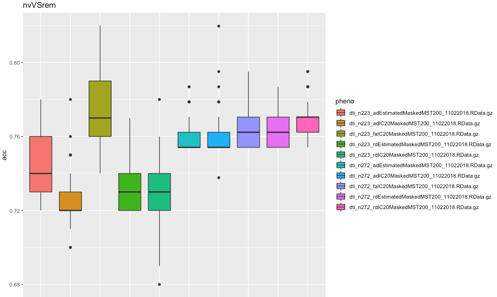
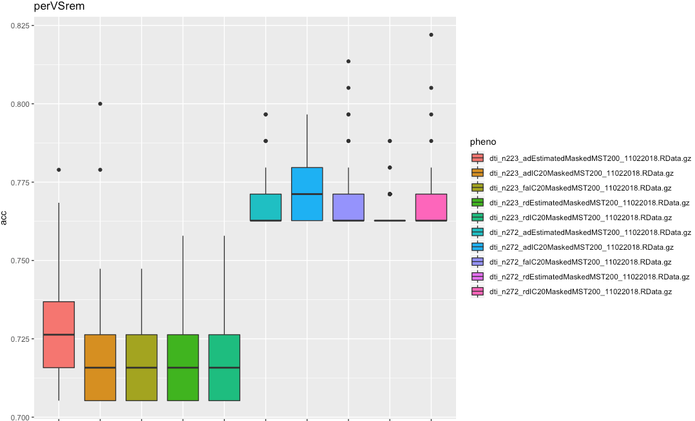
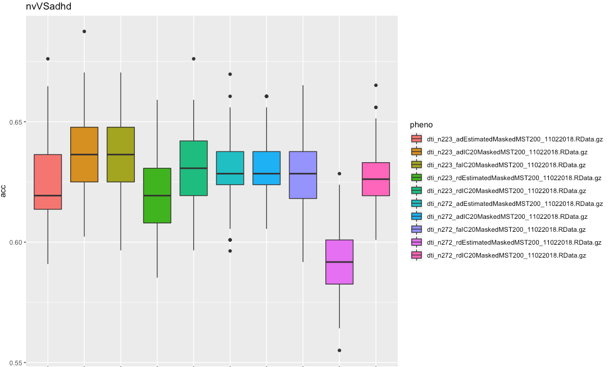
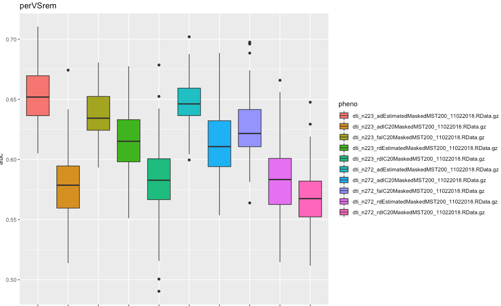

# 2018-10-29 15:56:46

I'm going to do a quick push to try to ru all images in the same space using
ICA. Let's see what that gives us. First step is to convert all our images to
TT_N27 space, and we can use that matrix later to put the EPI in the same space
(https://afni.nimh.nih.gov/pub/dist/edu/latest/afni_handouts/afni10_volreg_talairach.pdf)


# 2018-10-30 08:00:53

```bash
cd ~/data/baseline_prediction/same_space/anat;
for m in `cut -d"," -f 1 ../../struct_rois_09062018_260timeDiff12mo.csv`; do
    m2=`printf %04d $m`;
    mri_convert /Volumes/Shaw/freesurfer5.3_subjects/${m2}/mri/orig.mgz ./${m2}.nii.gz;
    @auto_tlrc -base TT_N27+tlrc -input ${m2}.nii.gz -no_pre -suffix _inTLRC;
done;
```

then, just so we can run everything in my desktop without depending on caterpie for data_by_maskID:

```bash
cd ~/data/baseline_prediction/same_space/epi;
for m2 in `cat ../../rsfmri_3minWithClinical.tsv`; do
    echo $m2;
    # mylink=`readlink /Volumes/Shaw/data_by_maskID/${m2} | sed "s/\.\./\/Volumes\/Shaw/"`;
    # 3dcopy ${mylink}/afni/${m2}.rest.subjectSpace.results/errts.${m2}.fanaticor+orig.HEAD ${m2}_epi.nii;
    @auto_tlrc -apar ../anat/${m2}_inTLRC.nii -input ${m2}_epi.nii -suffix _inTLRC -dxyz 2.5;
done;
```

Should probably check that the alignment worked well though... I'll go on with
converting rsFMRI as well, and **NEED TO CHECK ALIGNMENT LATER!**

# dti

Let's go ahead and do this for DTI as well, which should be just a matter of
making symlinks as we have all these data already generates for QC purposes:

```bash
for n in 223 272; do
    cd ~/data/baseline_prediction/same_space/dti/n${n}
    # ignore header
    for m in `tail -n +2 ~/data/baseline_prediction/dti_gf_09212018_${n}timeDiff12mo.csv | cut -d"," -f 2 -`; do
        maskid=`printf %04d $m`;
        for p in fa ad rd; do
            ln -s /Volumes/Shaw/dti_robust_tsa/analysis_may2017/${maskid}_tensor_diffeo_${p}.nii.gz .;
        done;
    done;
done
```

But then I gunziped and split everything by directory, because the Matlab tool
was having lots of issues listing the directory.

# 2018-11-02 15:38:15

I've been generally running one version with 30 ICs, an then another one using
the estimated number of ICs. Both, using MST500 for stability. I need to study a
bit on what that actually does, because I don't see a stability metric like
ICASSO. Of course, I could just do ICASSO if I want to. `

Another thing to look into is a better mask, because for the strucutral analysis
I'm getting a lot of white matter and ventricle action. So, having a nicer gray
matter mask would be better than just using the automask. That will be
especially important for DTI too, if the property files didn't use the mask when
being generated.

Of course, STILL NEED TO CHECK THAT TLRC ALIGNMENT WORKED WELL!

# 2018-11-05 11:16:22

I figured that since I'm doing a lot of this work, we might as well usea a
non-Linear transform, and also produce all the figures automatically. That's
where the new SSwarp function comes in.

On the same step, I think we'll have better success in ICA if we
use gray matter masks (or white matter, for DTI, if the files we're using are
not restricted to that yet). So, for the structural data we'll need to use
Freesurfer masks and put them into the common space.

Ideally I'd run this in Biowulf, but until I hear from them about Xfvb and
netpbm, I'l run it locally:

```bash
cd ~/data/baseline_prediction/same_space/anat;
for m in `cut -d"," -f 1 ../../struct_rois_09062018_260timeDiff12mo.csv`; do
    @SSwarper -input ${m2}.nii.gz -base TT_N27_SSW.nii.gz -subid ${m2};
    3dcalc -a /Volumes/Shaw/freesurfer5.3_subjects/${m2}/SUMA/aparc+aseg_REN_gm.nii.gz \
        -prefix ${m2}_gm_mask.nii -expr "step(a)";
    3dNwarpApply -nwarp "anatQQ.${m2}_WARP.nii anatQQ.${m2}.aff12.1D" \
        -source ${m2}_gm_mask.nii -master anatQQ.${m2}.nii -inter NN \
        -overwrite -prefix ${m2}_gm_mask_NL_inTLRC.nii;
done;
```

For DTI, they're all in the same space already, so I'll just use the FA skeleton
mask we've been using for the voxelwise analysis.

Just needed to say that using the fa_skeleton masks causes the estimates of ICs
to be quite low. For both n223 and n272 AD, I get only 4 ICs. For n223 FA, I got
only 1, so I'm not running faEstimatedMaskedMST200. I'll check n272 and also rd,
but I might end up skipping those estimated results in the end.

Yep, only one IC for FA n272 as well. Will only run IC20, and then check on RD.

# 2018-11-06 10:43:47

I got 10 and 11 for RD, so I'm running estimated there as well.

For anatomy, it's actually faster to swarm it:

```bash
cd ~/data/baseline_prediction/same_space/anat;
for m in `cut -d"," -f 1 ../../struct_rois_09062018_260timeDiff12mo.csv`; do
    m2=`printf %04d $m`;
    echo "export OMP_NUM_THREADS=16; cd ~/data/baseline_prediction/same_space/anat; @SSwarper -input ${m2}.nii.gz -base TT_N27_SSW.nii.gz -subid ${m2}" >> swarm.SSwarper
done;
swarm -g 10 -t 16 --job-name SSwarper --time 2:00:00 -f swarm.SSwarper -m afni --partition quick --logdir trash

for m in `cut -d"," -f 1 ../../struct_rois_09062018_260timeDiff12mo.csv`; do
    m2=`printf %04d $m`;
    3dcalc -a /data/NCR_SBRB/freesurfer5.3_subjects/${m2}/SUMA/aparc+aseg_REN_gm.nii.gz \
        -prefix ${m2}_gm_mask.nii -expr "step(a)";
    3dNwarpApply -nwarp "anatQQ.${m2}_WARP.nii anatQQ.${m2}.aff12.1D" \
        -source ${m2}_gm_mask.nii -master anatQQ.${m2}.nii -inter NN \
        -overwrite -prefix ${m2}_gm_mask_NL_inTLRC.nii;
done;
```

The last two commands run quite fast, but it's also a nice break to first go
through the images to make sure alignment was successfull... visually checked,
and it looks good.

Back to DTI, let's convert the group ICA to a format that we can readily read
into R:

```matlab
load('rdEstimatedMaskedMST200Subject.mat')
load('rdEstimatedMaskedMST200_ica_c1-1.mat')
dlmwrite('~/data/baseline_prediction/same_space/dti/n223/rdEstimatedMaskedMST200.csv', tc)
dlmwrite('~/data/baseline_prediction/same_space/dti/n223/filelist.txt',files.name, '')
load('adEstimatedMaskedMST200_ica_c1-1.mat')
dlmwrite('~/data/baseline_prediction/same_space/dti/n223/adEstimatedMaskedMST200.csv', tc)
load('faIC20MaskedMST200_ica_c1-1.mat')
dlmwrite('~/data/baseline_prediction/same_space/dti/n223/faIC20MaskedMST200.csv', tc)
load('adIC20MaskedMST200_ica_c1-1.mat')
dlmwrite('~/data/baseline_prediction/same_space/dti/n223/adIC20MaskedMST200.csv', tc)
load('rdIC20MaskedMST200_ica_c1-1.mat')
dlmwrite('~/data/baseline_prediction/same_space/dti/n223/rdIC20MaskedMST200.csv', tc)
```

Then, in R:

```r
fnames = readLines('~/data/baseline_prediction/same_space/dti/n272/filelist.txt')
maskids = sapply(fnames, function(x) gsub('/gpfs/gsfs7/users/sudregp/baseline_prediction/same_space/dti/n272/rd/','', x)[[1]])
mask.id = sapply(maskids, function(x) as.numeric(gsub('_tensor_diffeo_rd.nii,1','', x)[[1]]))
for (f in c('adEstimatedMaskedMST200', 'rdEstimatedMaskedMST200',
            'adIC20MaskedMST200', 'rdIC20MaskedMST200', 'faIC20MaskedMST200')) {
    fname = sprintf('~/data/baseline_prediction/same_space/dti/n272/%s.csv', f)
    d = read.csv(fname, header=0)
    colnames(d) = sapply(1:ncol(d), function(x) sprintf('v_%02d',x))
    d2 = cbind(mask.id, d)
    data = merge(clin, d2, by='mask.id')
    out_fname = sprintf('/data/NCR_SBRB/baseline_prediction/dti_n272_%s_11022018.RData.gz', f)
    save(data, file=out_fname, compress=T)
}
```

And then do the same thing for the other n.

Now, let's run the raw scripts for all those different permutations, and see
what we get:

```bash
job_name=dti_sameSpace;
mydir=/data/NCR_SBRB/baseline_prediction/;
swarm_file=swarm.automl_${job_name};
rm -rf $swarm_file;
for f in dti_n223_adEstimatedMaskedMST200_11022018.RData.gz \
         dti_n223_rdEstimatedMaskedMST200_11022018.RData.gz \
         dti_n223_adIC20MaskedMST200_11022018.RData.gz \
         dti_n223_rdIC20MaskedMST200_11022018.RData.gz \
         dti_n223_faIC20MaskedMST200_11022018.RData.gz \
         dti_n272_adEstimatedMaskedMST200_11022018.RData.gz \
         dti_n272_rdEstimatedMaskedMST200_11022018.RData.gz \
         dti_n272_adIC20MaskedMST200_11022018.RData.gz \
         dti_n272_rdIC20MaskedMST200_11022018.RData.gz \
         dti_n272_faIC20MaskedMST200_11022018.RData.gz; do
    for target in nvVSper nvVSrem perVSrem nvVSadhd; do
        for i in {1..100}; do
            echo "Rscript --vanilla ~/research_code/automl/raw_autoValidation.R ${mydir}/$f ${mydir}/long_clin_0918.csv ${target} ${mydir}/models_spatial_within_DL/${USER} $RANDOM" >> $swarm_file;
        done;
    done;
done
sed -i -e "s/^/unset http_proxy; /g" $swarm_file;
split -l 1000 $swarm_file ${job_name}_split;
for f in `/bin/ls ${job_name}_split??`; do
    echo "ERROR" > swarm_wait_${USER}
    while grep -q ERROR swarm_wait_${USER}; do
        echo "Trying $f"
        swarm -f $f -g 30 -t 16 --time 3:00:00 --partition quick --logdir trash_${job_name} --job-name ${job_name} -m R,afni --gres=lscratch:10 2> swarm_wait_${USER};
        if grep -q ERROR swarm_wait_${USER}; then
            echo -e "\tError, sleeping..."
            sleep 10m;
        fi;
    done;
done
```

While we wait for the DTI stuff above running, let's go back to structural. Now,
the challenge is making the grey matter masks. Using AFNI's 3dmasktool, let's
create 3 masks: intersection, union, and a general one based on their examples
(70% overlap plus some other shenanigans).

```bash
3dmask_tool -input ????_gm_mask_NL_inTLRC.nii -prefix group_gm_mask_inter.nii -frac 1
3dmask_tool -input ????_gm_mask_NL_inTLRC.nii -prefix group_gm_mask_union.nii -frac 0
3dmask_tool -input ????_gm_mask_NL_inTLRC.nii -prefix group_gm_mask_fancy.nii \
    -dilate_input 5 -5 -frac 0.7 -fill_holes
```

Now we just need to run the Estimated and IC versions of ICA for each of the
masks.


# rsFMRI after nonlinear transform

The rsFMRI data still needs to go to the template space after all the no-linear
transforms. This is how we'll do it:

```bash
cd ~/data/baseline_prediction/same_space/epi;
for m2 in `cat ../../rsfmri_3minWithClinical.tsv`; do
    echo $m2;
    3dNwarpApply -nwarp "../anat/anatQQ.${m2}_WARP.nii ../anat/anatQQ.${m2}.aff12.1D" \
        -source ${m2}_epi.nii -master ../anat/anatQQ.${m2}.nii -dxyz 2.5\
        -overwrite -prefix ${m2}_epi_NL_inTLRC.nii;
done;
```

Also, I just confirmed that in our main analysis the EPI is warped to subject
space, and not vice-versa. So, we should be good here to apply the non-linear
transform to the errts file.

But not all mask ids in fMRI are in the structural analysis, so we need to warp
those still...

# 2018-11-07 08:59:20

```bash
cd ~/data/baseline_prediction/same_space/epi;
mkdir extra_NL
for m2 in `cat ../../rsfmri_3minWithClinical.tsv`; do
    if [ ! -e ${m2}_epi_NL_inTLRC.nii ]; then
        mri_convert /data/NCR_SBRB/freesurfer5.3_subjects/${m2}/mri/orig.mgz extra_NL/${m2}.nii.gz;
        echo "export OMP_NUM_THREADS=16; cd ~/data/baseline_prediction/same_space/epi/extra_NL; @SSwarper -input ${m2}.nii.gz -base TT_N27_SSW.nii.gz -subid ${m2}" >> swarm.SSwarper;
    fi;
done;
swarm -g 10 -t 16 --job-name SSwarper --time 2:00:00 -f swarm.SSwarper -m afni --partition quick --logdir trash

# then, when it's finished
cd ~/data/baseline_prediction/same_space/epi;
for m2 in `cat ../../rsfmri_3minWithClinical.tsv`; do
    if [ ! -e ${m2}_epi_NL_inTLRC.nii ]; then
        3dNwarpApply -nwarp "extra_NL/anatQQ.${m2}_WARP.nii extra_NL/anatQQ.${m2}.aff12.1D" \
        -source ${m2}_epi.nii -master extra_NL/anatQQ.${m2}.nii -dxyz 2.5\
        -overwrite -prefix ${m2}_epi_NL_inTLRC.nii;
    fi;
done;
```

And let's also grab the DTI results:

```bash
echo "target,pheno,var,seed,nfeat,model,auc,f1,acc,ratio" > dtiSameSpace_summary.csv;
dir=dti_sameSpace
for f in `ls -1 trash_${dir}/*o`; do
    phen=`head -n 2 $f | tail -1 | awk '{FS=" "; print $6}' | cut -d"/" -f 6`;
    target=`head -n 2 $f | tail -1 | awk '{FS=" "; print $8}'`;
    seed=`head -n 2 $f | tail -1 | awk '{FS=" "; print $10}'`;
    var=`head -n 2 $f | tail -1 | awk '{FS=" "; print $5}' | cut -d"/" -f 4 | sed -e "s/\.R//g"`;
    model=`grep -A 1 model_id $f | tail -1 | awk '{FS=" "; print $2}' | cut -d"_" -f 1`;
    auc=`grep -A 1 model_id $f | tail -1 | awk '{FS=" "; print $3}'`;
    nfeat=`grep "Running model on" $f | awk '{FS=" "; print $5}'`;
    ratio=`grep -A 1 "Class distribution" $f | tail -1 | awk '{FS=" "; {for (i=2; i<=NF; i++) printf $i ";"}}'`;
    f1=`grep -A 2 "Maximum Metrics:" $f | tail -1 | awk '{FS=" "; print $5}'`;
    acc=`grep -A 5 "Maximum Metrics:" $f | tail -1 | awk '{FS=" "; print $5}'`;
    echo $target,$phen,$var,$seed,$nfeat,$model,$auc,$f1,$acc,$ratio >> dtiSameSpace_summary.csv;
done;
```

And we can make some plots in R:

```r
data = read.csv('~/tmp/dtiSameSpace_summary.csv')
target='nvVSper'
p1<-ggplot(data[data$target == target,], aes(x=pheno, y=acc, fill=pheno))
print(p1+geom_boxplot() + ggtitle(target))
```












So, these results are slightly worse than doing raw on all features, and about
5-10% worse than using the spatial filters. Maybe it will be worth it for
structural and rsFMRI, but not looking good for DTI.

# 2018-11-16 13:47:24

Let's take a look at the MELODIC results in the EPI data in the same space. It
estimates 208 ICS, which is a lot, but gives the potential number of variables
we have, might not be too bad. This is what I ran:

```bash
melodic -i 3min.txt -o groupmelodic_fix.ica -v --nobet --bgthreshold=10 --tr=2.5 --report --Oall -a concat 
```

But just by looking at the report I can tell that it's crap. Lots of noise in
non-voxel regions. So, I'll need to define a mask.

Then, combine it across subjects:

```bash
for m in `cat 3min_clean.txt`; do 3dAutomask -prefix ${m}_automask.nii ${m}_epi_NL_inTLRC.nii; done 
3dmask_tool -input ????_automask.nii -prefix group_epi_mask_union.nii -frac 0
3dmask_tool -input ????_automask.nii -prefix group_epi_mask_inter.nii -frac 1
3dmask_tool -input ????_automask.nii -prefix group_epi_mask_fancy.nii \
    -dilate_input 5 -5 -frac 0.7 -fill_holes
```

And re-run it as above, but with correct masks (two options):

```bash
melodic -i 3min.txt -o groupmelodic_union.ica -v --nobet -m group_epi_mask_union.nii --tr=2.5 --report --Oall -a concat;
melodic -i 3min.txt -o groupmelodic_fancy.ica -v --nobet -m group_epi_mask_fancy.nii --tr=2.5 --report --Oall -a concat;
melodic -i 3min.txt -o groupmelodic_inter.ica -v --nobet -m group_epi_mask_inter.nii --tr=2.5 --report --Oall -a concat;
```

The fancy mask created 89 ICS, which is a bit better. Looking at the report,
many look artefactual, but there are also many that look quite nice. So, we can
go ahead and continue the analysis.

So, now we need to do the dual regression and grab the values for each scan.

```bash
pipe='fancy';
cd ~/data/baseline_prediction/same_space/epi/groupmelodic_${pipe}.ica
mkdir dual
while read s; do
    echo ${pipe} $s;
    $FSLDIR/bin/fsl_glm -i ../${s}_epi_NL_inTLRC.nii -d melodic_IC \
        -o dual/dr_stage1_${s}.txt --demean -m ../group_epi_mask_${pipe}.nii;
    $FSLDIR/bin/fsl_glm -i ../${s}_epi_NL_inTLRC.nii -d dual/dr_stage1_${s}.txt \
        -o dual/dr_stage2_$s --demean -m ../group_epi_mask_${pipe}.nii --des_norm \
        --out_z=dual/dr_stage2_${s}_Z;
done < ../3min_clean.txt
```

# 2018-11-28 16:13:39

## MELODIC

Let's give MELODIC another try. I have the results, so it's just a matter of figuring out which ICs to use. Because the known networks can end up split among different ICs, let's work with the top 5 ICs for each of the 4 interesting networks: DMN, cognitive, DAN, and VAN, for a total of 20 ICs if they don't overlap. We'll also look at their plots to make sure they make sense. And that's in each pipeline.

This page has actually been quite helpful in figuring out MELODIC:

http://psych.colorado.edu/~anre8906/guides/01-ica.html

Let's convert the MNI152 space to our template space, then extract the networks as independent masks.

```bash
#bw
cd /data/NCR_SBRB/software/Yeo_JNeurophysiol11_MNI152/
@SSwarper -input FSL_MNI152_FreeSurferConformed_1mm.nii.gz -base TT_N27_SSW.nii.gz -subid FSL_MNI152_inTLRC
3dNwarpApply -nwarp "anatQQ.FSL_MNI152_inTLRC_WARP.nii anatQQ.FSL_MNI152_inTLRC.aff12.1D" \
        -source Yeo2011_7Networks_MNI152_FreeSurferConformed1mm_LiberalMask.nii.gz \
        -master ~/data/baseline_prediction/same_space/epi/0951_epi_NL_inTLRC.nii -inter NN \
        -overwrite -prefix ~/data/baseline_prediction/same_space/epi/Yeo2011_7Networks_LiberalMask_NL_inTLRC.nii;
cd ~/data/baseline_prediction/same_space/epi/
for i in {1..7}; do
    3dcalc -prefix Yeo_liberal_inTLRC_net${i}.nii \
        -a Yeo2011_7Networks_LiberalMask_NL_inTLRC.nii -expr "amongst(a,${i})";
done
3dTcat -prefix Yeo_liberal_inTLRC_combined.nii Yeo_liberal_inTLRC_net1.nii \
    Yeo_liberal_inTLRC_net2.nii Yeo_liberal_inTLRC_net3.nii \
    Yeo_liberal_inTLRC_net4.nii Yeo_liberal_inTLRC_net5.nii \
    Yeo_liberal_inTLRC_net6.nii Yeo_liberal_inTLRC_net7.nii
```

Then, for each pipeline, we need to run:

```bash
#bw
cd ~/data/baseline_prediction/same_space/epi/groupmelodic_inter.ica/
3dMatch -inset melodic_IC.nii.gz -refset ../Yeo_liberal_inTLRC_combined.nii \
    -mask ../group_epi_mask_inter.nii -prefix matches -overwrite
cat matches_REF_coeff.vals
```

Now that I think of it, let's stick with only the top IC match for now. That's because it's already 4 networks per pipeline, for a total of 12 new datasets to run. We can always do the top 5 for DMN or other network later.

So, following the steps above, this is what I got for each pipeline:

```
# inter
0               17              0.355           0.247
1               8               0.402           0.168
2               7               0.453           0.138
3               11              0.389           0.162
4               31              0.426           0.031
5               12              0.311           0.216
6               2               0.427           0.318

# union
0               42              0.375           0.067
1               23              0.335           0.049
2               65              0.353           0.042
3               8               0.511           0.039
4               82              0.452           0.035
5               3               0.344           0.058
6               4               0.349           0.093

# fancy
0               37              0.364           0.133
1               24              0.345           0.100
2               57              0.297           0.085
3               4               0.451           0.079
4               54              0.365           0.072
5               1               0.316           0.117
6               2               0.295           0.184
```

Let's make some plots to visualize them:

```bash
for i in 57 4 1 2; do
    echo $i;
    flirt -in stats/thresh_zstat${i}.nii.gz \
        -ref $FSLDIR/data/standard/MNI152_T1_0.5mm -applyxfm -usesqform \
        -out presentation/thresh_zstat${i}_highres.nii.gz;
    overlay 1 0 $FSLDIR/data/standard/MNI152_T1_0.5mm \
        -A presentation/thresh_zstat${i}_highres.nii.gz 2.5 10 \
        presentation/${i}_overlay.nii.gz;
    slicer presentation/${i}_overlay.nii.gz -a presentation/${i}_sliced.ppm;
    convert presentation/${i}_sliced.ppm presentation/${i}_sliced.png;
    slicer presentation/${i}_overlay.nii.gz -S 24 1200 presentation/${i}_axials.ppm;
    convert presentation/${i}_axials.ppm presentation/${i}_axials.png;
done
```

0: visual
1: somatomotor
2: DAN
3: VAN
4: limbic
5: cognitive (frontoparietal)
6: DMN

Then, we need to output the voxels in each mask, and make our decoding files. But I'm not sure I like those pictures... the thresholding seems a bit weird. Need to check out how I thresholded stuff for the heritability paper!