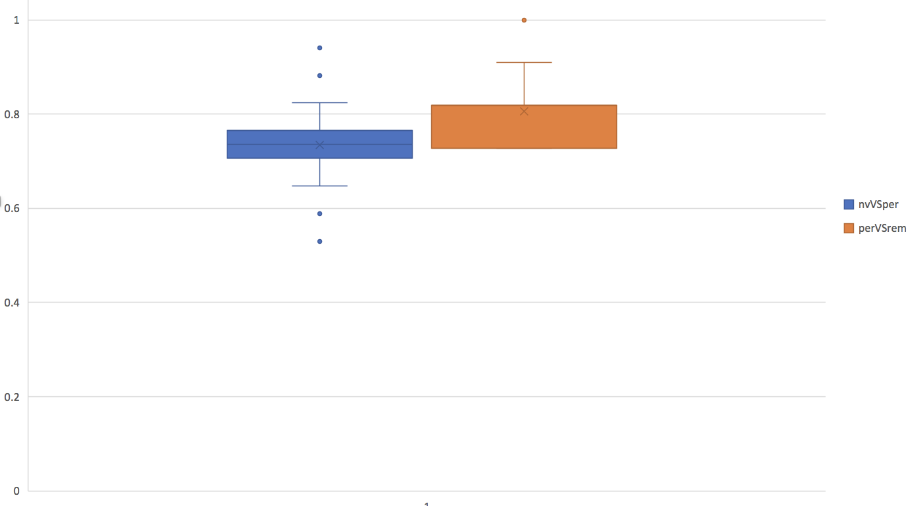

# 2018-10-31 10:14:20

The idea here is to use only voxels that are clustered together. The minimal
size of the cluster can be drawn from actual random data, or the real data with
shuffled labels. I imagine the latter will be more conservative, demanding
bigger clusters. It would also keep the structure of the signal. It's worth
trying both way to see what happens.

Let's start with DTI, as that's where most results are, and use 3dClust just to
save on time for figuring out how to properly do it in R.

```r
ijk_fname = '~/data/baseline_prediction/dti_voxels_223/0881_fa.txt'
out_dir = '~/data/baseline_prediction/dti_voxels_rnd/'
nperms = 1000
pval = .05

set.seed(42)
out = read.table(ijk_fname)
for (p in 1:nperms) {
    out[, 4] = 0
    idx = sample(1:nrow(out), nrow(out) * pval, replace=F)
    out[idx, 4] = 1
    write.table(out, file=sprintf('%s/%05d.txt', out_dir, p), row.names=F, col.names=F)
}
```

Now we just need to run 3dClust in all files and output the maximum cluster in
each:

```bash
for i in {1..1000}; do
    p=`printf %05d $i`;
    cat ${p}.txt | 3dUndump -master ~/data/baseline_prediction/mean_223_fa_skeleton_mask.nii.gz -ijk -datum float -prefix tmp -overwrite -;
    # grab top cluster row
    3dclust -NN1 2 -orient LPI tmp+orig. 2>/dev/null | grep -v \# | head -n 1 >> top_clusters.txt
done
```

Now, we can easily check how often a cluster of size 6 (for example):

```bash
awk '{FS=" "; print $1}' top_clusters.txt | grep 6 | wc -l
# 7
awk '{FS=" "; print $1}' top_clusters.txt | grep 7 | wc -l
# 1
awk '{FS=" "; print $1}' top_clusters.txt | grep 8 | wc -l
# 0
awk '{FS=" "; print $1}' top_clusters.txt | grep 5 | wc -l
# 33
```

So, here I could go up to 5, meaning that with random data I saw clusters of 5
or more voxels only 41 out of 1000 permutations. This would get rid of random
noise.

The script uni_spatial_test... is working, but the question is whether the
smallest cluster we are getting from the test above is good enough. So, let's
see how much bigger the clusters would have to be, when using results of a
specific test.

I ran a quick tests and we're already at 17, which gives a good idea of how much
data smoothing affects these results! LEt's run a thousand as well as see how it
looks:

```bash
job_name=nvVSperAD_rndSpatial;
mydir=/data/NCR_SBRB/baseline_prediction/;
swarm_file=swarm.${job_name};
rm -rf $swarm_file;
f=dti_ad_voxelwise_n223_09212018.RData.gz;
target=nvVSper;
for i in {1..1000}; do
    echo "Rscript --vanilla ~/research_code/automl/generate_random_uni_spatial.R ${mydir}/$f ${mydir}/long_clin_0918.csv ${target} $RANDOM" >> $swarm_file;
done
swarm -f $swarm_file --time 15:00 --partition quick --logdir trash_${job_name} --job-name ${job_name} -m R,afni;
```

but sometimes this takes so long that it's almost faster to just split it into
many cores of a c32 machine...

```bash
split -l 32 $swarm_file ${job_name}_split;
for f in `/bin/ls ${job_name}_split??`; do
    bash $f &
done
```

Now we just need to compile the results similar to before:

```bash
for f in `ls /data/NCR_SBRB/tmp/diag_group2_*_rnd_clusters.txt`; do
    grep -v \# $f | head -n 1 >> nvVSper_top_clusters.txt
done
```

And, in R:

```r
> x = read.table('/data/NCR_SBRB/tmp/nvVSper_top_clusters.txt')[,1]
> sum(x>20)/1000
[1] 0.284
> sum(x>40)/1000
[1] 0.049
```

But honestly, that's somewhat of a tall order, because we're asking the initial
clusters to survive one of the most stringent neuroimaging thresholds one uses,
and in consequence discarding anything that might be meaningful, but did not go
above that threshold. We should probably stick with the random data (not random
labels) threshold then.

Let's then run a few DTI permiutations under these spatial maps conditions:

```bash
job_name=spatialAD;
mydir=/data/NCR_SBRB/baseline_prediction/;
swarm_file=swarm.automl_${job_name};
rm -rf $swarm_file;
f=dti_ad_voxelwise_n223_09212018.RData.gz;
for target in nvVSper perVSrem; do
    for i in {1..100}; do
        echo "Rscript --vanilla ~/research_code/automl/uni_spatial_test_autoValidation_DL.R ${mydir}/$f ${mydir}/long_clin_0918.csv ${target} ${mydir}/models_uni_spatial/${USER} $RANDOM 8" >> $swarm_file;
    done;
done
sed -i -e "s/^/unset http_proxy; /g" $swarm_file;
swarm -f $swarm_file -g 40 -t 16 --time 3:00:00 --partition norm --logdir trash_${job_name} --job-name ${job_name} -m R,afni --gres=lscratch:10;
```

# structural

The beauty of this method is that we can still use the structural data and the
univariate filters if we want to. Just like DTI, we can get max clusters using
random data, or specific targets. Let's stick with random data for now.

```r
nvox = 163842
out_dir = '~/data/baseline_prediction/struct_voxels_rnd/'
nperms = 1000
pval = .05

set.seed(42)
for (p in 1:nperms) {
    out = rep(0, nvox)
    idx = sample(1:nvox, floor(nvox * pval), replace=F)
    out[idx] = 1
    write.table(out, file=sprintf('%s/%05d.txt', out_dir, p), row.names=F, col.names=F)
}
```

```bash
for i in {1..1000}; do
    rm lh_10_volume_ClstTable_e1_a2.0.1D;
    p=`printf %05d $i`;
    SurfClust -i /Volumes/Shaw/freesurfer5.3_subjects/fsaverage/SUMA/lh.pial.asc \
        -input ~/data/baseline_prediction/struct_voxels_rnd/${p}.txt 0 \
        -rmm -1.000000 -thresh_col 0 -athresh .95 -sort_area -no_cent \
        -prefix lh_10_volume -out_roidset -out_fulllist -amm2 2
    # grab top cluster row
    grep -v \# lh_10_volume_ClstTable_e1_a2.0.1D | head -n 1 >> top_struct_clusters.txt
done
```

Then, in R we calculate our upper limit:

```r
> x = read.table('~/data/baseline_prediction/top_struct_clusters.txt')[,3]
> summary(x)
   Min. 1st Qu.  Median    Mean 3rd Qu.    Max. 
  3.040   4.260   4.940   5.707   6.100  33.530 
```

So, let's go for 34 just to be conservative.

# 2018-11-01 11:14:04

Time to collect some of the DTI results:

```bash
echo "target,pheno,var,seed,nfeat,model,auc,f1,acc,ratio" > spatialAD_summary.csv;
dir=spatialAD;
for f in `ls trash_${dir}/*o`; do
    phen=`head -n 2 $f | tail -1 | awk '{FS=" "; print $6}' | cut -d"/" -f 5`;
    target=`head -n 2 $f | tail -1 | awk '{FS=" "; print $8}'`;
    seed=`head -n 2 $f | tail -1 | awk '{FS=" "; print $10}'`;
    var=`head -n 2 $f | tail -1 | awk '{FS=" "; print $5}' | cut -d"/" -f 4 | sed -e "s/\.R//g"`;
    model=`grep -A 1 model_id $f | tail -1 | awk '{FS=" "; print $2}' | cut -d"_" -f 1`;
    auc=`grep -A 1 model_id $f | tail -1 | awk '{FS=" "; print $3}'`;
    nfeat=`grep "Running model on" $f | awk '{FS=" "; print $5}'`;
    ratio=`grep -A 1 "Class distribution" $f | tail -1 | awk '{FS=" "; {for (i=2; i<=NF; i++) printf $i ";"}}'`;
    f1=`grep -A 2 "Maximum Metrics:" $f | tail -1 | awk '{FS=" "; print $5}'`;
    acc=`grep -A 5 "Maximum Metrics:" $f | tail -1 | awk '{FS=" "; print $5}'`;
    echo $target,$phen,$var,$seed,$nfeat,$model,$auc,$f1,$acc,$ratio >> spatialAD_summary.csv;
done
```

The results are slightly better than just using plain raw data, which
shows how robust we can be to bad variables.



We should probably now run the shuffled version of the tests now, and see how
much better than that we do.

```bash
job_name=rndSpatialAD;
mydir=/data/NCR_SBRB/baseline_prediction/;
swarm_file=swarm.automl_${job_name};
rm -rf $swarm_file;
f=dti_ad_voxelwise_n223_09212018.RData.gz;
for target in nvVSper perVSrem; do
    for i in {1..100}; do
        echo "Rscript --vanilla ~/research_code/automl/uni_spatial_test_autoValidation_DL.R ${mydir}/$f ${mydir}/long_clin_0918.csv ${target} ${mydir}/models_uni_spatial/${USER} -$RANDOM 8" >> $swarm_file;
    done;
done
sed -i -e "s/^/unset http_proxy; /g" $swarm_file;
swarm -f $swarm_file -g 40 -t 16 --time 3:00:00 --partition norm --logdir trash_${job_name} --job-name ${job_name} -m R,afni --gres=lscratch:10;
```

Collecting random AD:

```bash
echo "target,pheno,var,seed,nfeat,model,auc,f1,acc,ratio" > rndSpatialAD_summary.csv;
dir=rndSpatialAD;
for f in `ls trash_${dir}/*o`; do
    phen=`head -n 2 $f | tail -1 | awk '{FS=" "; print $6}' | cut -d"/" -f 5`;
    target=`head -n 2 $f | tail -1 | awk '{FS=" "; print $8}'`;
    seed=`head -n 2 $f | tail -1 | awk '{FS=" "; print $10}'`;
    var=`head -n 2 $f | tail -1 | awk '{FS=" "; print $5}' | cut -d"/" -f 4 | sed -e "s/\.R//g"`;
    model=`grep -A 1 model_id $f | tail -1 | awk '{FS=" "; print $2}' | cut -d"_" -f 1`;
    auc=`grep -A 1 model_id $f | tail -1 | awk '{FS=" "; print $3}'`;
    nfeat=`grep "Running model on" $f | awk '{FS=" "; print $5}'`;
    ratio=`grep -A 1 "Class distribution" $f | tail -1 | awk '{FS=" "; {for (i=2; i<=NF; i++) printf $i ";"}}'`;
    f1=`grep -A 2 "Maximum Metrics:" $f | tail -1 | awk '{FS=" "; print $5}'`;
    acc=`grep -A 5 "Maximum Metrics:" $f | tail -1 | awk '{FS=" "; print $5}'`;
    echo $target,$phen,$var,$seed,$nfeat,$model,$auc,$f1,$acc,$ratio >> rndSpatialAD_summary.csv;
done
```

The results are quite similar... but I'm not sure if this is a fair test. Let's
not use it for now.

And we can run some structural results as well, with and without randomness to
get things going.

```bash
job_name=spatialThickness;
mydir=/data/NCR_SBRB/baseline_prediction/;
swarm_file=swarm.automl_${job_name};
rm -rf $swarm_file;
f=struct_thickness_09192018_260timeDiff12mo.RData.gz;
for target in nvVSper perVSrem; do
    for i in {1..100}; do
        echo "Rscript --vanilla ~/research_code/automl/uni_spatial_test_autoValidation_DL.R ${mydir}/$f ${mydir}/long_clin_0918.csv ${target} ${mydir}/models_uni_spatial/${USER} $RANDOM 35" >> $swarm_file;
    done;
done
sed -i -e "s/^/unset http_proxy; /g" $swarm_file;
swarm -f $swarm_file -g 40 -t 16 --time 3:00:00 --partition norm --logdir trash_${job_name} --job-name ${job_name} -m R,afni --gres=lscratch:10;
```

```bash
echo "target,pheno,var,seed,nfeat,model,auc,f1,acc,ratio" > spatialThickness_summary.csv;
dir=spatialThickness;
for f in `ls trash_${dir}/*o`; do
    phen=`head -n 2 $f | tail -1 | awk '{FS=" "; print $6}' | cut -d"/" -f 5`;
    target=`head -n 2 $f | tail -1 | awk '{FS=" "; print $8}'`;
    seed=`head -n 2 $f | tail -1 | awk '{FS=" "; print $10}'`;
    var=`head -n 2 $f | tail -1 | awk '{FS=" "; print $5}' | cut -d"/" -f 4 | sed -e "s/\.R//g"`;
    model=`grep -A 1 model_id $f | tail -1 | awk '{FS=" "; print $2}' | cut -d"_" -f 1`;
    auc=`grep -A 1 model_id $f | tail -1 | awk '{FS=" "; print $3}'`;
    nfeat=`grep "Running model on" $f | awk '{FS=" "; print $5}'`;
    ratio=`grep -A 1 "Class distribution" $f | tail -1 | awk '{FS=" "; {for (i=2; i<=NF; i++) printf $i ";"}}'`;
    f1=`grep -A 2 "Maximum Metrics:" $f | tail -1 | awk '{FS=" "; print $5}'`;
    acc=`grep -A 5 "Maximum Metrics:" $f | tail -1 | awk '{FS=" "; print $5}'`;
    echo $target,$phen,$var,$seed,$nfeat,$model,$auc,$f1,$acc,$ratio >> spatialThickness_summary.csv;
done
```


Results again seem better than chance, but not stellar yet. Maybe a good point
to start adding modalities together? Or, at least re-riun the within-modality
tests?

