# 2018-10-19 11:23:28

Now that we have a bit better testing framework, let's repeat the
within-modality assessment of datasets and see which ones fare best.

## DTI

```bash
job_name=withinDTI_DL;
mydir=/data/NCR_SBRB/baseline_prediction/;
swarm_file=swarm.automl_${job_name};
rm -rf $swarm_file;
for f in dti_ALL_voxelwise_n223_09212018.RData.gz dti_ALL_voxelwise_n272_09212018.RData.gz \
    dti_fa_voxelwise_n223_09212018.RData.gz dti_fa_voxelwise_n272_09212018.RData.gz \
    dti_ad_voxelwise_n223_09212018.RData.gz dti_ad_voxelwise_n272_09212018.RData.gz \
    dti_rd_voxelwise_n223_09212018.RData.gz dti_rd_voxelwise_n272_09212018.RData.gz \
    dti_tracts_n223_10042018.RData.gz dti_tracts_n272_10042018.RData.gz; do
    for target in nvVSper nvVSrem perVSrem nvVSadhd; do
        for i in {1..100}; do
            echo "Rscript --vanilla ~/research_code/automl/uni_test_autoValidation_DL.R ${mydir}/$f ${mydir}/long_clin_0918.csv ${target} ${mydir}/models_within_DL/${USER} $RANDOM" >> $swarm_file;
        done;
    done;
done
sed -i -e "s/^/unset http_proxy; /g" $swarm_file;
split -l 1000 $swarm_file ${job_name}_split;
for f in `/bin/ls ${job_name}_split??`; do
    echo "ERROR" > swarm_wait_${USER}
    while grep -q ERROR swarm_wait_${USER}; do
        echo "Trying $f"
        swarm -f $f -g 60 -t 16 --time 3:00:00 --partition norm --logdir trash_${job_name} --job-name ${job_name} -m R --gres=lscratch:10 2> swarm_wait_${USER};
        if grep -q ERROR swarm_wait_${USER}; then
            echo -e "\tError, sleeping..."
            sleep 10m;
        fi;
    done;
done
```

## Structural

```bash
job_name=withinStruct_DL;
mydir=/data/NCR_SBRB/baseline_prediction/;
swarm_file=swarm.automl_${job_name};
rm -rf $swarm_file;
for f in struct_thickness_09192018_260timeDiff12mo.RData.gz \
    struct_area_09192018_260timeDiff12mo.RData.gz \
    struct_volume_09192018_260timeDiff12mo.RData.gz \
    struct_rois_09192018_260timeDiff12mo.RData.gz;  do
    for target in nvVSper nvVSrem perVSrem nvVSadhd; do
        for i in {1..100}; do
            echo "Rscript --vanilla ~/research_code/automl/uni_test_autoValidation_DL.R ${mydir}/$f ${mydir}/long_clin_0918.csv ${target} ${mydir}/models_within_DL/${USER} $RANDOM" >> $swarm_file;
        done;
    done;
done
sed -i -e "s/^/unset http_proxy; /g" $swarm_file;
split -l 1000 $swarm_file ${job_name}_split;
for f in `/bin/ls ${job_name}_split??`; do
    echo "ERROR" > swarm_wait_${USER}
    while grep -q ERROR swarm_wait_${USER}; do
        echo "Trying $f"
        swarm -f $f -g 60 -t 16 --time 3:00:00 --partition norm --logdir trash_${job_name} --job-name ${job_name} -m R --gres=lscratch:10 2> swarm_wait_${USER};
        if grep -q ERROR swarm_wait_${USER}; then
            echo -e "\tError, sleeping..."
            sleep 10m;
        fi;
    done;
done
```

## rsFMRI

```bash
job_name=withinResting_DL;
mydir=/data/NCR_SBRB/baseline_prediction/;
swarm_file=swarm.automl_${job_name};
rm -rf $swarm_file;
for f in aparc.a2009s_n215_09182018.RData.gz \
    aparc.a2009s_trimmed_n215_09182018.RData.gz \
    aparc_n215_09182018.RData.gz \
    aparc_trimmed__n215_09182018.RData.gz;  do
    for target in nvVSper nvVSrem perVSrem nvVSadhd; do
        for i in {1..100}; do
            echo "Rscript --vanilla ~/research_code/automl/uni_test_autoValidation_DL.R ${mydir}/$f ${mydir}/long_clin_0918.csv ${target} ${mydir}/models_within_DL/${USER} $RANDOM" >> $swarm_file;
        done;
    done;
done
sed -i -e "s/^/unset http_proxy; /g" $swarm_file;
split -l 1000 $swarm_file ${job_name}_split;
for f in `/bin/ls ${job_name}_split??`; do
    echo "ERROR" > swarm_wait_${USER}
    while grep -q ERROR swarm_wait_${USER}; do
        echo "Trying $f"
        swarm -f $f -g 60 -t 16 --time 3:00:00 --partition norm --logdir trash_${job_name} --job-name ${job_name} -m R --gres=lscratch:10 2> swarm_wait_${USER};
        if grep -q ERROR swarm_wait_${USER}; then
            echo -e "\tError, sleeping..."
            sleep 10m;
        fi;
    done;
done
```

## genetics

```bash
job_name=withinSNPs_DL;
mydir=/data/NCR_SBRB/baseline_prediction/;
swarm_file=swarm.automl_${job_name};
rm -rf $swarm_file;
for f in geno3_snps1e04_09192018.RData.gz geno3_snps1e05_09192018.RData.gz \
    geno3_snps1e05_09192018.RData.gz geno3_snps1e07_09192018.RData.gz \
    geno3_snps1e08_09192018.RData.gz geno3_snps1e09_09192018.RData.gz \
    geno3_prs_09192018.RData.gz;  do
    for target in nvVSper nvVSrem perVSrem nvVSadhd; do
        for i in {1..100}; do
            echo "Rscript --vanilla ~/research_code/automl/uni_test_autoValidation_DL.R ${mydir}/$f ${mydir}/long_clin_0918.csv ${target} ${mydir}/models_within_DL/${USER} $RANDOM" >> $swarm_file;
        done;
    done;
done
sed -i -e "s/^/unset http_proxy; /g" $swarm_file;
split -l 1000 $swarm_file ${job_name}_split;
for f in `/bin/ls ${job_name}_split??`; do
    echo "ERROR" > swarm_wait_${USER}
    while grep -q ERROR swarm_wait_${USER}; do
        echo "Trying $f"
        swarm -f $f -g 60 -t 16 --time 3:00:00 --partition norm --logdir trash_${job_name} --job-name ${job_name} -m R --gres=lscratch:10 2> swarm_wait_${USER};
        if grep -q ERROR swarm_wait_${USER}; then
            echo -e "\tError, sleeping..."
            sleep 10m;
        fi;
    done;
done
```

# 2018-10-22 09:23:25

And now we need to grab the results:

```bash
echo "target,pheno,var,seed,nfeat,model,auc,f1,acc,spec,sens,prec,ratio" > withinDomainAutoframeDL_summary.csv;
for dir in DTI_DL Resting_DL SNPs_DL Struct_DL; do
    echo $dir
    for f in `ls trash_within${dir}/*o`; do
        phen=`head -n 2 $f | tail -1 | awk '{FS=" "; print $7}' | cut -d"/" -f 5`;
        target=`head -n 2 $f | tail -1 | awk '{FS=" "; print $8}'`;
        seed=`head -n 2 $f | tail -1 | awk '{FS=" "; print $10}'`;
        var=`head -n 2 $f | tail -1 | awk '{FS=" "; print $5}' | cut -d"/" -f 4 | sed -e "s/\.R//g"`;
        model=`grep -A 1 model_id $f | tail -1 | awk '{FS=" "; print $2}' | cut -d"_" -f 1`;
        auc=`grep -A 1 model_id $f | tail -1 | awk '{FS=" "; print $3}'`;
        nfeat=`grep "Running model on" $f | awk '{FS=" "; print $5}'`;
        ratio=`grep -A 1 "Class distribution" $f | tail -1 | awk '{FS=" "; {for (i=2; i<=NF; i++) printf $i ";"}}'`;
        f1=`grep -A 2 "Maximum Metrics:" $f | tail -1 | awk '{FS=" "; print $5}'`;
        acc=`grep -A 5 "Maximum Metrics:" $f | tail -1 | awk '{FS=" "; print $5}'`;
        spec=`grep -A 8 "Maximum Metrics:" $f | tail -1 | awk '{FS=" "; print $5}'`;
        sens=`grep -A 7 "Maximum Metrics:" $f | tail -1 | awk '{FS=" "; print $5}'`;
        prec=`grep -A 6 "Maximum Metrics:" $f | tail -1 | awk '{FS=" "; print $5}'`
        echo $target,$phen,$var,$seed,$nfeat,$model,$auc,$f1,$acc,$spec,$sens,$prec,$ratio >> withinDomainAutoframeDL_summary.csv;
    done;
done
```

# 2018-10-25 11:50:35

Now that I know things are not doing so hot for PCA compared to raw, and while I
play with ICA and AE on the side, let's check what's really the best phenotype
within modality using raw, so that we can start to combine them and see if
anything comes up that way.

```bash
job_name=withinDTI_rawDL;
mydir=/data/NCR_SBRB/baseline_prediction/;
swarm_file=swarm.automl_${job_name};
rm -rf $swarm_file;
for f in dti_ALL_voxelwise_n223_09212018.RData.gz dti_ALL_voxelwise_n272_09212018.RData.gz \
    dti_fa_voxelwise_n223_09212018.RData.gz dti_fa_voxelwise_n272_09212018.RData.gz \
    dti_ad_voxelwise_n223_09212018.RData.gz dti_ad_voxelwise_n272_09212018.RData.gz \
    dti_rd_voxelwise_n223_09212018.RData.gz dti_rd_voxelwise_n272_09212018.RData.gz \
    dti_tracts_n223_10042018.RData.gz dti_tracts_n272_10042018.RData.gz; do
    for target in nvVSper nvVSrem perVSrem nvVSadhd; do
        for i in {1..100}; do
            echo "Rscript --vanilla ~/research_code/automl/raw_autoValidation_DL.R ${mydir}/$f ${mydir}/long_clin_0918.csv ${target} ${mydir}/models_raw_within_DL/${USER} $RANDOM" >> $swarm_file;
        done;
    done;
done
for f in dti_ALL_voxelwise_n223_09212018.RData.gz dti_ALL_voxelwise_n272_09212018.RData.gz \
    dti_rd_voxelwise_n223_09212018.RData.gz dti_rd_voxelwise_n272_09212018.RData.gz \
    dti_tracts_n223_10042018.RData.gz dti_tracts_n272_10042018.RData.gz; do
    for target in nvVSper nvVSrem perVSrem nvVSadhd; do
        for i in {1..100}; do
            echo "Rscript --vanilla ~/research_code/automl/raw_autoValidation_DL.R ${mydir}/$f ${mydir}/long_clin_0918.csv ${target} ${mydir}/models_raw_within_DL/${USER} -$RANDOM" >> $swarm_file;
        done;
    done;
done
sed -i -e "s/^/unset http_proxy; /g" $swarm_file;
split -l 1000 $swarm_file ${job_name}_split;
for f in `/bin/ls ${job_name}_split??`; do
    echo "ERROR" > swarm_wait_${USER}
    while grep -q ERROR swarm_wait_${USER}; do
        echo "Trying $f"
        swarm -f $f -g 60 -t 16 --time 3:00:00 --partition norm --logdir trash_${job_name} --job-name ${job_name} -m R --gres=lscratch:10 2> swarm_wait_${USER};
        if grep -q ERROR swarm_wait_${USER}; then
            echo -e "\tError, sleeping..."
            sleep 10m;
        fi;
    done;
done
```

```bash
job_name=withinStruct_rawDL;
mydir=/data/NCR_SBRB/baseline_prediction/;
swarm_file=swarm.automl_${job_name};
rm -rf $swarm_file;
for f in struct_thickness_09192018_260timeDiff12mo.RData.gz \
    struct_area_09192018_260timeDiff12mo.RData.gz \
    struct_volume_09192018_260timeDiff12mo.RData.gz \
    struct_rois_09192018_260timeDiff12mo.RData.gz; do
    for target in nvVSper nvVSrem perVSrem nvVSadhd; do
        for i in {1..100}; do
            echo "Rscript --vanilla ~/research_code/automl/raw_autoValidation_DL.R ${mydir}/$f ${mydir}/long_clin_0918.csv ${target} ${mydir}/models_raw_within_DL/${USER} $RANDOM" >> $swarm_file;
        done;
    done;
done
for f in struct_volume_09192018_260timeDiff12mo.RData.gz \
    struct_rois_09192018_260timeDiff12mo.RData.gz018.RData.gz; do
    for target in nvVSper nvVSrem perVSrem nvVSadhd; do
        for i in {1..100}; do
            echo "Rscript --vanilla ~/research_code/automl/raw_autoValidation_DL.R ${mydir}/$f ${mydir}/long_clin_0918.csv ${target} ${mydir}/models_raw_within_DL/${USER} -$RANDOM" >> $swarm_file;
        done;
    done;
done
sed -i -e "s/^/unset http_proxy; /g" $swarm_file;
split -l 1000 $swarm_file ${job_name}_split;
for f in `/bin/ls ${job_name}_split??`; do
    echo "ERROR" > swarm_wait_${USER}
    while grep -q ERROR swarm_wait_${USER}; do
        echo "Trying $f"
        swarm -f $f -g 60 -t 16 --time 3:00:00 --partition norm --logdir trash_${job_name} --job-name ${job_name} -m R --gres=lscratch:10 2> swarm_wait_${USER};
        if grep -q ERROR swarm_wait_${USER}; then
            echo -e "\tError, sleeping..."
            sleep 10m;
        fi;
    done;
done
```

```bash
job_name=withinResting_rawDL;
mydir=/data/NCR_SBRB/baseline_prediction/;
swarm_file=swarm.automl_${job_name};
rm -rf $swarm_file;
for f in aparc.a2009s_n215_10252018.RData.gz \
    aparc.a2009s_trimmed_n215_10252018.RData.gz \
    aparc_n215_10252018.RData.gz \
    aparc_trimmed_n215_10252018.RData.gz; do
    for target in nvVSper nvVSrem perVSrem nvVSadhd; do
        for i in {1..100}; do
            echo "Rscript --vanilla ~/research_code/automl/raw_autoValidation_DL.R ${mydir}/$f ${mydir}/long_clin_0918.csv ${target} ${mydir}/models_raw_within_DL/${USER} $RANDOM" >> $swarm_file;
        done;
    done;
done
for f in aparc.a2009s_n215_10252018.RData.gz aparc_n215_10252018.RData.gz; do
    for target in nvVSper nvVSrem perVSrem nvVSadhd; do
        for i in {1..100}; do
            echo "Rscript --vanilla ~/research_code/automl/raw_autoValidation_DL.R ${mydir}/$f ${mydir}/long_clin_0918.csv ${target} ${mydir}/models_raw_within_DL/${USER} -$RANDOM" >> $swarm_file;
        done;
    done;
done
sed -i -e "s/^/unset http_proxy; /g" $swarm_file;
split -l 1000 $swarm_file ${job_name}_split;
for f in `/bin/ls ${job_name}_split??`; do
    echo "ERROR" > swarm_wait_${USER}
    while grep -q ERROR swarm_wait_${USER}; do
        echo "Trying $f"
        swarm -f $f -g 60 -t 16 --time 3:00:00 --partition norm --logdir trash_${job_name} --job-name ${job_name} -m R --gres=lscratch:10 2> swarm_wait_${USER};
        if grep -q ERROR swarm_wait_${USER}; then
            echo -e "\tError, sleeping..."
            sleep 10m;
        fi;
    done;
done
```

```bash
job_name=withinSNP_rawDL;
mydir=/data/NCR_SBRB/baseline_prediction/;
swarm_file=swarm.automl_${job_name};
rm -rf $swarm_file;
for f in geno3_snps1e04_09192018.RData.gz geno3_snps1e05_09192018.RData.gz \
    geno3_snps1e05_09192018.RData.gz geno3_snps1e07_09192018.RData.gz \
    geno3_snps1e08_09192018.RData.gz geno3_snps1e09_09192018.RData.gz \
    geno3_prs_09192018.RData.gz; do
    for target in nvVSper nvVSrem perVSrem nvVSadhd; do
        for i in {1..100}; do
            echo "Rscript --vanilla ~/research_code/automl/raw_autoValidation_DL.R ${mydir}/$f ${mydir}/long_clin_0918.csv ${target} ${mydir}/models_raw_within_DL/${USER} $RANDOM" >> $swarm_file;
        done;
    done;
done
for f in geno3_snps1e04_09192018.RData.gz geno3_snps1e05_09192018.RData.gz \
    geno3_snps1e05_09192018.RData.gz geno3_snps1e07_09192018.RData.gz \
    geno3_snps1e08_09192018.RData.gz geno3_snps1e09_09192018.RData.gz \
    geno3_prs_09192018.RData.gz; do
    for target in nvVSper nvVSrem perVSrem nvVSadhd; do
        for i in {1..100}; do
            echo "Rscript --vanilla ~/research_code/automl/raw_autoValidation_DL.R ${mydir}/$f ${mydir}/long_clin_0918.csv ${target} ${mydir}/models_raw_within_DL/${USER} -$RANDOM" >> $swarm_file;
        done;
    done;
done
sed -i -e "s/^/unset http_proxy; /g" $swarm_file;
split -l 1000 $swarm_file ${job_name}_split;
for f in `/bin/ls ${job_name}_split??`; do
    echo "ERROR" > swarm_wait_${USER}
    while grep -q ERROR swarm_wait_${USER}; do
        echo "Trying $f"
        swarm -f $f -g 60 -t 16 --time 3:00:00 --partition norm --logdir trash_${job_name} --job-name ${job_name} -m R --gres=lscratch:10 2> swarm_wait_${USER};
        if grep -q ERROR swarm_wait_${USER}; then
            echo -e "\tError, sleeping..."
            sleep 10m;
        fi;
    done;
done
```

# 2018-10-26 14:50:56

DTI is the only one that is still running. So, we can go ahead and evaluate the
other ones:

```bash
dir=withinSNP_rawDL;
echo "target,pheno,var,seed,nfeat,model,auc,f1,acc,ratio" > ${dir}_summary.csv;
for f in `ls -1 trash_${dir}/*o`; do
    phen=`head -n 2 $f | tail -1 | awk '{FS=" "; print $6}' | cut -d"/" -f 6`;
    target=`head -n 2 $f | tail -1 | awk '{FS=" "; print $8}'`;
    seed=`head -n 2 $f | tail -1 | awk '{FS=" "; print $10}'`;
    var=`head -n 2 $f | tail -1 | awk '{FS=" "; print $5}' | cut -d"/" -f 4 | sed -e "s/\.R//g"`;
    model=`grep -A 1 model_id $f | tail -1 | awk '{FS=" "; print $2}' | cut -d"_" -f 1`;
    auc=`grep -A 1 model_id $f | tail -1 | awk '{FS=" "; print $3}'`;
    nfeat=`grep "Running model on" $f | awk '{FS=" "; print $5}'`;
    ratio=`grep -A 1 "Class distribution" $f | tail -1 | awk '{FS=" "; {for (i=2; i<=NF; i++) printf $i ";"}}'`;
    f1=`grep -A 2 "Maximum Metrics:" $f | tail -1 | awk '{FS=" "; print $5}'`;
    acc=`grep -A 5 "Maximum Metrics:" $f | tail -1 | awk '{FS=" "; print $5}'`;
    echo $target,$phen,$var,$seed,$nfeat,$model,$auc,$f1,$acc,$ratio >> ${dir}_summary.csv;
done;
```

Rerunning one of the fMRI trimmed results because of a typo. Also had to re-run
all struct voxelwise because we ran out of memory.

The issue with structural raw is in converting to h2o... not sure what's going
on:

```
dtrain = as.h2o(df[, x])
Error in h2o.parseSetup(data, pattern = "", destination_frame, header,  : 
  length of col.names must equal to the number of columns in dataset
```

need to look more into it...

# 2018-10-29 10:17:03

```bash
for dir in withinDTI_rawDL withinResting_rawDL withinSNP_rawDL; do
    echo $dir;
    echo "target,pheno,var,seed,nfeat,model,auc,f1,acc,ratio" > ${dir}_summary.csv;
    for f in `ls -1 trash_${dir}/*o`; do
        phen=`head -n 2 $f | tail -1 | awk '{FS=" "; print $6}' | cut -d"/" -f 6`;
        target=`head -n 2 $f | tail -1 | awk '{FS=" "; print $8}'`;
        seed=`head -n 2 $f | tail -1 | awk '{FS=" "; print $10}'`;
        var=`head -n 2 $f | tail -1 | awk '{FS=" "; print $5}' | cut -d"/" -f 4 | sed -e "s/\.R//g"`;
        model=`grep -A 1 model_id $f | tail -1 | awk '{FS=" "; print $2}' | cut -d"_" -f 1`;
        auc=`grep -A 1 model_id $f | tail -1 | awk '{FS=" "; print $3}'`;
        nfeat=`grep "Running model on" $f | awk '{FS=" "; print $5}'`;
        ratio=`grep -A 1 "Class distribution" $f | tail -1 | awk '{FS=" "; {for (i=2; i<=NF; i++) printf $i ";"}}'`;
        f1=`grep -A 2 "Maximum Metrics:" $f | tail -1 | awk '{FS=" "; print $5}'`;
        acc=`grep -A 5 "Maximum Metrics:" $f | tail -1 | awk '{FS=" "; print $5}'`;
        echo $target,$phen,$var,$seed,$nfeat,$model,$auc,$f1,$acc,$ratio >> ${dir}_summary.csv;
    done;
done;
```

So, apparently DTI_AD_n223 is still the best, and it does perform much better
tha random... the actual results is just not as exciting.

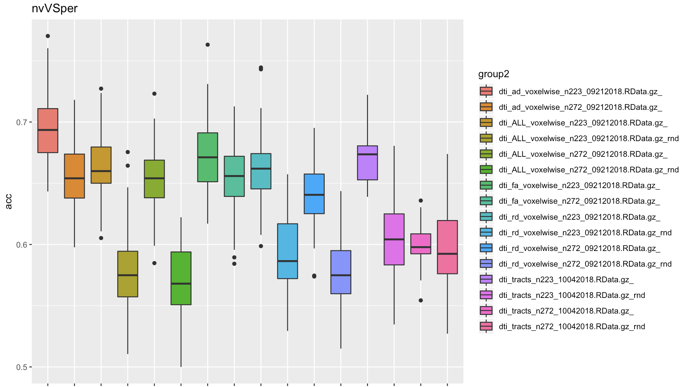

It doesn't reallt help with perVSrem though. 


This is what I'm running to plot, btw:

```r
data$group = ''
data[data$seed<0,]$group = 'rnd'
data$group2 = sapply(1:nrow(data), function(x) { sprintf('%s_%s', data$pheno[x], data$group[x])} )
# then, for each target
target='nvVSper'
p1<-ggplot(data[data$target == target,], aes(x=group2, y=acc, fill=group2))
print(p1+geom_boxplot() + ggtitle(target))
```

The other two plots, just for giggles:


Plotting other metrics doesn't make that much difference either.

How about fMRI?

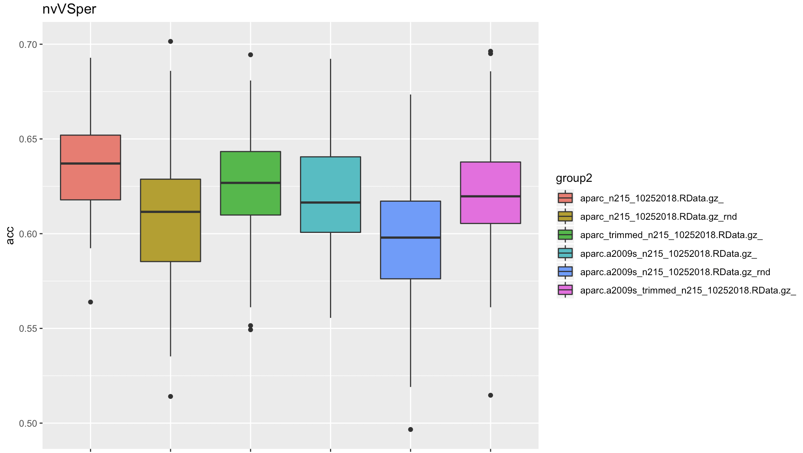


So, again, there is some signal there, a bit better than chance, but still
nothing impressive.

Finally, SNPs. 


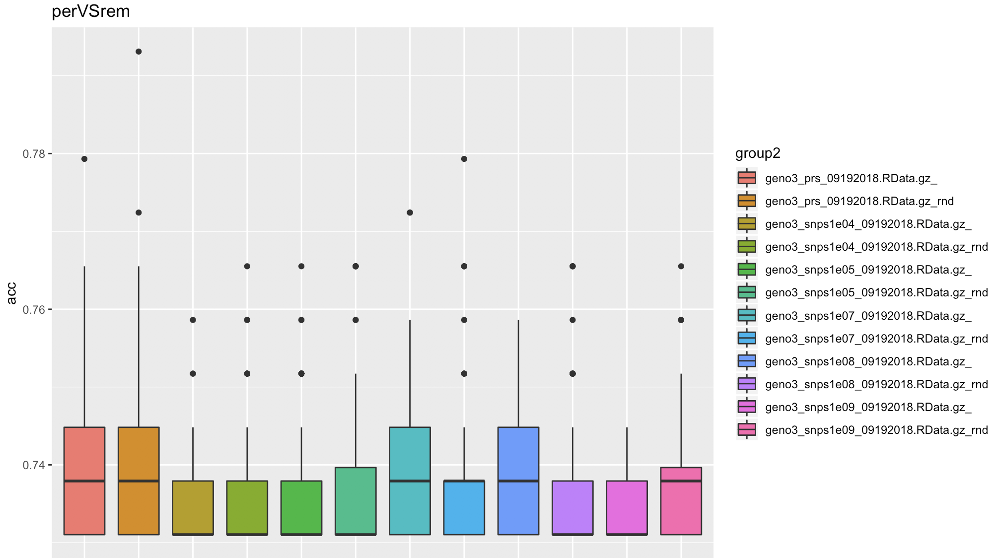

As expected, barely better than chance. 

BTW, it looks like it works to have the raw MR data firs tsaved to a tmp .csv
and then read in with importFile. So, let's change the raw function to do that
in those cases!

# 2018-10-30 07:54:01

I was looking at some old notes, and even if I manage to load the structural data in the raw script, it will fail during computations due to lack of memory, even in 120Gb machines. I could use a large memory node, but this might be overkill. Let's invest some time in the same space idea and see what we get.

# 2018-11-01 16:39:03

Going to fire up the within-domain tests using the spatial filter and test set
approach, using 90-10 split. This only applies to DTI and spatial, but it's
still worth trying out.

```bash
job_name=withinDTI_spatialTestDL;
mydir=/data/NCR_SBRB/baseline_prediction/;
swarm_file=swarm.automl_${job_name};
rm -rf $swarm_file;
for f in dti_fa_voxelwise_n223_09212018.RData.gz dti_fa_voxelwise_n272_09212018.RData.gz \
    dti_ad_voxelwise_n223_09212018.RData.gz dti_ad_voxelwise_n272_09212018.RData.gz \
    dti_rd_voxelwise_n223_09212018.RData.gz dti_rd_voxelwise_n272_09212018.RData.gz; do
    for target in nvVSper nvVSrem perVSrem nvVSadhd; do
        for i in {1..100}; do
            echo "Rscript --vanilla ~/research_code/automl/uni_spatial_test_autoValidation_DL.R ${mydir}/$f ${mydir}/long_clin_0918.csv ${target} ${mydir}/models_spatial_within_DL/${USER} $RANDOM 8" >> $swarm_file;
        done;
    done;
done
sed -i -e "s/^/unset http_proxy; /g" $swarm_file;
split -l 1000 $swarm_file ${job_name}_split;
for f in `/bin/ls ${job_name}_split??`; do
    echo "ERROR" > swarm_wait_${USER}
    while grep -q ERROR swarm_wait_${USER}; do
        echo "Trying $f"
        swarm -f $f -g 40 -t 16 --time 3:00:00 --partition norm --logdir trash_${job_name} --job-name ${job_name} -m R,afni --gres=lscratch:10 2> swarm_wait_${USER};
        if grep -q ERROR swarm_wait_${USER}; then
            echo -e "\tError, sleeping..."
            sleep 10m;
        fi;
    done;
done
```

```bash
job_name=withinStruct_spatialTestDL;
mydir=/data/NCR_SBRB/baseline_prediction/;
swarm_file=swarm.automl_${job_name};
rm -rf $swarm_file;
for f in struct_thickness_09192018_260timeDiff12mo.RData.gz \
    struct_area_09192018_260timeDiff12mo.RData.gz \
    struct_volume_09192018_260timeDiff12mo.RData.gz; do
    for target in nvVSper nvVSrem perVSrem nvVSadhd; do
        for i in {1..100}; do
            echo "Rscript --vanilla ~/research_code/automl/uni_spatial_test_autoValidation_DL.R ${mydir}/$f ${mydir}/long_clin_0918.csv ${target} ${mydir}/models_spatial_within_DL/${USER} $RANDOM 35" >> $swarm_file;
        done;
    done;
done
sed -i -e "s/^/unset http_proxy; /g" $swarm_file;
split -l 1000 $swarm_file ${job_name}_split;
for f in `/bin/ls ${job_name}_split??`; do
    echo "ERROR" > swarm_wait_${USER}
    while grep -q ERROR swarm_wait_${USER}; do
        echo "Trying $f"
        swarm -f $f -g 60 -t 16 --time 3:00:00 --partition norm --logdir trash_${job_name} --job-name ${job_name} -m R,afni --gres=lscratch:10 2> swarm_wait_${USER};
        if grep -q ERROR swarm_wait_${USER}; then
            echo -e "\tError, sleeping..."
            sleep 10m;
        fi;
    done;
done
```

# 2018-11-02 09:36:57

Time to grab the results again:

```bash
echo "target,pheno,var,seed,nfeat,model,auc,f1,acc,ratio" > spatialTest_summary.csv;
for dir in withinDTI_spatialTestDL withinStruct_spatialTestDL; do
    echo $dir;
    for f in `ls -1 trash_${dir}/*o`; do
        phen=`head -n 2 $f | tail -1 | awk '{FS=" "; print $6}' | cut -d"/" -f 6`;
        target=`head -n 2 $f | tail -1 | awk '{FS=" "; print $8}'`;
        seed=`head -n 2 $f | tail -1 | awk '{FS=" "; print $10}'`;
        var=`head -n 2 $f | tail -1 | awk '{FS=" "; print $5}' | cut -d"/" -f 4 | sed -e "s/\.R//g"`;
        model=`grep -A 1 model_id $f | tail -1 | awk '{FS=" "; print $2}' | cut -d"_" -f 1`;
        auc=`grep -A 1 model_id $f | tail -1 | awk '{FS=" "; print $3}'`;
        nfeat=`grep "Running model on" $f | awk '{FS=" "; print $5}'`;
        ratio=`grep -A 1 "Class distribution" $f | tail -1 | awk '{FS=" "; {for (i=2; i<=NF; i++) printf $i ";"}}'`;
        f1=`grep -A 2 "Maximum Metrics:" $f | tail -1 | awk '{FS=" "; print $5}'`;
        acc=`grep -A 5 "Maximum Metrics:" $f | tail -1 | awk '{FS=" "; print $5}'`;
        echo $target,$phen,$var,$seed,$nfeat,$model,$auc,$f1,$acc,$ratio >> spatialTest_summary.csv;
    done;
done;
```

I'm plotting AUC because it's easier to see the differences there. But it looks
like the n223 DTI is indeed better. For struct, area and volume are better!


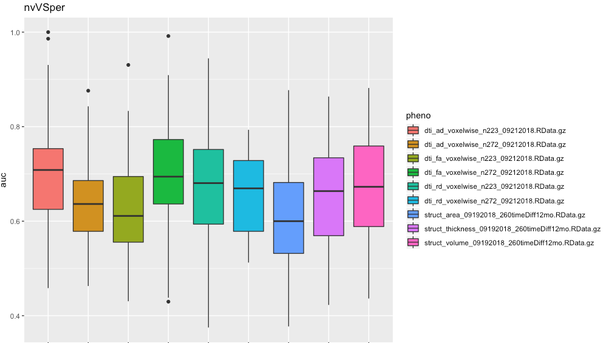

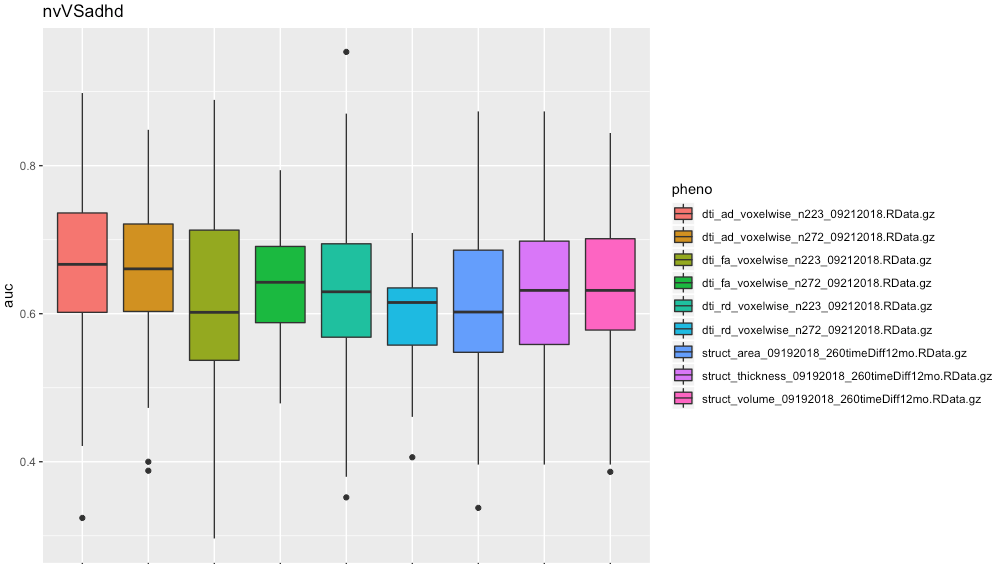

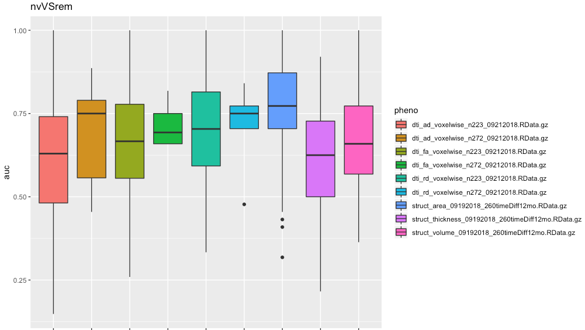

But let's also plot accuracy, in case it helps with decisions:

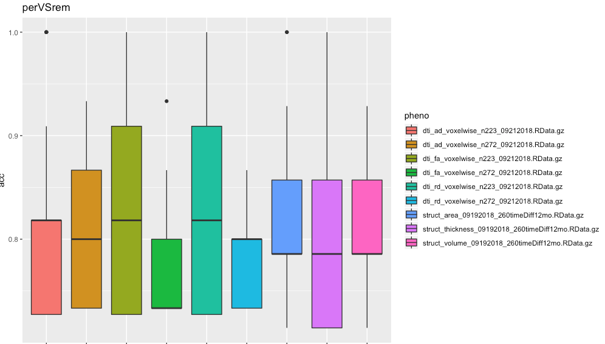

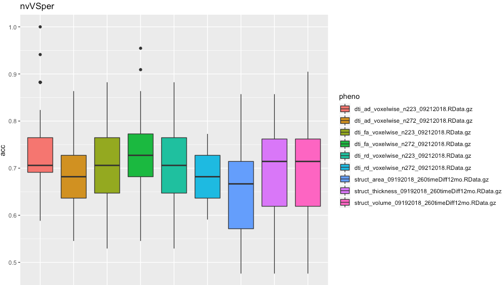


# 2018-11-07 12:10:47

Today I thought about averaging the voxels inside a cluster, because that would
reduce the number of features and sqaush any concerns about overfitting others
might have. So, let's re-run the different DTI scenarios that way, and then run
structural as well when the code is ready.

```bash
job_name=withinDTI_spatialAvgTestDL;
mydir=/data/NCR_SBRB/baseline_prediction/;
swarm_file=swarm.automl_${job_name};
rm -rf $swarm_file;
for f in dti_fa_voxelwise_n223_09212018.RData.gz dti_fa_voxelwise_n272_09212018.RData.gz \
    dti_ad_voxelwise_n223_09212018.RData.gz dti_ad_voxelwise_n272_09212018.RData.gz \
    dti_rd_voxelwise_n223_09212018.RData.gz dti_rd_voxelwise_n272_09212018.RData.gz; do
    for target in nvVSper nvVSrem perVSrem nvVSadhd; do
        for i in {1..100}; do
            echo "Rscript --vanilla ~/research_code/automl/uni_spatialAverage_test_autoValidation_DL.R ${mydir}/$f ${mydir}/long_clin_0918.csv ${target} ${mydir}/models_spatial_within_DL/${USER} $RANDOM 8" >> $swarm_file;
        done;
    done;
done
sed -i -e "s/^/unset http_proxy; /g" $swarm_file;
split -l 1000 $swarm_file ${job_name}_split;
for f in `/bin/ls ${job_name}_split??`; do
    echo "ERROR" > swarm_wait_${USER}
    while grep -q ERROR swarm_wait_${USER}; do
        echo "Trying $f"
        swarm -f $f -g 40 -t 16 --time 3:00:00 --partition norm --logdir trash_${job_name} --job-name ${job_name} -m R,afni --gres=lscratch:10 2> swarm_wait_${USER};
        if grep -q ERROR swarm_wait_${USER}; then
            echo -e "\tError, sleeping..."
            sleep 10m;
        fi;
    done;
done
```

```bash
job_name=withinStruct_spatialAvgTestDL;
mydir=/data/NCR_SBRB/baseline_prediction/;
swarm_file=swarm.automl_${job_name};
rm -rf $swarm_file;
for f in struct_thickness_09192018_260timeDiff12mo.RData.gz \
    struct_area_09192018_260timeDiff12mo.RData.gz \
    struct_volume_09192018_260timeDiff12mo.RData.gz; do
    for target in nvVSper nvVSrem perVSrem nvVSadhd; do
        for i in {1..100}; do
            echo "Rscript --vanilla ~/research_code/automl/uni_spatialAverage_test_autoValidation_DL.R ${mydir}/$f ${mydir}/long_clin_0918.csv ${target} ${mydir}/models_spatial_within_DL/${USER} $RANDOM 35" >> $swarm_file;
        done;
    done;
done
sed -i -e "s/^/unset http_proxy; /g" $swarm_file;
split -l 1000 $swarm_file ${job_name}_split;
for f in `/bin/ls ${job_name}_split??`; do
    echo "ERROR" > swarm_wait_${USER}
    while grep -q ERROR swarm_wait_${USER}; do
        echo "Trying $f"
        swarm -f $f -g 40 -t 16 --time 3:00:00 --partition norm --logdir trash_${job_name} --job-name ${job_name} -m R,afni --gres=lscratch:10 2> swarm_wait_${USER};
        if grep -q ERROR swarm_wait_${USER}; then
            echo -e "\tError, sleeping..."
            sleep 10m;
        fi;
    done;
done
```

# 2018-11-08 17:01:02

Let's put together the results for the spatialAverage pipeline:

```bash
echo "target,pheno,var,seed,nfeat,model,auc,f1,acc,ratio" > spatialAverageTest_summary.csv;
for dir in withinDTI_spatialAvgTestDL withinStruct_spatialAvgTestDL; do
    echo $dir;
    for f in `ls -1 trash_${dir}/*o`; do
        phen=`head -n 2 $f | tail -1 | awk '{FS=" "; print $6}' | cut -d"/" -f 6`;
        target=`head -n 2 $f | tail -1 | awk '{FS=" "; print $8}'`;
        seed=`head -n 2 $f | tail -1 | awk '{FS=" "; print $10}'`;
        var=`head -n 2 $f | tail -1 | awk '{FS=" "; print $5}' | cut -d"/" -f 4 | sed -e "s/\.R//g"`;
        model=`grep -A 1 model_id $f | tail -1 | awk '{FS=" "; print $2}' | cut -d"_" -f 1`;
        auc=`grep -A 1 model_id $f | tail -1 | awk '{FS=" "; print $3}'`;
        nfeat=`grep "Running model on" $f | awk '{FS=" "; print $5}'`;
        ratio=`grep -A 1 "Class distribution" $f | tail -1 | awk '{FS=" "; {for (i=2; i<=NF; i++) printf $i ";"}}'`;
        f1=`grep -A 2 "Maximum Metrics:" $f | tail -1 | awk '{FS=" "; print $5}'`;
        acc=`grep -A 5 "Maximum Metrics:" $f | tail -1 | awk '{FS=" "; print $5}'`;
        echo $target,$phen,$var,$seed,$nfeat,$model,$auc,$f1,$acc,$ratio >> spatialAverageTest_summary.csv;
    done;
done;
```

And for plotting:

```r
data = read.csv('~/tmp/spatialAverageTest_summary.csv')
target='nvVSper'
p1<-ggplot(data[data$target == target,], aes(x=pheno, y=acc, fill=pheno))
print(p1+geom_boxplot() + ggtitle(target))
```


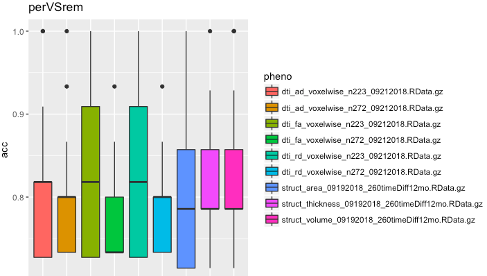

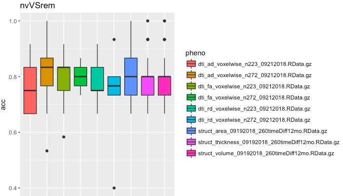


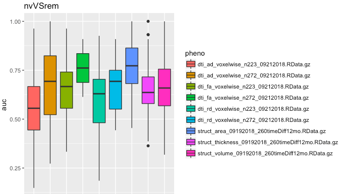


The results are honestly not that different. It might make a difference later when we start combining datasets and the number of variables might make some difference.

Another thing to try is to log-transform the data (or whatever makes it more
Gaussian), prior to doing the univariate analysis. I don't think many of the
algorithms will care that the data is gaussian, but it's worth a try to make it
look nicer. I'd probably do some more work on combining these results and fMRI, but this is transformation might be something to be tried later.

Another check we can try is check for outliers. Instead of removing the entire
subject (unless it's necessary, of course), we could try setting variables to
NA, as out algorithms can handle that. And, of course we could using caret's
nearZero variance filter and also findCorrelation if we end up too concerned
about many variables in the raw data. It might help, and still keep
non-univariate features in the model.

So, I guess next thing is to write code to combine the domains, and while that is running, to play more with rsfMRI.