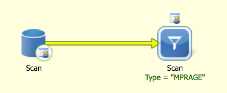

# 2018-10-26 15:18:41, GS

## structural

Start with a simple Query in Labmatrix for Scans of type = MPRAGE. Output all
columns and save the results as CSV. 



Next, we gather the Freesurfer cortical scores from Labmatrix. Again, a simple
Query of QualityControl custom
data, with subsets of Type = Freesurfer5.3_ext_avg OR Type =
Freesurfer5.3_int_avg. Save the results as CSV again.


## DTI
For DTI, we need to run get_dti_movement.py to get all variables for us. They
are spit out to a file ~/tmp/mean_dti_movement.csv. You can always get the most
recent version of the script from
https://github.com/gsudre/research_code/blob/master/dti/get_dti_motion.py

We need a list of mask ids to call the script, so let's just use the list of all
mask ids we currently have, and the script will take care of letting you know
what it cannot find to have DTI:

```bash
# in caterpie
/bin/ls -1 /mnt/shaw/data_by_maskID/ | grep -E "^....$" > ~/tmp/maskids.txt;
python ~/research_code/dti/get_dti_motion.py ~/tmp/maskids.txt /mnt/shaw/
```

Note that the first argument to the script is the list of mask ids. All we do
there is list the mask id directory and keep only the entires that have 4 of any
characters (more likely than not, the mask id directories).

To get the mean FA/AD/RD, we need to access the tensors before they go into
DTI-TK, so that whatever processing happens later doesn't affect the QC
estimates. Since this is a crude estimate, we won't skeletonize it, and just
create a mask based on FA values, to be used over all other properties.

```bash
# still in caterpie
outputDir=/mnt/shaw/dti_subjectSpace_properties
maskidDir=/mnt/shaw/data_by_maskID/
maskidFile=~/tmp/maskids.txt
if [ ! -d $outputDir ]; then mkdir $outputDir; fi;
cd $outputDir
echo "maskid,mean_fa,mean_ad,mean_rd,nvoxInMask" > mean_props.csv;
while read m; do
    tensorDir=${maskidDir}/${m}/edti_proc/edti_DMC_DR_R1_SAVE_DTITK/;
    if [ ! -d $tensorDir ]; then
        tensorDir=${maskidDir}/${m}/edti_proc/edti_DMC_R1_SAVE_DTITK/;
        tensorFile=edti_DMC_R1_tensor.nii;
    else
        tensorFile=edti_DMC_DR_R1_tensor.nii;
    fi;
    if [ ! -d $tensorDir ]; then
        echo $tensorDir "does not exist. Skipping..."
    else
        echo "Evaluating QC metrics for $m"
        if [ ! -e ${m}_faLTp2_mask.nii ]; then
            TVtool -in ${tensorDir}/${tensorFile} -fa -out ./${m}_fa.nii;
            TVtool -in ${tensorDir}/${tensorFile} -ad -out ./${m}_ad.nii;
            TVtool -in ${tensorDir}/${tensorFile} -rd -out ./${m}_rd.nii;
            3dcalc -a ${m}_fa.nii -prefix ${m}_faLTp2_mask.nii -overwrite -expr "step(a-.2)";
        fi;
        fa=`3dmaskave -q -mask ${m}_faLTp2_mask.nii ${m}_fa.nii`;
        ad=`3dmaskave -q -mask ${m}_faLTp2_mask.nii ${m}_ad.nii`;
        rd=`3dmaskave -q -mask ${m}_faLTp2_mask.nii ${m}_rd.nii`;
        nvox=`3dBrickStat -count -non-zero ${m}_faLTp2_mask.nii`;
        echo ${m},${fa},${ad},${rd},${nvox} >> mean_props.csv;
    fi;
done < $maskidFile
```

## rsFMRI
Finally, to gather the fMRI parameters we do (using the same list of all mask
ids used for DTI):

```bash
# again in caterpie
echo "maskid,totalTRs,usedTRs,enormGoodTRs" > ~/tmp/good_trs.csv;
while read s; do
    mydir=/mnt/shaw/data_by_maskID/${s}/afni/${s}.rest.subjectSpace.results;
    if [ -e ${mydir}/errts.${s}.fanaticor+orig.HEAD ]; then
        echo $s;
        used=`1d_tool.py -infile ${mydir}//X.xmat.1D -show_rows_cols -verb 0 | cut -d " " -f 1 -`;
        if [ -e ${mydir}//X.nocensor.xmat.1D ]; then
            total=`1d_tool.py -infile ${mydir}//X.nocensor.xmat.1D -show_rows_cols -verb 0 | cut -d " " -f 1 -`;
        else
            total=$used;
        fi;
        1deval -a ${mydir}/motion_${s}_enorm.1D \
               -b ${mydir}/censor_${s}_combined_2.1D \
               -expr 'a*b' > ~/tmp/rm.ec.1D;
        mvmt=`3dTstat -prefix - -nzmean ~/tmp/rm.ec.1D\' 2>/dev/null`;
        echo ${s},${total},${used},${mvmt} >> ~/tmp/good_trs.csv;
    else
        echo $m "does not have rsFMRI results. Skipping...";
    fi;
done < ~/tmp/maskids.txt
```

Then run the same thing for the .05 results.

## combining everything

Finally, in R we can merge everything:

```r
mprage_fname = '~/Downloads/mprage.csv'
fs_fname = '~/Downloads/fs.csv'
dti_fname = '~/tmp/mean_dti_movement.csv'
dtiprops_fname = '~/tmp/mean_props.csv'
fmri01_fname = '~/tmp/good_trs.csv'
fmri05_fname = '~/tmp/good_trs.csv'
out_fname = '~/tmp/master_qc.csv'

mprage = read.csv(mprage_fname)
# collapse the mprage scores to only get the best one
best_mprage = do.call(rbind, by(mprage, mprage$Mask.ID, function(x) x[which.min(x$QC), ] ))
best_mprage = best_mprage[, c('Mask.ID', 'QC')]
colnames(best_mprage)[2] = 'mprage_QC'
fs = read.csv(fs_fname)
# same thing, but now for Freesurfer internal and external
fs_ext = fs[fs$Type=='Freesurfer5.3_ext_avg',]
fs_ext = do.call(rbind, by(fs_ext, fs_ext$Mask.ID, function(x) x[which.min(x$Score), ] ))
fs_ext = fs_ext[, c('Mask.ID', 'Score')]
colnames(fs_ext)[2] = 'ext_avg_freesurfer5.3'
fs_int = fs[fs$Type=='Freesurfer5.3_int_avg',]
fs_int = do.call(rbind, by(fs_int, fs_int$Mask.ID, function(x) x[which.min(x$Score), ] ))
fs_int = fs_int[, c('Mask.ID', 'Score')]
colnames(fs_int)[2] = 'int_avg_freesurfer5.3'
# for fMRI and DTI it's just a matter of opening them and renaming a few
# variables to make it a bit more elegant
dti = read.csv(dti_fname)
dti = dti[, 1:(ncol(dti)-2)]  # we don't need to know which slices were removed
colnames(dti)[1] = 'Mask.ID'
dtiprops = read.csv(dtiprops_fname)
colnames(dtiprops)[1] = 'Mask.ID'
fmri01 = read.csv(fmri01_fname)
colnames(fmri01) = sapply(colnames(fmri01), function(x) sprintf('%s_fmri01', x))
colnames(fmri01)[1] = 'Mask.ID'
fmri05 = read.csv(fmri05_fname)
colnames(fmri05) = sapply(colnames(fmri01), function(x) sprintf('%s_fmri05', x))
colnames(fmri05)[1] = 'Mask.ID'
# finally, do a big'ol merge on everything
m = merge(best_mprage, fs_ext, by='Mask.ID', all.x=T, all.y=T)
m = merge(m, fs_int, by='Mask.ID', all.x=T, all.y=T)
m = merge(m, dti, by='Mask.ID', all.x=T, all.y=T)
m = merge(m, dtiprops, by='Mask.ID', all.x=T, all.y=T)
m = merge(m, fmri01, by='Mask.ID', all.x=T, all.y=T)
m = merge(m, fmri05, by='Mask.ID', all.x=T, all.y=T)
write.csv(m, file=out_fname, row.names=F)
```

## Appending new IDs

These instructions show you how to collect QC metrics for a set of mask ids.
This could be the complete set you're playing with or just a subset, to later be
concatenated to a master list. Choose your own destiny.
